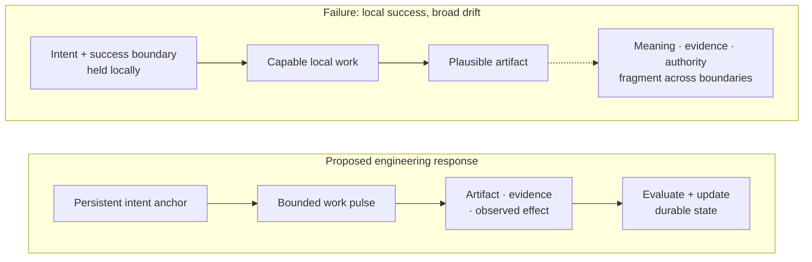
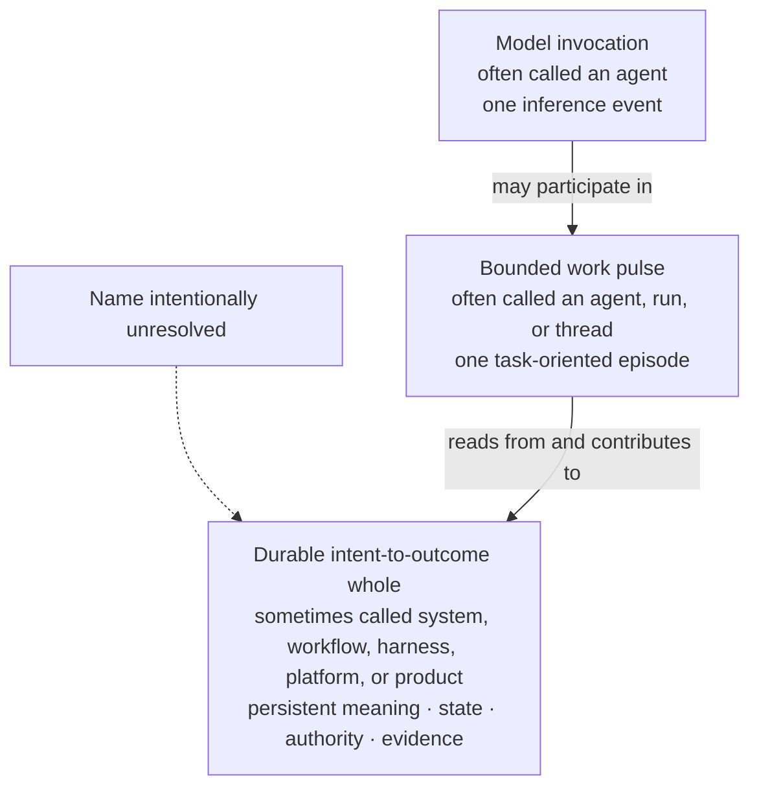
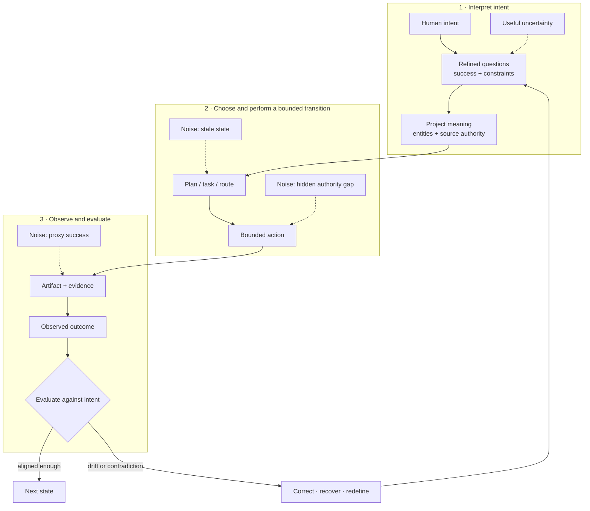
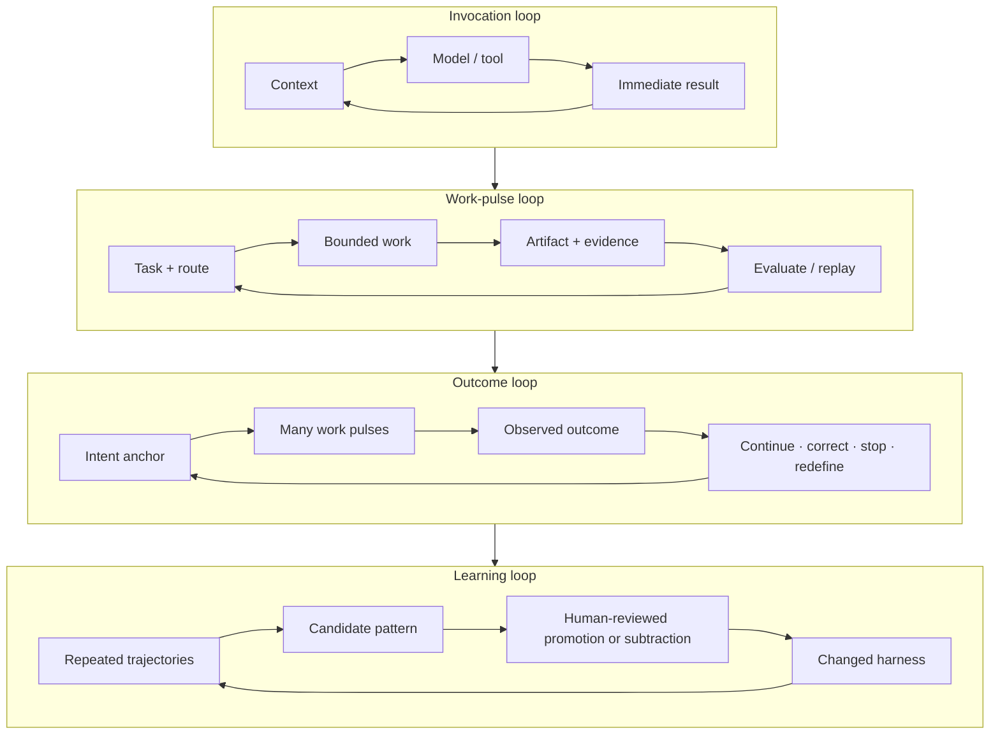
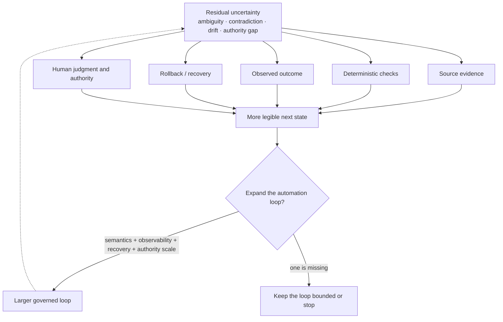

# Intent-to-Outcome Engineering: Principles for Durable Agentic Systems

> **Status:** evolving engineering framework. This document separates project observations,
> engineering inferences, working hypotheses, and research horizons. It is not
> a claim of a finished Azoth system, a new scientific theory, or a formal
> control-theory model.

## The framework at three resolutions

- **Plain language:** build the AI system around the real outcome, not the
  model call.
- **Engineering view:** place probabilistic intelligence inside explicit
  meaning, trustworthy evidence, deterministic effect boundaries, evaluation,
  accountable human authority, and recovery.
- **Research view:** treat the relationship between evolving human intent and
  observed system effects as partially identifiable. Use bounded, reversible
  work to improve that relationship without claiming a complete objective,
  guaranteed convergence, or zero uncertainty.

Agent systems are the practical origin and strongest evidence for this framework.
The broader claim is more modest: the same discipline may help engineer other
systems whose requirements, environment, or measures of success remain
uncertain while the work is underway.

## The engineering failure comes first

AI-assisted work can be locally excellent and broadly wrong.

A model finds the bug but forgets the release boundary. A research thread
discovers an important dependency but never returns it to the parent outcome.
A migration produces valid SQL for the wrong business meaning. A multi-stage
campaign completes every assigned artifact while its evidence, authority, or
definition of success has drifted.

Conversation is a useful interface for coordinating a bounded episode of work.
The structural problem begins when the transcript is also expected to be the
plan, project memory, evidence ledger, authority boundary, and outcome state.
Larger context windows and better prompts can postpone some drift; they do not
by themselves make transitions across threads, tools, repositories, people,
providers, and time inspectable or recoverable.

These failures are not explained by model capability alone. They appear when
work crosses contexts, tools, people, repositories, providers, and time. The
system has to preserve and repeatedly reinterpret:

- what outcome is being pursued;
- what success and failure mean;
- which project semantics govern the work;
- what is known, inferred, disputed, or stale;
- which effect is currently authorized;
- what actually happened; and
- whether to continue, correct, recover, stop, or redefine the outcome.

**Observation.** A successful local trajectory is not sufficient evidence of
a successful system transition.

**Engineering inference.** The primary engineering object should be the path
from intent to observed outcome, not the apparent capability of one model
interaction.

## 1. “Agent” currently names several different things

**Observation.** Public definitions use “agent” for units at different scales:
an LLM with instructions and tools, a runtime-controlled loop, a dynamically
directed workflow, or a complete product and operating system.

This framework uses three distinctions:

| Unit | Working definition | Durability |
|---|---|---|
| **Model invocation** | One inference event with supplied context, instructions, and available tools | Ephemeral |
| **Work pulse** | A bounded episode organized around a task, question, transition, or evaluation; it may contain many model and tool calls | Finite by scope, effect, and return condition; leaves durable outputs |
| **Durable whole** | The persistent system that carries purpose, project meaning, evidence, authority, recovery, and outcome state across many pulses | Cross-session and cross-component |

**Work pulse** is the stable term here. **Node** remains provisional shorthand
for a functional locus—a human, model, repository, validator, tool, memory
surface, or external system. It is descriptive language, not a fixed ontology.

Calling the durable whole “the agent” can be a useful analogy: it directs
attention away from the thread and toward the system that actually maintains
continuity. But the analogy is not a naming decision. If “agent” already names
the model, run, thread, workflow, and product, the missing name may itself be an
important design question.

**Working hypothesis.** Durable intelligence in agentic work is distributed
across models, people, representations, tools, evidence, control boundaries,
and recovery mechanisms. It should not be attributed to the model alone.

## 2. Purpose and success form the persistent intent anchor

**Engineering inference.** A durable system needs a small, inspectable anchor
that survives changes in thread, plan, and local strategy.

The anchor is not a frozen prompt. At minimum it contains:

- **purpose:** why the work exists;
- **success boundary:** what observable condition would count as acceptable;
- **constraints and exclusions:** what may not be optimized away;
- **authority:** who may approve which consequential transition; and
- **revision state:** what has been learned that legitimately changes the
  interpretation of the outcome.

The anchor can change, but it should change explicitly. A useful discovery may
redefine success; it should not silently replace the original purpose because
it was interesting or locally tractable.

**Working hypothesis.** A compact intent anchor plus evidence-backed state will
preserve outcome continuity better than relying on conversation history or
native compaction alone.

### Intent is represented, not directly observed

The source of an intended outcome is a **subject**: one person or a collective
whose purposes and values give the work its direction. Because that direction
can change, an intent anchor is a versioned representation—not a permanent
substitute for the subject.

For a collective, disagreement is part of the state. Preserve whose view is
represented, who has authority for the present decision, what is contested,
and which revision supersedes an earlier one. Evidence can narrow plausible
interpretations and increase agreement about acceptable action without
revealing one uniquely measurable objective.

**Working hypothesis.** Explicit versions, sources, disagreement, and authority
will make revisions more recoverable than treating the latest prompt, metric,
or stakeholder statement as the whole objective.

If better evidence does not narrow consequential disagreement or improve
outcome prediction, longer iteration is not evidence of better alignment.

## 3. Alignment signal is translated through intermediate states

**Working hypothesis.** What propagates through a durable system is an
**alignment signal**: the maintained relationship between the current intent
anchor and each intermediate state produced on the way to an outcome.

The signal is not a payload passed unchanged between components. Each
transition translates intent into another form: a question, project meaning, a
plan, an action, an artifact, evidence, or an observed effect. A work pulse is
an instrument for making one or more of those translations; it does not own the
continuity of the whole outcome.

The term is deliberately metaphorical. It is not assumed to be a scalar, and
this document does not claim a calibrated signal-to-noise measure. The
relationship may become clearer, degrade through drift or proxy success, or
reveal that the intent anchor itself needs explicit revision.

Good work does not minimize uncertainty at any cost. It may reveal ambiguity
that the system had been hiding. Making that uncertainty visible can strengthen
alignment even though the immediate state looks less certain.

The engineering goal is therefore not “low entropy” in the abstract. It is to
preserve enough signal about purpose, meaning, evidence, and authority that the
system can identify drift and choose a legitimate next transition.

An alignment signal is credible only to the extent that its provenance,
interpretation, and relationship to the intended outcome can be challenged.
More feedback is not automatically better: repeated proxy measurements can
amplify the wrong target, and a moving target can become an unfalsifiable excuse
for failure. The system should stop, refuse, or return to the subject when:

- authoritative perspectives conflict beyond the current decision boundary;
- the next effect is irreversible or high-impact and evidence is insufficient;
- feedback is not reducing a material disagreement or improving prediction;
- the available measure can be satisfied while the real outcome worsens; or
- continuing would spend more attention or risk than the decision warrants.

## 4. Project ontology and task-specific composition

**Observation.** Generic coordination patterns transferred across operational
data projects; entity meanings, source precedence, acceptance rules, and
exceptions did not.

**Engineering inference.** The durable system needs a project-local ontology:
an operational account of the entities, relationships, sources of truth,
constraints, and success conditions that matter for the current outcome.

This does not require a universal knowledge graph. It may be implemented with
ordinary files, typed records, schemas, tests, queries, state machines, or
provider artifacts. The important properties are inspectability, authority,
and fitness for the decisions being made.

Composition should also be task-specific. Research, architecture,
implementation, evaluation, and recovery are processing functions, not
permanent characters that every task must invoke. A work pulse should use the
smallest combination of nodes and controls that respects the task’s semantic
and authority boundaries.

**Working hypothesis.** Dynamic composition will outperform one universal
pipeline when the selection rule is itself observable and evaluated against
representative work.

**Counter-risk.** Composition can create handoff loss, coordination cost, and
false specialization. A strong continuous context may outperform multiple
roles when the work does not need independent evidence or authority separation.

## 5. Feedback loops exist at several scales

**Engineering inference.** “The loop” is not one repeated agent call. Durable
work contains nested feedback cycles with different evidence and stopping
conditions.

The loops should not collapse into one self-authorizing cycle. A pulse can
evaluate its artifact without gaining release authority. A project can capture
a lesson without promoting it into shared policy. A harness can propose an
improvement without approving its own governance change.

**Working hypothesis.** Larger automation loops can carry more work end to end,
but only if their semantic grounding, observability, recovery, and authority
grow with their consequence.

## 6. Learning must be externalized without becoming self-authorizing policy

**Observation.** Useful lessons disappear when they live only in a transcript.
But automatically converting every lesson into global instruction creates
conflicting rules, context saturation, and governance drift.

**Engineering inference.** Capture and promotion should be separate:

1. a work pulse leaves an artifact, trajectory, outcome, and local lesson;
2. raw evidence stays near its authoritative project source;
3. a candidate pattern carries provenance and known limitations;
4. review compares it with other projects and representative failures;
5. a human-controlled boundary decides whether to keep it local, defer it,
   promote it, revise it, or remove an older rule; and
6. the changed harness is evaluated again rather than treated as permanent.

This makes learning durable without allowing the system to silently rewrite
the values and boundaries under which it operates.

**Working hypothesis.** Promotion quality should be judged by held-out work,
not the confidence or frequency with which a pattern was proposed.

## 7. Residual entropy, recovery, and human authority

**Working hypothesis.** “Residual entropy” is useful shorthand for unresolved
ambiguity, contradiction, drift, provenance gaps, and governance uncertainty
that remain after a bounded pulse. It is not a formal thermodynamic quantity or
an empirically calibrated score.

Evidence, deterministic checks, observed outcomes, rollback, and human judgment
can all reduce or restructure that uncertainty. Humans are not generic cleanup
workers at the edge of the loop. They retain authority over meaning, value,
risk trade-offs, protected effects, policy promotion, and release.

Some uncertainty should remain visible. Forcing every question into a confident
answer creates noise by hiding the very state a later decision needs.

**Engineering inference.** The point where human authority enters is not a
single terminal drain. Human judgment can shape the intent anchor, resolve
meaning, approve a transition, redefine success, review learning, or stop the
system at several levels.

### Search broadly, act narrowly

Human judgment does not reveal a hidden objective. It decides how much
uncertainty the next consequence can safely carry. While uncertainty is high,
the system can use competing hypotheses, critiques, simulations, and reversible
probes. Before a consequential effect, it contracts to the simplest action
that:

1. remains acceptable across the still-plausible interpretations of intent;
2. has downside proportionate to the available evidence;
3. preserves observation, recovery, and accountable authority; and
4. exposes a clear condition for continuing, correcting, or stopping.

The threshold is consequence-relative. A reversible probe may proceed under
substantial uncertainty; an irreversible or high-impact action requires
stronger agreement, independent evidence, and explicit human authority. The
threshold means the action is robust and recoverable enough—not that
uncertainty has disappeared.

## 8. Architectural subtraction is a first-class operation

**Observation.** A framework built to prevent real failures later created
duplicated state, context competition, and ceremony that obscured project work.

**Engineering inference.** Harness components are falsifiable hypotheses. A
role, handoff, memory layer, retriever, gate, or status mirror should exist only
while it protects an observed boundary better than the simpler alternative.

Subtraction is not anti-governance. The goal is to preserve load-bearing
controls—semantic validation, source authority, evidence, consequential-action
gates, independent readback, and recovery—while removing structures that have
become redundant or performative.

**Working hypothesis.** As models and native runtimes improve, some explicit
harness structure should disappear. Durable intent, project meaning, authority,
evidence, and outcome evaluation are more likely to remain than any particular
role taxonomy or orchestration topology.

## The framework in one statement

**Working hypothesis.** Agentic engineering should be organized around a
durable intent-to-outcome system. Model invocations occur inside bounded work
pulses. The system maintains a versioned, revisable representation of the
subject's intent rather than treating any prompt or metric as the objective
itself. Pulses read project meaning and authority from persistent state,
perform or investigate a limited transition, and return artifacts and evidence
to nested feedback loops. Humans retain authority over meaning, value,
disagreement, risk, policy, and consequential effects. The harness learns
externally to any one context and subtracts machinery when evidence no longer
justifies it.

This is intentionally a description rather than a coined name for the durable
whole.

## Counterarguments

### “This is just workflow orchestration”

Possibly. The stronger claim is not that orchestration is new, but that current
agent discourse often places identity and continuity at the model or thread
level. The argument is useful only if shifting the unit of analysis improves
outcome continuity, recovery, and governance in practice.

### “A sufficiently capable model can hold the whole outcome in context”

For some tasks, yes. External state adds cost and can become stale. The framework
predicts value mainly when work spans long time horizons, distinct authorities,
multiple evidence surfaces, irreversible effects, or contexts that cannot
reliably remain together.

### “Typed handoffs and roles lose more context than they protect”

Often true. Independent contexts should be used when they provide evidence,
specialization, or authority separation worth the handoff loss—not because a
multi-agent diagram looks sophisticated.

### “Alignment signal and entropy are vague metaphors”

They are. They should remain qualified until operational definitions predict
better decisions. If the metaphors do not improve system design or evaluation,
they should be replaced.

### “Evolving intent makes every failure explainable after the fact”

It would, unless revisions are explicit. A changed target should record who
changed it, which evidence justified the change, what earlier interpretation it
supersedes, and which predictions or acceptance decisions should now differ.
Iteration without improving those material predictions is not convergence.

### “Human gates prevent meaningful autonomy”

The objective is not maximum step count without a person. It is the largest
legitimate loop whose semantics, evidence, recovery, and authority can be
trusted. Human attention should move toward meaning and consequence while
mechanical verification and routine work become increasingly automated.

## Falsifiable questions

1. Does an explicit intent anchor reduce broad failure on long-running tasks
   compared with transcript history and native compaction?
2. Which outcome-state fields improve decisions, and which merely increase
   maintenance cost?
3. Can work pulses return useful detours to a parent outcome without a brittle
   universal graph?
4. When do typed handoffs outperform one strong continuous context on quality,
   cost, latency, and recoverability?
5. Can task-specific composition beat a fixed pipeline on representative work?
6. Which observable conditions justify increasing an automation loop’s scope?
7. Can project-local patterns be promoted without reducing held-out project
   quality or erasing local meaning?
8. Does architectural subtraction improve outcome quality and operator effort,
   or only reduce visible complexity?
9. Can alignment signal or residual entropy be operationalized without
   rewarding hidden uncertainty and proxy success?
10. Which system properties remain necessary as models, tools, context windows,
    and native runtimes improve?
11. Do versioned intent representations improve recovery when a subject or
    collective changes direction?
12. Which evidence narrows consequential disagreement, and which merely
    reinforces a proxy that the system already knows how to satisfy?
13. Can consequence-relative thresholds reduce irreversible mistakes without
    turning human approval into routine ceremony?

## Research agenda

**Research horizon.** The next useful work is empirical:

- create benchmark tasks with plausible narrow-success/broad-failure paths;
- compare transcript-only, intent-anchor, and richer outcome-state conditions;
- record outcome quality, trajectory quality, cost, latency, human effort, and
  recovery time together;
- measure handoff loss in single-context and composed work-pulse variants;
- compare unversioned requirements with intent records that preserve source,
  disagreement, authority, and explicit revision;
- test whether new evidence narrows material predictions and acceptable-action
  sets rather than merely increasing agreement with a proxy;
- test promotion and subtraction decisions against held-out projects;
- study loop expansion under different observability, recovery, and authority
  conditions; and
- replace the signal and entropy metaphors if more precise concepts explain the
  evidence better.

## Source and comparison lineage

These sources situate the question. They neither establish Yiwei’s project
experience nor prove Azoth’s design.

| Source | What it contributes | What it does not establish |
|---|---|---|
| [OpenAI Agents SDK](https://openai.github.io/openai-agents-python/agents/) | A prevailing implementation definition centered on an LLM, instructions, tools, handoffs, guardrails, and runtime behavior | That one agent instance is the correct durable unit of an outcome |
| [Anthropic, *Building Effective Agents*](https://www.anthropic.com/engineering/building-effective-agents) | An explicit acknowledgement that “agent” has several definitions, plus a workflow/agent distinction | The terminology or system boundary proposed here |
| [OpenAI, *Harness engineering*](https://openai.com/index/harness-engineering/) | Repository knowledge as system of record, short maps into deeper truth, feedback loops, and architectural enforcement | A universal repository layout or proof that Azoth’s contracts are optimal |
| [Meta-Harness](https://arxiv.org/abs/2603.28052) | Evidence that harness code can be optimized using source, scores, and prior execution traces | Safe autonomous policy promotion or general outcome alignment |
| [Distributed cognition](https://escholarship.org/uc/item/8sb9s5rm) | A lens for cognition distributed across people, representations, and artifacts | That agentic software is literally a cognitive theory |
| [Clark and Chalmers, *The Extended Mind*](https://web.ics.purdue.edu/~drkelly/ClarkChalmersTheExtendedMind1998.pdf) | A lens for treating tightly coupled external state as causally important | A direct engineering specification for durable agentic systems |
| [Facility](https://github.com/theam/Facility) | An external comparison using explicit roles, human plan approval, repository checks, receipts, and outcome monitoring | Yiwei’s project experience, Azoth lineage, or independent validation of Facility’s claims |

Facility is a contemporary external comparison. I have not worked on it, and
its public design is not evidence for the internal Agentic Framework or Azoth.

## Evidence and implementation boundary

The historical evidence and braided chronology live in [*Narrow Success, Broad
Failure*](case-studies/narrow-success-broad-failure.md). The [executable
proof](PERSONAL_HARNESS_OS.md) implements only a selected transition slice:
effect-aware routing, bounded context, explicit authority and stopping state,
and no-write rehearsal.

The wider root workshop contains additional intake, research, planning,
ledger, campaign, evaluation, and replay capabilities. They are evidence for
the direction of travel, not proof that the durable whole described here is
complete.

## Working conclusion

The ambition is not to wrap every model call in a larger framework. It is to
recognize that durable intelligence may live in the evolving relationship
among intent, project meaning, work pulses, evidence, authority, feedback,
recovery, and people.

If that framing improves real outcomes, it deserves refinement. If a simpler
model explains and supports the work better, this framework should contract with
the architecture it recommends.
