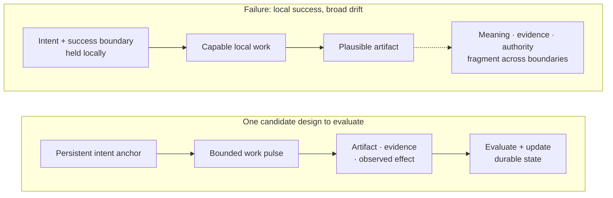
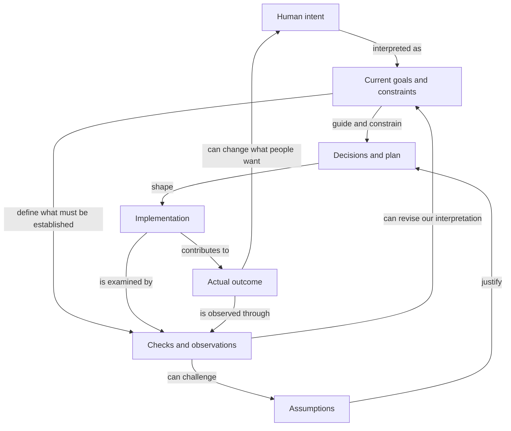
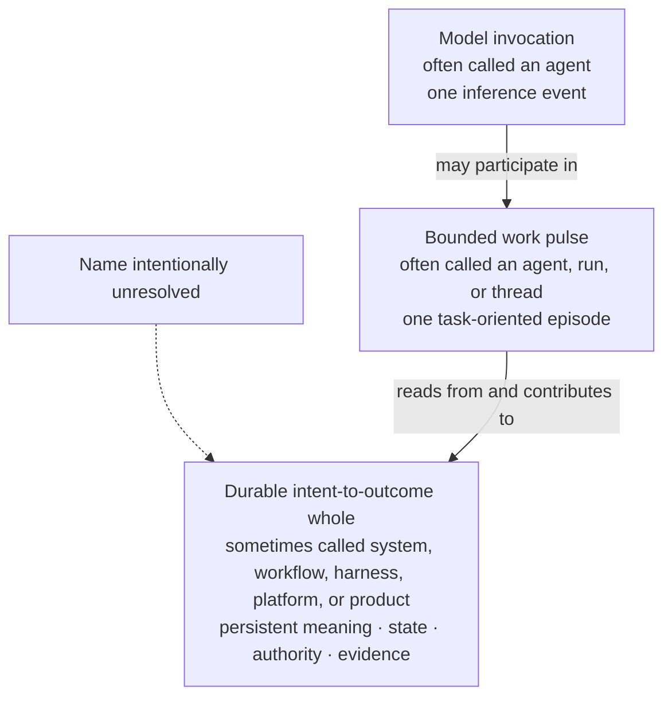
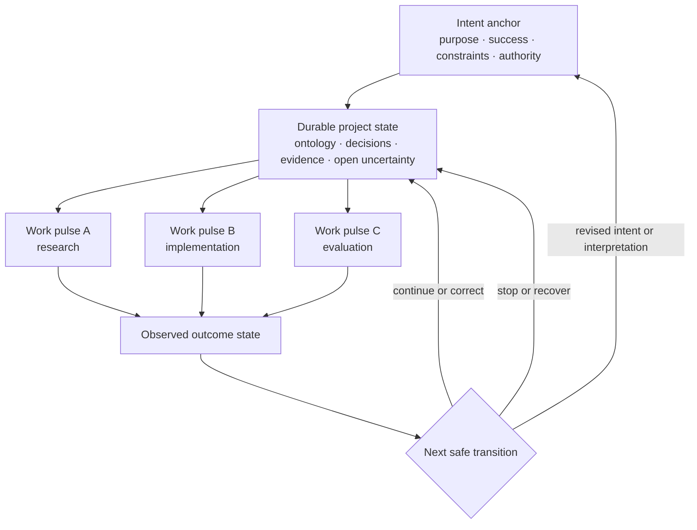
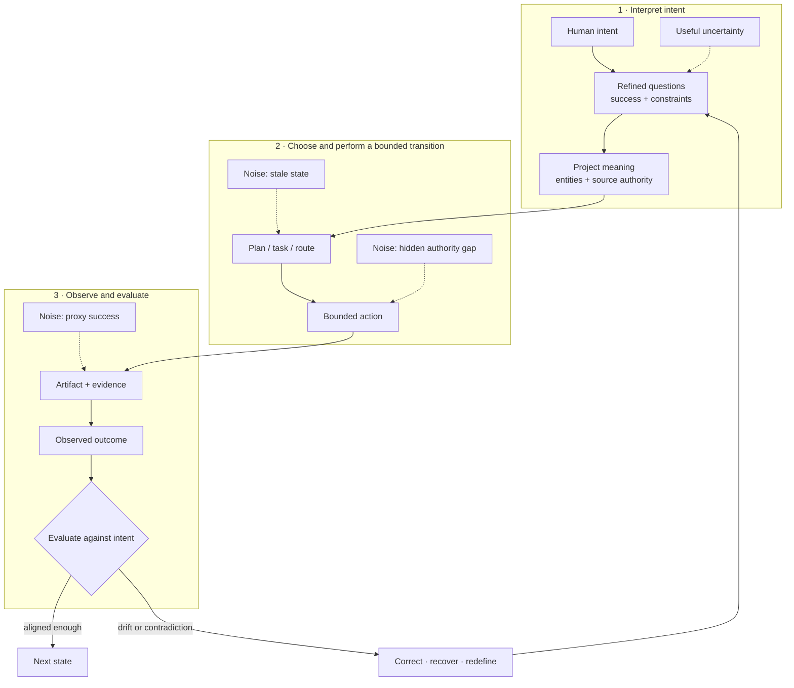
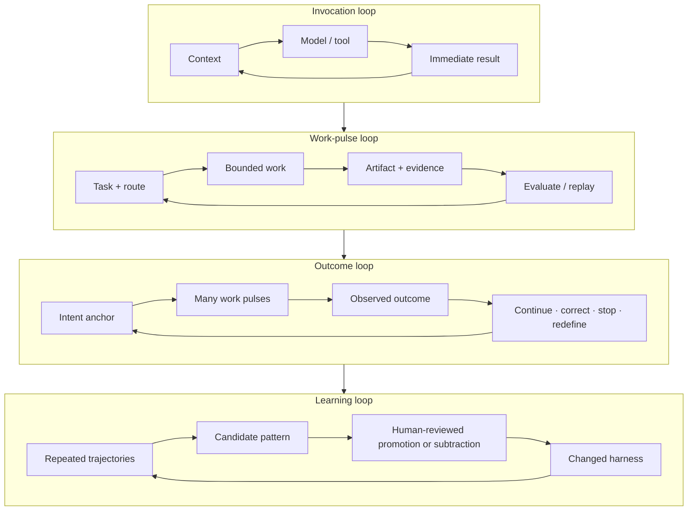
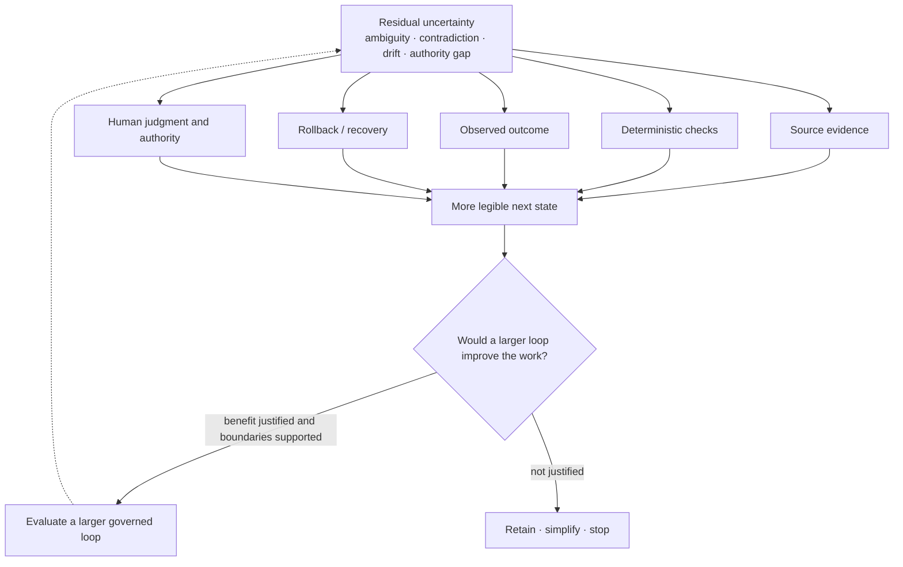

# Intent-to-Outcome Engineering: Principles for Durable Agentic Systems

> **Status:** evolving engineering framework. This document separates project observations,
> engineering inferences, working hypotheses, and research horizons. It is not
> a claim of a finished Azoth system, a new scientific theory, or a formal
> control-theory model.

## The framework at three resolutions

- **Plain language:** build the AI system around the real outcome, not the
  model call.
- **Engineering view:** keep goals, assumptions, decisions, work and evidence
  connected to the intended outcome as understanding changes. Use project
  meaning, trustworthy evidence, accountable authority and recovery to make
  those decisions sound.
- **Research view:** treat the relationship between evolving human intent and
  observed system effects as partially identifiable. Use bounded, reversible
  work to improve that relationship without claiming a complete objective,
  guaranteed convergence, or zero uncertainty.

Agent systems are the practical origin and strongest evidence for this framework.
The broader claim is more modest: the same discipline may help engineer other
systems whose requirements, environment, or measures of success remain
uncertain while the work is underway.

## The engineering failure comes first

AI-assisted work can be locally excellent and broadly wrong.

A model finds the bug but forgets the release boundary. A research thread
discovers an important dependency but never returns it to the parent outcome.
A migration produces valid SQL for the wrong business meaning. A multi-stage
campaign completes every assigned artifact while its evidence, authority, or
definition of success has drifted.

Conversation can carry enough context for an episode of work. Difficulties arise
when it no longer makes the relevant plan, meaning, evidence, authority or
outcome state reliably available across transitions. Larger context windows,
better models and native recovery may solve some of these problems. Evaluate
where they suffice and where additional support improves work across threads,
tools, repositories, people, providers and time.

These failures are not explained by model capability alone. They appear when
work crosses contexts, tools, people, repositories, providers, and time. The
system has to preserve and repeatedly reinterpret:

- what outcome is being pursued;
- what success and failure mean;
- which project semantics govern the work;
- what is known, inferred, disputed, or stale;
- which effect is currently authorized;
- what actually happened; and
- whether to continue, correct, recover, stop, or redefine the outcome.

**Observation.** A successful local trajectory is not sufficient evidence of
a successful system transition.

**Engineering inference.** The primary engineering object should be the path
from intent to observed outcome, not the apparent capability of one model
interaction.

## How the relationships give work its meaning

Intent shapes the relationships that make a decision appropriate, an
implementation useful, and evidence relevant. We work with a revisable
interpretation of what a person or collective wants. That interpretation can
be incomplete or mistaken, and what people want can itself change.

This is a map of dependencies and feedback, not a required execution sequence
or software schema. Its connections have different meanings: an assumption
justifies a plan, a constraint limits an action, and a check supports a
particular claim. Our account of those connections can also be wrong.
The diagram selects a few useful relationships; it does not claim to contain
every influence or require all work to pass through the same stages.

Reconsideration may follow a changed intention, new evidence about the same
intention, or recognition that the system misunderstood the request. Follow
the affected relationships: preserve useful work, revisit the decisions whose
justification changed, and establish what evidence or authority is now needed.
An earlier passing test may remain valid while becoming insufficient for the
revised goal. A decision may still be appropriate even if its rationale needs
updating. Reassess authorization for affected actions; an unchanged action
within its approved scope does not need approval again merely because another
part of the work changed. A different result is not legitimate merely because
the system can invent a new explanation for it.

Consider an API cutover that now has to keep older clients working. The new
API and its passing tests can remain useful. They no longer establish enough
to authorize the revised cutover: compatibility needs evidence, and a plan to
remove the old endpoint needs reconsideration. A resumed agent needs to recover
that reasoning, whether from ordinary context or explicit records. The test is
whether the relevant change reaches the dependent work while valid progress is
preserved. This is an illustrative case, not a reported deployment.

These relationships matter whether an agent handles them implicitly or uses
explicit records. Externalize them where doing so improves decisions,
verification or recovery enough to justify the cost. The appropriate degree
of structure can change with the work, the people and the capabilities of the
models. Making every relationship explicit is neither an assumed feasible
solution nor the objective.

Actual effects also depend on the environment, other actors and chance. An
outcome can disappoint despite a sound decision, or succeed despite a flawed
process. Distinguish what was built, whether it serves the intended use, what
effect was observed and how confidently that effect can be attributed to the
work. Outcomes provide essential feedback; they are not a complete verdict on
decision quality by themselves.

## 1. “Agent” currently names several different things

**Observation.** Public definitions use “agent” for units at different scales:
an LLM with instructions and tools, a runtime-controlled loop, a dynamically
directed workflow, or a complete product and operating system.

This framework uses three distinctions:

| Unit | Working definition | Durability |
|---|---|---|
| **Model invocation** | One inference event with supplied context, instructions, and available tools | Ephemeral |
| **Work pulse** | A bounded episode organized around a task, question, transition, or evaluation; it may contain many model and tool calls | Finite by scope, effect, and return condition; leaves durable outputs |
| **Durable whole** | The persistent system that carries purpose, project meaning, evidence, authority, recovery, and outcome state across many pulses | Cross-session and cross-component |

**Work pulse** is the stable term here. **Node** remains provisional shorthand
for a functional locus—a human, model, repository, validator, tool, memory
surface, or external system. It is descriptive language, not a fixed ontology.

Calling the durable whole “the agent” can be a useful analogy: it directs
attention away from the thread and toward the system that actually maintains
continuity. But the analogy is not a naming decision. If “agent” already names
the model, run, thread, workflow, and product, the missing name may itself be an
important design question.

**Working hypothesis.** Durable intelligence in agentic work is distributed
across models, people, representations, tools, evidence, control boundaries,
and recovery mechanisms. It should not be attributed to the model alone.

## 2. Purpose and success must remain recoverable

**Engineering aim.** People and agents should be able to recover the current
purpose, constraints, acceptance basis and decision authority when the thread,
plan or local strategy changes.

**Implementation hypothesis.** A small, inspectable intent anchor is one way
to support that continuity. Compare it with native context and ordinary
project artifacts; use it where it improves decisions or recovery enough to
justify its maintenance.

When an explicit anchor is useful, the following contents are a starting
point to evaluate, rather than a universal minimum schema:

- **purpose:** why the work exists;
- **success boundary:** what observable condition would count as acceptable;
- **constraints and exclusions:** what may not be optimized away;
- **authority:** who may approve which consequential transition; and
- **revision state:** what changed in intent or its interpretation, whose
  revision it is, and which decisions it affects.

Revisions affecting purpose, acceptance or authority should remain
understandable to the people and agents whose decisions depend on them,
whether carried in an explicit anchor or ordinary context. A useful discovery
may redefine success; it should not silently replace the original purpose
because it was interesting or locally tractable.
Revisions can also begin with a person's changed preference, without new
empirical evidence. Preserve who changed what and the authority under which it
changes the work; do not require evidence to justify a value choice. Keep the
earlier aim and its observed result distinguishable from the revised pursuit.

**Working hypothesis.** A compact intent anchor plus evidence-backed state will
preserve outcome continuity better than relying on conversation history or
native compaction alone.

### Intent is represented, not directly observed

The source of an intended outcome is a **subject**: one person or a collective
whose purposes and values give the work its direction. Because that direction
can change, an intent anchor is a versioned representation—not a permanent
substitute for the subject.

For a collective, disagreement is part of the state. Preserve whose view is
represented, who has authority for the present decision, what is contested,
and which revision supersedes an earlier one. Evidence can narrow plausible
interpretations, but it can also reveal hidden disagreement or overlooked
options. It need not produce consensus or reveal one uniquely measurable
objective.

**Working hypothesis.** Explicit versions, sources, disagreement, and authority
will make revisions more recoverable than treating the latest prompt, metric,
or stakeholder statement as the whole objective.

Judge further inquiry by whether it can change a material decision, improve a
prediction or expose consequential uncertainty. Longer iteration and growing
agreement are not sufficient evidence of better alignment.

## 3. Alignment signal is translated through intermediate states

**Working hypothesis.** What propagates through a durable system is an
**alignment signal**: the maintained relationship between the current working
interpretation of intent and each intermediate state produced on the way to an
outcome. An explicit intent anchor is one possible representation of that
interpretation.

The signal is not a payload passed unchanged between components. Each
transition translates intent into another form: a question, project meaning, a
plan, an action, an artifact, evidence, or an observed effect. A work pulse is
an instrument for making one or more of those translations; it does not own the
continuity of the whole outcome.

The term is deliberately metaphorical. It is not assumed to be a scalar, and
this document does not claim a calibrated signal-to-noise measure. The
relationship may become clearer, degrade through drift or proxy success, or
reveal that the current interpretation needs revision.

Good work does not minimize uncertainty at any cost. It may reveal ambiguity
that the system had been hiding. Making that uncertainty visible can strengthen
alignment even though the immediate state looks less certain.

The engineering goal is therefore not “low entropy” in the abstract. It is to
preserve enough signal about purpose, meaning, evidence, and authority that the
system can identify drift and choose a legitimate next transition.

An alignment signal is credible only to the extent that its provenance,
interpretation, and relationship to the intended outcome can be challenged.
More feedback is not automatically better: repeated proxy measurements can
amplify the wrong target, and a moving target can become an unfalsifiable excuse
for failure.

Completion is also a valid stopping condition. When the authorized stage is
delivered and sufficiently checked for its consequence, report the result and
material limits, preserve useful continuity and stop. Unresolved questions
beyond that stage do not automatically authorize further work. A completed
subtask, however, cannot stand for an unfinished required outcome.

The system should stop, refuse, or return to the subject when:

- authoritative perspectives conflict beyond the current decision boundary;
- the next effect is irreversible or high-impact and evidence is insufficient;
- further feedback is unlikely to improve a material decision enough to
  justify its cost;
- the available measure can be satisfied while the real outcome worsens; or
- continuing would spend more attention or risk than the decision warrants.

## 4. Project ontology and task-specific composition

**Observation.** Generic coordination patterns transferred across operational
data projects; entity meanings, source precedence, acceptance rules, and
exceptions did not.

**Engineering inference.** Useful decisions depend on project-specific meaning:
the relevant entities, relationships, sources of truth, constraints and success
conditions. A project-local ontology is one way to make that meaning available
and open to challenge; it is an implementation choice, not a requirement for
an additional model in every project.

Native context and ordinary project artifacts may already carry enough.
Where more explicit representation improves decisions or recovery, it can use
files, typed records, schemas, tests, queries, state machines or provider
artifacts. Compare the benefit with the risk of stale or duplicated meaning.
The required degree of explicitness is an empirical question; a universal
knowledge graph is not the destination.

Composition should also be task-specific. Research, architecture,
implementation, evaluation, and recovery are processing functions, not
permanent characters that every task must invoke. A work pulse should use the
smallest combination of nodes and controls that respects the task’s semantic
and authority boundaries.

**Working hypothesis.** Dynamic composition will outperform one universal
pipeline when the selection rule is itself observable and evaluated against
representative work.

**Counter-risk.** Composition can create handoff loss, coordination cost, and
false specialization. A strong continuous context may outperform multiple
roles when the work does not need independent evidence or authority separation.

## 5. Feedback loops exist at several scales

**Engineering inference.** “The loop” is not one repeated agent call. Durable
work contains nested feedback cycles with different evidence and stopping
conditions.

The loops should not collapse into one self-authorizing cycle. A pulse can
evaluate its artifact without gaining release authority. A project can capture
a lesson without promoting it into shared policy. A harness can propose an
improvement without approving its own governance change.

**Working hypothesis.** Larger automation loops may reduce coordination effort,
but expansion is useful only when it improves outcomes or human effort enough
to justify the added cost and risk. Their semantic grounding, observability,
recovery and authority must support the consequences they carry. Loop size is
not a measure of success.

## 6. Learning should remain useful without becoming self-authorizing policy

**Observation.** Useful lessons have been lost when later work could not recover
them from earlier conversations. Automatically converting local lessons into
global instruction has also produced conflicting rules, context saturation
and governance drift.

**Engineering inference.** Retain a lesson when it can improve future decisions;
existing context or project artifacts may suffice. Learning something does not
itself confer authority to change shared policy. Keep the decision to preserve
a local lesson separate from the decision to give it wider authority.

For a consequential policy change, one candidate process is:

1. retain the local lesson with enough of its evidence and context to assess it;
2. raw evidence stays near its authoritative project source;
3. a candidate pattern carries provenance and known limitations;
4. review compares it with other projects and representative failures;
5. a human-controlled boundary decides whether to keep it local, defer it,
   promote it, revise it, or remove an older rule; and
6. the changed harness is evaluated again rather than treated as permanent.

Use only the parts that earn their cost in the setting. A local correction need
not enter a promotion process at all. The aim is to keep useful learning
available without silently rewriting the values and boundaries under which the
system operates.

**Working hypothesis.** Promotion quality should be judged by held-out work,
not the confidence or frequency with which a pattern was proposed.

## 7. Residual entropy, recovery, and human authority

**Working hypothesis.** “Residual entropy” is useful shorthand for unresolved
ambiguity, contradiction, drift, provenance gaps, and governance uncertainty
that remain after a bounded pulse. It is not a formal thermodynamic quantity or
an empirically calibrated score.

Evidence, deterministic checks, observed outcomes, rollback, and human judgment
can all reduce or restructure that uncertainty. Humans are not generic cleanup
workers at the edge of the loop. They retain authority over meaning, value,
risk trade-offs, protected effects, policy promotion, and release.

Some uncertainty should remain visible. Forcing every question into a confident
answer creates noise by hiding the very state a later decision needs.

**Engineering inference.** The point where human authority enters is not a
single terminal drain. Human judgment can shape the intent anchor, resolve
meaning, approve a transition, redefine success, review learning, or stop the
system at several levels.

### Search broadly, act narrowly

Human judgment does not reveal a hidden objective. It decides how much
uncertainty the next consequence can safely carry. While uncertainty is high,
the system can use competing hypotheses, critiques, simulations, and reversible
probes. Before a consequential effect, it contracts to the simplest action
that:

1. remains acceptable across the still-plausible interpretations of intent;
2. has downside proportionate to the available evidence;
3. preserves observation, recovery, and accountable authority; and
4. exposes a clear condition for continuing, correcting, or stopping.

The threshold is consequence-relative. A reversible probe may proceed under
substantial uncertainty; an irreversible or high-impact action requires
stronger agreement, independent evidence, and explicit human authority. The
threshold means the action is robust and recoverable enough—not that
uncertainty has disappeared.

## 8. Architectural subtraction is a first-class operation

**Observation.** A framework built to prevent real failures later created
duplicated state, context competition, and ceremony that obscured project work.

**Engineering inference.** Harness components are falsifiable hypotheses. A
role, handoff, memory layer, retriever, gate, or status mirror should exist only
while it protects an observed boundary better than the simpler alternative.

Subtraction is not anti-governance. The goal is to preserve load-bearing
controls—semantic validation, source authority, evidence, consequential-action
gates, independent readback, and recovery—while removing structures that have
become redundant or performative.

**Working hypothesis.** As models and native runtimes improve, some explicit
harness structure should disappear. Durable intent, project meaning, authority,
evidence, and outcome evaluation are more likely to remain than any particular
role taxonomy or orchestration topology.

## The framework in one statement

**Working hypothesis.** Agentic engineering should be organized around the
evolving relationship between human intent and observed outcomes. Goals,
assumptions, decisions, implementation and evidence must remain useful to one
another as understanding changes. A prompt, metric or intent record is a
revisable representation of what people want, not the objective itself.
Evidence can change the plan, reveal a mistaken interpretation or help people
reconsider what they want to pursue. A change should reach the decisions that
depend on it while preserving work, evidence and authorization that remain
valid. Humans retain authority over meaning, value, disagreement, risk, policy
and consequential effects.

Explicit anchors, project ontologies, bounded work pulses, persistent state
and nested feedback are candidate ways to support that continuity. Native
context may already be sufficient for some work. Choose and revise the
arrangement by its effect on decisions, outcomes, human effort and recovery,
and remove machinery when it no longer justifies its cost.

This is intentionally a description rather than a coined name for the durable
whole.

## Counterarguments

### “This is just workflow orchestration”

Possibly. The stronger claim is not that orchestration is new, but that current
agent discourse often places identity and continuity at the model or thread
level. The argument is useful only if shifting the unit of analysis improves
outcome continuity, recovery, and governance in practice.

### “A sufficiently capable model can hold the whole outcome in context”

For some tasks, yes. External state adds cost and can become stale. The framework
predicts value mainly when work spans long time horizons, distinct authorities,
multiple evidence surfaces, irreversible effects, or contexts that cannot
reliably remain together.

### “Typed handoffs and roles lose more context than they protect”

Often true. Independent contexts should be used when they provide evidence,
specialization, or authority separation worth the handoff loss—not because a
multi-agent diagram looks sophisticated.

### “Alignment signal and entropy are vague metaphors”

They are. They should remain qualified until operational definitions predict
better decisions. If the metaphors do not improve system design or evaluation,
they should be replaced.

### “Evolving intent makes every failure explainable after the fact”

It would, if a new goal could erase the result under the previous one. Keep
revisions understandable: who changed the target or its interpretation, under
what authority, and which decisions or acceptance conditions should differ.
Evidence may explain a correction; a person can also choose a different aim
without new evidence. Neither makes earlier performance retroactively
successful. Test whether the change reaches the affected work.

### “A good outcome can be luck, and a bad one can be outside our control”

Yes. Evaluate the decision using what was reasonably knowable when it was made,
then use later effects to examine assumptions, reliability and what should
change. A passing test supports its tested claim; an observed benefit supports
an effect claim. Causal and general claims need additional evidence. The
framework would undermine itself if it rewarded favorable outcomes regardless
of process or blamed every external disappointment on implementation.

### “Human gates prevent meaningful autonomy”

Judge autonomy by useful outcomes, human effort and acceptable consequence.
The appropriate scope can grow, remain small or contract. Repeated approval for
an unchanged authorized action wastes attention; changing the action or its
scope can require a new decision. Human attention should move toward meaning
and consequence while mechanical verification and routine work become
increasingly automated.

## Falsifiable questions

1. Does an explicit intent anchor reduce broad failure on long-running tasks
   compared with transcript history and native compaction?
2. Which outcome-state fields improve decisions, and which merely increase
   maintenance cost?
3. Can work pulses return useful detours to a parent outcome without a brittle
   universal graph?
4. When do typed handoffs outperform one strong continuous context on quality,
   cost, latency, and recoverability?
5. Can task-specific composition beat a fixed pipeline on representative work?
6. Which observable conditions justify increasing an automation loop’s scope?
7. Can project-local patterns be promoted without reducing held-out project
   quality or erasing local meaning?
8. Does architectural subtraction improve outcome quality and operator effort,
   or only reduce visible complexity?
9. Can alignment signal or residual entropy be operationalized without
   rewarding hidden uncertainty and proxy success?
10. Which system properties remain necessary as models, tools, context windows,
    and native runtimes improve?
11. Do versioned intent representations improve recovery when a subject or
    collective changes direction?
12. Which evidence improves decisions or reveals consequential uncertainty,
    and which merely reinforces a proxy that the system already knows how to
    satisfy?
13. Can consequence-relative thresholds reduce irreversible mistakes without
    turning human approval into routine ceremony?
14. When intent, interpretation or facts change, can the system revise affected
    decisions, evidence requirements and actions while preserving valid work?
15. Can it finish all required work, then stop at a sufficiently checked stage
    without turning wider ambitions into unsolicited work?
16. Do evaluations distinguish decision quality, implementation conformance,
    observed effects and causal attribution?

## Research agenda

**Research horizon.** The next useful work is empirical:

- create benchmark tasks with plausible narrow-success/broad-failure paths;
- compare transcript-only, intent-anchor, and richer outcome-state conditions;
- record outcome quality, trajectory quality, cost, latency, human effort, and
  recovery time together;
- measure handoff loss in single-context and composed work-pulse variants;
- compare unversioned requirements with intent records that preserve source,
  disagreement, authority, and explicit revision;
- test whether new evidence improves decisions, predictions or visibility of
  consequential uncertainty rather than merely increasing agreement with a proxy;
- introduce changed goals, corrected interpretations and new facts partway
  through work; examine both necessary revisions and unnecessary rework;
- include completed-stage cases as well as unfinished-outcome cases to test
  stopping and persistence together;
- test promotion and subtraction decisions against held-out projects;
- study loop expansion under different observability, recovery, and authority
  conditions; and
- replace the signal and entropy metaphors if more precise concepts explain the
  evidence better.

## Source and comparison lineage

These sources situate the question. They neither establish Yiwei’s project
experience nor prove Azoth’s design.

| Source | What it contributes | What it does not establish |
|---|---|---|
| [OpenAI Agents SDK](https://openai.github.io/openai-agents-python/agents/) | A prevailing implementation definition centered on an LLM, instructions, tools, handoffs, guardrails, and runtime behavior | That one agent instance is the correct durable unit of an outcome |
| [Anthropic, *Building Effective Agents*](https://www.anthropic.com/engineering/building-effective-agents) | An explicit acknowledgement that “agent” has several definitions, plus a workflow/agent distinction | The terminology or system boundary proposed here |
| [OpenAI, *Harness engineering*](https://openai.com/index/harness-engineering/) | Repository knowledge as system of record, short maps into deeper truth, feedback loops, and architectural enforcement | A universal repository layout or proof that Azoth’s contracts are optimal |
| [Meta-Harness](https://arxiv.org/abs/2603.28052) | Evidence that harness code can be optimized using source, scores, and prior execution traces | Safe autonomous policy promotion or general outcome alignment |
| [Distributed cognition](https://escholarship.org/uc/item/8sb9s5rm) | A lens for cognition distributed across people, representations, and artifacts | That agentic software is literally a cognitive theory |
| [Clark and Chalmers, *The Extended Mind*](https://web.ics.purdue.edu/~drkelly/ClarkChalmersTheExtendedMind1998.pdf) | A lens for treating tightly coupled external state as causally important | A direct engineering specification for durable agentic systems |
| [Facility, 0.12 snapshot reviewed September 8, 2026](https://github.com/theam/facility/tree/c14bc6db34862e2e3135f9f6c0cf44370a998df8) | Persistent stories, workspaces, native coding-agent sessions and Git-based delivery evidence; a comparison for architectural subtraction after removal of earlier run/proposal/receipt machinery | Yiwei’s project experience, Azoth lineage, sustained product outcomes, or independent validation of Facility’s broader claims |

Facility is a contemporary external comparison. I have not worked on it, and
its public design is not evidence for the internal Agentic Framework or Azoth.

## Evidence and implementation boundary

The historical evidence and braided chronology live in [*Narrow Success, Broad
Failure*](case-studies/narrow-success-broad-failure.md). The [executable
proof](PERSONAL_HARNESS_OS.md) implements only a selected transition slice:
effect-aware routing, bounded context, explicit authority and stopping state,
and no-write rehearsal.

The wider root workshop contains additional intake, research, planning,
ledger, campaign, evaluation, and replay capabilities. They are evidence for
the direction of travel, not proof that the durable whole described here is
complete.

## Working conclusion

The ambition is not to wrap every model call in a larger framework. It is to
recognize that durable intelligence may live in the evolving relationship
among intent, project meaning, work pulses, evidence, authority, feedback,
recovery, and people.

If that framing improves real outcomes, it deserves refinement. If a simpler
model explains and supports the work better, this framework should contract with
the architecture it recommends.
