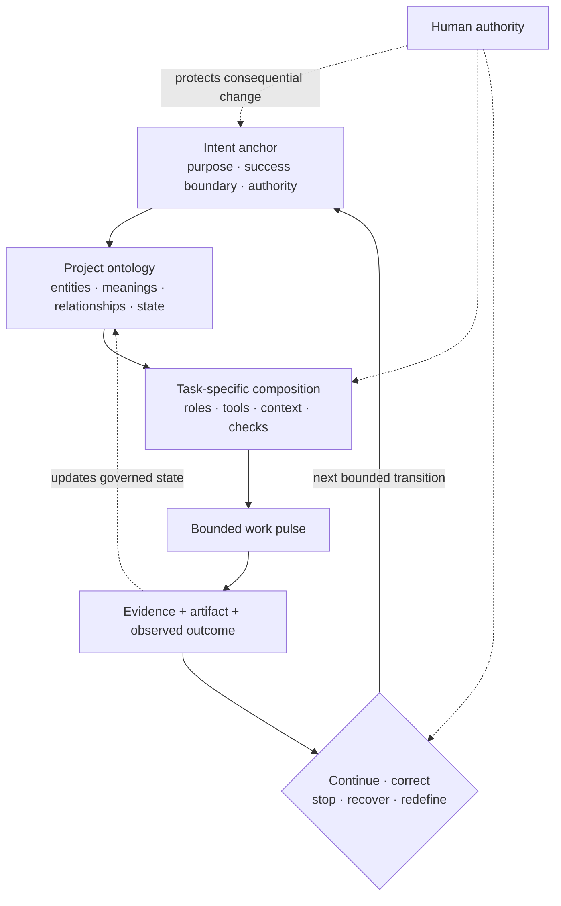

# Intent-to-Outcome Engineering: A Working Thesis on Durable Agentic Systems

> **Status:** working thesis for the unreleased `v0.3.0-rc.2` candidate.
> This document develops an engineering model from project observations and
> external comparison. It is not a formal control-theory result, a claim of
> invention, or a description of everything implemented in Azoth.

## The engineering failure comes first

An agent can complete the visible work and still fail the outcome. It can find
the right file, make a plausible change, pass a local check, and report success
while the larger system has lost the original purpose, used the wrong business
meaning, crossed an authority boundary, or optimized a proxy.

I call this **narrow success with broad failure**. The failure becomes more
likely as work crosses research, planning, implementation, evaluation, tools,
people, and separate context windows. A conversation is useful working state,
but it is a fragile place to preserve the reason the work exists.

**Observation.** In production conversational AI, reliable behaviour depended
on much more than a capable model response: governed definitions, scoped tools,
operational state, measurement, human gates, and recovery all affected whether
the workflow served its purpose.

**Observation.** In operational data work, technically valid queries were not
enough. Grain, lineage, ownership, exception rules, publication state, and the
decision the metric supported were part of correctness.

**Engineering inference.** The useful unit of design is therefore wider than a
prompt, model call, agent persona, or transcript. It is the coupled path that
turns a purpose into an observed outcome while preserving meaning and
authority.

## Three different units are often called an agent

The word *agent* hides distinctions that matter in architecture reviews.

| Unit | Working definition | What may persist |
|---|---|---|
| **Model invocation** | One probabilistic inference over instructions and selected context, optionally producing tool calls | Nothing beyond the returned result unless another component records it |
| **Bounded work pulse** | A finite episode of research, building, critique, or evaluation with an explicit input, effect boundary, and return condition | Evidence, artifacts, decisions, and proposed state changes |
| **Durable agentic system** | A coupled human-and-technical system that coordinates pulses around persistent purpose, success criteria, state, authority, feedback, and recovery | The governed outcome model and its inspectable history |

[OpenAI's Agents SDK](https://openai.github.io/openai-agents-python/agents/)
defines an agent close to the first two units: an LLM configured with
instructions, tools, and optional runtime behaviour such as handoffs,
guardrails, and structured outputs. [Anthropic's engineering
guide](https://www.anthropic.com/engineering/building-effective-agents)
distinguishes predefined workflows from agents whose LLM dynamically directs
its process and tool use. Both are useful implementation definitions. This
thesis asks a different systems question: what has to surround those runs for
intent to survive and outcomes to remain governable over time?

## The persistent anchor is purpose plus success boundary

The anchor is not a frozen task list. Plans should change when the system learns
something important. Even the stated goal may need explicit refinement.

The durable anchor is:

- **purpose** — why the work exists and for whom;
- **success boundary** — what acceptable completion, failure, and non-goals
  mean;
- **constraints and authority** — what the system may decide or change, and
  what remains human-owned; and
- **revision lineage** — what changed in the interpretation of the goal, on
  what evidence, and with whose authority.

**Working hypothesis.** If purpose and the success boundary are represented as
first-class, reviewable state, useful detours can change the plan without
silently replacing the outcome.

## Ontology is project-local operational meaning

Here, *ontology* means the explicit working model a system uses to distinguish
the things that matter: outcomes, questions, evidence, decisions, tasks,
artifacts, owners, states, dependencies, and permitted transitions. It also
includes domain meaning such as metric grain, policy scope, exception rules, or
the difference between a draft and a released artifact.

**Observation.** Reusing generic bootloader and verification practices across
an operational-data migration and a local data-request project was valuable,
but each project still required its own vocabulary, sources of truth, and
success rules.

**Engineering inference.** A reusable harness should carry thin coordination
contracts, not flatten project meaning into a universal schema. Project-local
ontology should remain near the work. A pattern should move across projects
only after evidence shows what is genuinely reusable and what must stay local.

This is deliberately weaker than claiming that one formal ontology can encode
all organizational work. The model is useful only when its representations
improve decisions, handoffs, evaluation, or recovery.

## Composition should follow the task

Stable org-chart simulations are a poor default architecture for agent work.
The useful processing functions depend on the current uncertainty and effect
boundary.

A task may need:

- one model invocation with a deterministic tool;
- separate research and implementation contexts;
- independent critique with a different evidence view;
- parallel exploration whose results are reconciled;
- a human decision before a consequential transition; or
- no agentic loop at all because a deterministic program is sufficient.

**Engineering inference.** Roles are temporary processing functions, not
people. A *researcher*, *architect*, *builder*, or *reviewer* earns its place
through isolation, different context, different authority, parallelism, or an
independent evaluation—not through the label itself.

Typed handoffs are useful when they preserve the receiving function's real
input contract: purpose, current evidence, unresolved questions, accepted
decisions, authority, expected artifact, and return condition. They are harmful
when they become ceremony that paraphrases the same state through multiple
files and prompts.

**Working hypothesis.** Task-specific composition will outperform a fixed
multi-agent graph when task shapes vary, provided the system can make handoff
loss, latency, cost, and outcome quality observable.

## Feedback is nested, not singular

A durable system needs more than a final answer score. Feedback occurs at
several timescales:

1. **Within a model invocation:** tool results and local checks condition the
   next action.
2. **Within a bounded pulse:** the artifact and trajectory are checked against
   the pulse's contract.
3. **Across an outcome:** evidence, decisions, and observed state determine the
   next safe transition.
4. **Across repeated work:** recurring failures may justify a change to
   instructions, tools, schemas, tests, or architecture.
5. **Across model and environment change:** previously useful machinery may
   become redundant or harmful.

**Observation.** Trajectories explain how a result was reached, while end-state
readback shows what actually changed. Either can look healthy while the other
reveals failure.

**Engineering inference.** Evaluation should join behaviour, artifact quality,
real outcome, operator friction, and recovery. No one metric should silently
stand in for the success boundary.

## Learning should be externalized and governed

This thesis does not use *learning* to imply online weight updates or
unreviewed self-modification. The practical learning surface is external:

- repository documentation and source-of-truth maps;
- schemas, typed state, and handoff contracts;
- tools and deterministic invariants;
- examples, tests, graders, and representative cases;
- retained trajectories and outcome receipts; and
- reviewed promotion or removal of recurring patterns.

**Observation.** OpenAI's [harness-engineering
account](https://openai.com/index/harness-engineering/) treats repository
knowledge as the system of record, uses a short map into deeper sources, and
encodes stable feedback into documentation and tooling. The
[Meta-Harness paper](https://arxiv.org/abs/2603.28052) tests an outer loop that
searches harness code using source, scores, and prior execution traces exposed
through a filesystem.

**Engineering inference.** Durable improvement can be represented as governed
changes to the environment around model calls. Capturing an episode is not the
same as accepting a policy; promotion requires provenance, repeated evidence,
and the appropriate human decision.

**Research horizon.** Automated harness evolution may make some architecture
self-tuning, but it raises a second-order alignment problem: which outcome,
cost, and authority constraints govern the optimizer itself?

## Human authority is part of the architecture

Human-in-the-loop cannot mean “ask a person whenever the system is nervous.”
The human role should correspond to legitimate ownership or consequence.

Examples include:

- defining or changing purpose and success criteria;
- resolving ambiguous business meaning;
- authorizing external, irreversible, sensitive, or high-impact effects;
- accepting trade-offs that cannot be reduced to a technical metric;
- promoting experience into durable policy; and
- deciding whether a public or production release should exist.

**Engineering inference.** A useful human gate presents a decision surface with
the evidence, alternatives, uncertainty, and exact effect. A gate that merely
adds approval latency without changing authority or judgment is ceremony, not
control.

## Architectural subtraction is a first-class move

Every instruction layer, memory mechanism, retriever, role, router, state file,
and gate is a hypothesis about a failure the model and environment cannot
handle unaided. Those hypotheses can be correct, project-specific, or made
obsolete.

**Observation.** The internal framework accumulated typed roles, multi-stage
pipelines, duplicated continuity surfaces, model tiers, memory layers, and
promotion machinery. Some controls protected real boundaries. Others competed
for context, restated volatile truth, or made the system reconstruct its own
harness before addressing the task. A later project-local contraction retained
domain validation and human authority while removing broad generic machinery.

**Engineering inference.** Complexity should carry a burden of proof. A
component earns its cost when representative work shows an improvement in the
success boundary that exceeds its context, latency, maintenance, handoff, and
failure costs.

This is not minimalism as an aesthetic rule. Removing a useful invariant can be
as damaging as adding a redundant agent. The missing discipline is the
counterfactual: compare the system with and without the component when that can
be done safely.

## Counterarguments that could change the model

| Counterargument | Why it matters | What evidence would change the thesis |
|---|---|---|
| Strong models plus long context make durable outcome state unnecessary | Custom state may create more drift than it prevents | Representative long-running work where transcript-native continuity matches or exceeds explicit outcome state on correctness, recovery, and operator effort |
| A standard ontology improves interoperability more than project-local models | Local meaning can become expensive fragmentation | Cross-domain deployments where a shared schema preserves semantics without large exception layers or lower decision quality |
| Fixed role pipelines are easier to govern than adaptive composition | Predictability can outweigh flexibility in regulated or repetitive work | Stable tasks where fixed graphs consistently reduce failure and total cost without hiding handoff loss |
| Externalized learning becomes bureaucracy | Promotion systems can accumulate stale rules and review queues | Evidence that direct model/tool improvement resolves recurring failures faster and more safely than governed repository change |
| Human gates are a scalability bottleneck | Poorly placed approval can erase the value of automation | Cases where authority can be delegated structurally with equivalent accountability, reversibility, and outcome quality |
| Architectural subtraction merely shifts complexity into prompts or people | A smaller repository is not necessarily a simpler system | Whole-system measurements showing that removed machinery lowered visible code but raised operator burden, latent risk, or recovery time |

## Falsifiable questions

The thesis should become narrower or change if evidence answers these poorly:

1. Does an explicit intent anchor reduce broad failure on multi-stage tasks
   compared with ordinary conversation history and native compaction?
2. Which fields in an outcome model predict better decisions, and which only
   create maintenance cost?
3. Can a useful detour be detected and returned to the parent outcome without
   a brittle universal graph?
4. When do typed handoffs improve independent reasoning, and when do they lose
   information that one continuous context would preserve?
5. Can task-specific role composition beat a strong single-agent baseline on
   quality, latency, cost, and recoverability?
6. What evidence is sufficient to promote a project-local pattern, and how
   often should promoted patterns be removed?
7. How should automated harness search respect human authority and avoid
   optimizing a proxy success envelope?
8. Which system properties remain necessary as models, tool APIs, context
   windows, and native runtimes improve?

## Research agenda

**Research horizon.** The next useful work is empirical rather than more
taxonomy:

- create benchmark tasks with plausible narrow-success/broad-failure paths;
- compare transcript-only, compact-intent-anchor, and richer outcome-state
  conditions;
- measure handoff loss and context competition in single- and multi-agent
  variants;
- record outcome quality, trajectory quality, cost, latency, human effort, and
  recovery time together;
- test promotion and subtraction decisions against held-out tasks; and
- examine how authority contracts behave under partial failure and model
  change.

The current [executable proof](PERSONAL_HARNESS_OS.md) is intentionally smaller:
it implements effect-aware routing, bounded context, explicit authority and
stopping state, plus no-write rehearsal. The historical evidence and
architectural evolution are recorded separately in [*Narrow Success, Broad
Failure*](case-studies/narrow-success-broad-failure.md).

## Source and comparison lineage

These sources calibrate the thesis; none establishes Yiwei's project experience
or proves Azoth's design.

| Source | What it contributes here | What it does not establish |
|---|---|---|
| [OpenAI Agents SDK](https://openai.github.io/openai-agents-python/agents/) | A prevailing implementation definition built around an LLM, instructions, tools, runtime behaviour, handoffs, and guardrails | That an agent instance is the correct durable unit of an outcome |
| [Anthropic, *Building Effective Agents*](https://www.anthropic.com/engineering/building-effective-agents) | The workflow/agent distinction and an engineering preference for the simplest sufficient composition | Azoth's intent anchor or project ontology |
| [OpenAI, *Harness engineering*](https://openai.com/index/harness-engineering/) | Repository knowledge as system of record, short maps into deeper truth, architectural invariants, and feedback loops | A universal repository layout or proof that Azoth's contracts are optimal |
| [Meta-Harness](https://arxiv.org/abs/2603.28052) | Evidence that harness code can be optimized using source, scores, and prior execution traces | Safe autonomous policy promotion or general outcome alignment |
| [Distributed cognition](https://escholarship.org/uc/item/8sb9s5rm) | A systems lens for cognition distributed across people, representations, and artifacts | That software-agent architecture is literally a cognitive theory |
| [Clark and Chalmers, *The Extended Mind*](https://web.ics.purdue.edu/~drkelly/ClarkChalmersTheExtendedMind1998.pdf) | A lens for treating tightly coupled external state as causally important to a process | A direct engineering specification for durable agentic systems |
| [Facility](https://github.com/theam/Facility) | An external comparison with explicit roles, human plan approval, repository/CI checks, receipts, and outcome monitoring | Yiwei's project experience, Azoth lineage, or validation of Facility's own product claims |

Facility is included only as a current external comparison. I have not worked on
the project, and its public design is not presented as evidence for the internal
Agentic Framework or Azoth.

## Working conclusion

**Working hypothesis.** A durable agentic system is best treated as an
intent-to-outcome engineering system: model invocations and tools perform
bounded work inside a larger, inspectable loop of purpose, project meaning,
authority, evidence, evaluation, and revision.

The idea should survive only if it improves real work. Its strongest form is
not a grand ontology or a large harness. It is the discipline to keep intent
and success explicit, compose the smallest sufficient system for the task,
externalize learning without surrendering human authority, and subtract
machinery when evidence no longer justifies it.
