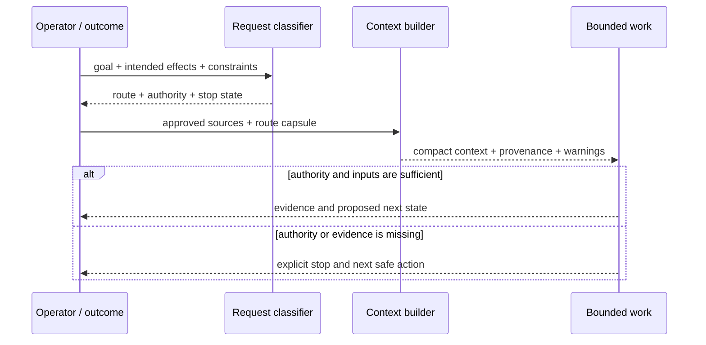

# Executable Proof: Routing, Context, and Authority

> **Status:** implemented and tested proof slice for `v0.3.0-rc.2`.
> It contains selected routing, context, and no-write rehearsal contracts. It
> is not the definition of Azoth, a complete operating system, or evidence of
> external adoption.

This implementation was developed under the working name **Personal Harness
OS**. The name is retained in file and API paths for provenance, but it is too
broad for the public claim. What exists here is better understood as one compact
experiment: can the system make effect, context, authority, and stopping state
explicit without forcing every task through a large orchestration framework?

The candidate includes:

- a deterministic request classifier;
- a typed route capsule;
- bounded, source-referenced context assembly;
- a generic no-write rehearsal runner with four representative cases; and
- 30 portable public tests across the selected contracts.

For the historical evidence and architectural lineage, start with [*Narrow
Success, Broad Failure*](case-studies/narrow-success-broad-failure.md). For the
evolving model this proof is intended to test, read [*Intent-to-Outcome
Engineering*](INTENT_TO_OUTCOME_ENGINEERING.md).

## What problem this slice tests

A useful agent thread often discovers something the initial plan did not
contain: an undefined business term, a contradictory dependency, an unverified
assumption, or a new risk. Investigating it is correct. Allowing that
investigation to silently inherit write authority or replace the original
outcome is not.

This slice tests the minimum transition contract around a bounded pulse of work:



The classifier does not execute work or grant authority. The context packet does
not turn retrieved information into governing instruction. The rehearsal does
not mutate the repository. Each concern remains small enough to inspect.

## What it demonstrates—and what it does not

| Capability | Candidate status | Evidence |
|---|---|---|
| Effect- and risk-aware routing | Implemented and tested | `HarnessRequest`, `HarnessDecision`, `RouteCapsule` |
| Compact context with source pointers and missing-source warnings | Implemented and tested | `build_context_view`, `build_personal_harness_context` |
| Read-only route rehearsal with mutation detection | Implemented and tested | rehearsal runner, four-case fixture, no-write check |
| Research sufficiency and knowledge-richness assessment | Related machinery is inspectable; not validated here as one product journey | [`research_sufficiency.py`](../scripts/research_sufficiency.py), [`proposal_knowledge_richness.py`](../scripts/proposal_knowledge_richness.py) |
| Stage-aware handoffs and delivery pipeline | Part of the wider Azoth lineage; outside this proof slice | [pipeline overview](playbook/01-pipeline-overview.md), [session lifecycle](playbook/03-session-lifecycle.md) |
| Durable intent-to-outcome system spanning many work pulses | Working thesis; not claimed as fully implemented | [working thesis](INTENT_TO_OUTCOME_ENGINEERING.md) |

The distinction is deliberate. A desired operating experience is not evidence
that every layer exists. This page documents only the small surface a reviewer
can run and inspect now.

## Public interfaces

### `HarnessRequest` and `classify_harness_request`

`HarnessRequest` captures the goal, intended actions, planned paths, trace
requirements, success criteria, constraints, and relevant repository
conditions. `classify_harness_request` maps the request into one operating mode
using the existing side-effect classifier rather than duplicating risk logic.

The classifier is advisory and deterministic. It does not execute tools, grant
authority, or mutate project state.

### `HarnessDecision` and `RouteCapsule`

The decision contains the selected profile plus the operator promise,
exclusions, escalation reasons, source references, and a route capsule. The
capsule makes the transition state explicit:

- selected profile;
- side-effect class;
- route state;
- whether fresh authority is required;
- authority plane;
- required inputs;
- next safe action; and
- stop reason, when applicable.

This prevents a friendly interface from hiding a missing approval or turning a
recommendation into write authority.

### `build_context_view`

The context builder joins only the approved summaries needed for the selected
route:

- the route capsule;
- compact memory results;
- optional approved personal context;
- a project receipt or readback; and
- explicit forbidden actions.

Raw memory entries are filtered. Missing optional sources stay missing or
produce warnings; they are not invented. Context entries retain source pointers
so the caller can inspect their authority and freshness.

### `build_personal_harness_context`

The integration function classifies the request, asks existing recall
components for bounded results, adds optional project state, and returns one
JSON-serialisable packet. It is read-only by default.

## Mode ladder

| Mode | What it provides | What it must not imply |
|---|---|---|
| `guide` | Orientation, explanation, and decision support | Project mutation or planning-state ownership |
| `assisted` | Selected tools, skills, agents, and focused checks | Hidden roadmap ownership or no-human-gate continuation |
| `managed` | Project-local operating and planning state | Authority inherited from another repository |
| `governed_autonomy` | Campaign-bounded continuation | Open-ended loops or action without budget and stop conditions |

`managed` and `governed_autonomy` stop when fresh authority is missing. The
ladder exposes consequence; it is not a mechanism for bypassing control.

## Example route

With the repository's `scripts/` directory on the Python import path:

```python
from harness_profile import HarnessRequest, classify_harness_request

decision = classify_harness_request(
    HarnessRequest(
        goal="Verify the project before changing its release workflow.",
        requested_actions=("focused_verification",),
        planned_paths=("release/",),
        trace_required=True,
    )
)

print(decision.to_route_capsule())
```

The result is a decision packet, not an execution request. A caller can display
it, use it to select bounded tooling, or stop for the authority it names.

## Context selection contract

The implementation uses pointer-style progressive disclosure:

1. Begin with the goal, intended effects, and route.
2. Add a small number of relevant summaries with source references.
3. Inspect the underlying source only when the current decision needs it.
4. Keep raw evidence at its origin instead of copying it into every context.
5. Append session evidence separately from durable policy.
6. Let a separate review decide whether repeated evidence deserves promotion.

This differs from injecting a full instruction manual or memory dump at
startup. It does not reject retrieval: indexed retrieval is appropriate when a
measured information problem justifies it.

## Authority and recovery

The proof distinguishes four concerns:

- **advice** — may be generated without write authority;
- **project-local effects** — require authority owned by the target project;
- **governed continuation** — requires a budget, evidence ledger, write claim,
  and stop conditions; and
- **protected or external effects** — stop for direct human authority.

Crossing from one concern to another is an explicit transition. Authority in a
toolkit never silently grants authority inside a project. Git checkpoints,
manifests, deterministic validation, and rollback paths remain the preferred
recovery mechanisms for file-backed work.

## Portable rehearsal

The candidate contains three portable pieces:

1. A generic runner that accepts a case file and returns a JSON-serialisable
   report.
2. Four consumer-facing cases at
   `examples/personal-harness/rehearsal-cases.yaml`.
3. A focused no-write rehearsal test wired into public CI.

Each case declares its goal, intended effects, context, expected route,
authority requirement, and warnings. The runner executes the same public
classifier and context builders, fingerprints repository state before and
after, and fails if the contract or no-write expectation is violated.

This is behavioural evidence, not a second orchestration layer.

## Validation contract

The release candidate runs the focused public tests:

```bash
python3 -m pytest \
  tests/test_harness_profile.py \
  tests/test_context_view.py \
  tests/test_personal_harness_context.py \
  tests/test_personal_harness_practice_rehearsal.py \
  -q
```

They cover lightweight and consequential routing, explicit authority stops,
deterministic route capsules, bounded context, raw-memory filtering,
optional-source warnings, project-receipt handling, and repository no-write
behaviour.

The complete extracted tree must also pass its fail-closed boundary, privacy,
credential-pattern, manifest, release-evidence, and local-reference checks.

## Public preview boundary

This proof slice intentionally excludes:

- private operator or project data;
- machine-specific paths and repository names;
- private cockpit and daily-flow adapters;
- workshop campaigns, memories, receipts, and release evidence;
- credentials, tokens, and external-system configuration;
- installer or cross-host support claims; and
- any claim that Azoth is a finished universal harness or externally adopted
  product.

The selected interfaces define the `v0.3.0-rc.2` preview boundary. They are not
a general backward-compatibility promise for later previews.

## Open questions

- Which parts of the mode language remain useful after more capable models and
  native agent runtimes absorb work the classifier currently makes explicit?
- Which applications need indexed retrieval beyond ordinary file and tool
  discovery?
- How should project-specific improvements be evaluated before being promoted
  into a shared contract?
- Can higher-level coordination emerge safely from accumulated trajectories
  without turning experience into unreviewed policy?

The value of this slice is therefore modest but concrete: it makes a few
important transition properties executable and inspectable. Its deeper role in
Azoth is as evidence—one experiment in a longer inquiry about preserving intent,
context, authority, and feedback across complex agent-assisted work.

Return to the [case-study evidence](case-studies/narrow-success-broad-failure.md)
or continue with the [working thesis](INTENT_TO_OUTCOME_ENGINEERING.md). These
documents provide lineage and interpretation; they do not expand this proof's
implementation claim.
