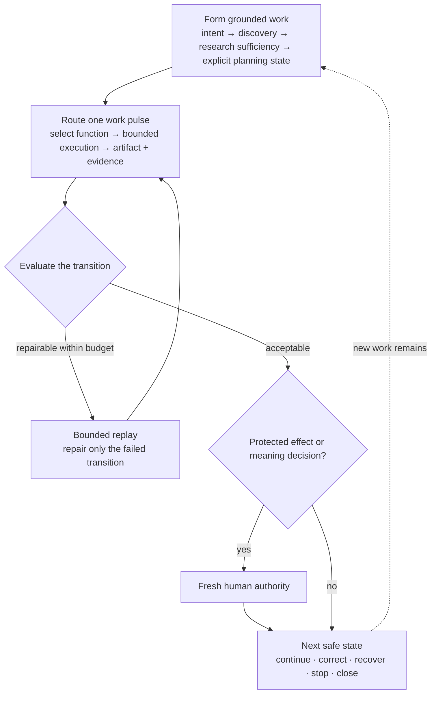
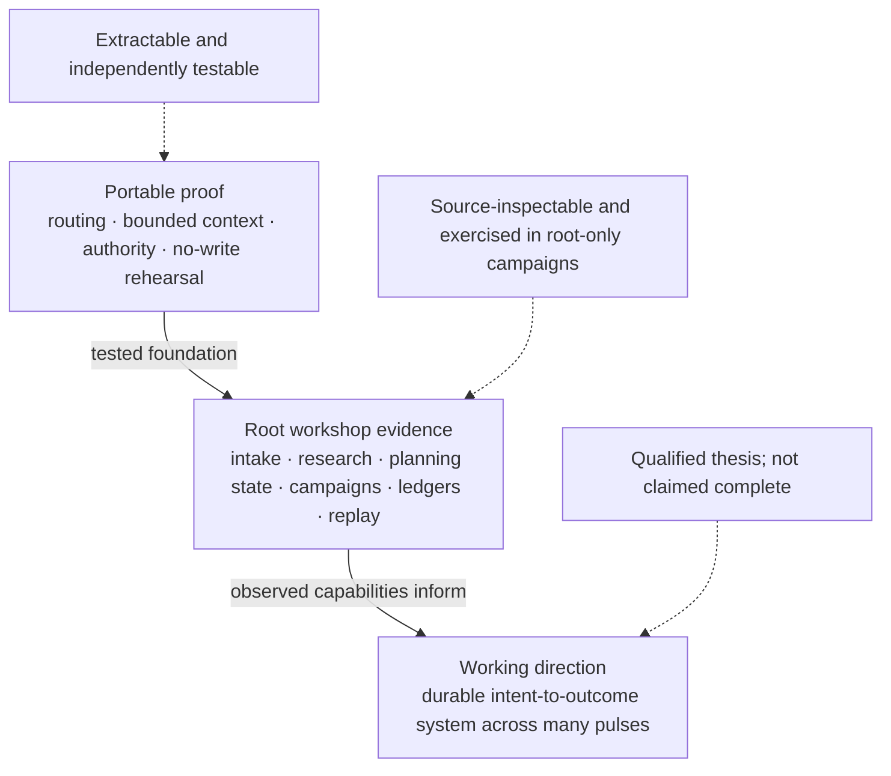
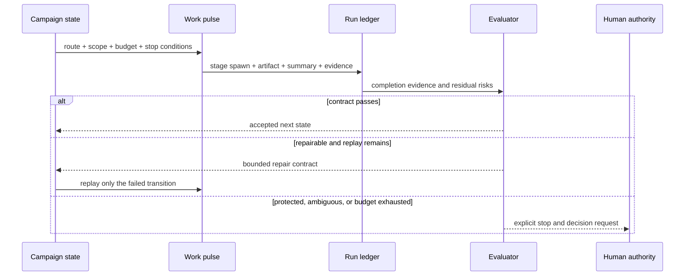
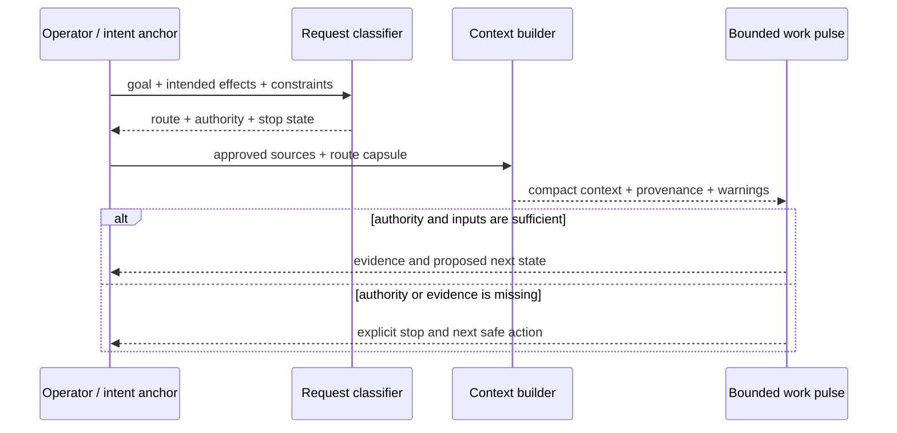

# Executable Proof: Routing, Context, and Authority

> **Status:** implemented and tested proof slice for `v0.3.0-rc.2`.
> The extracted candidate contains selected routing, context, and no-write
> rehearsal contracts. The wider root workshop contains additional working
> capabilities, but they are not claimed here as one finished public product.

This implementation was developed under the working name **Personal Harness
OS**. The name remains in file and API paths for provenance. The public claim is
more precise: this page shows the composite operator journey being assembled
across the wider Azoth workshop, what has been observed in real root campaigns,
and which small slice is independently extractable and tested.

For the project history, read [*Narrow Success, Broad
Failure*](case-studies/narrow-success-broad-failure.md). For the evolving model
behind the work, read [*Intent-to-Outcome Engineering*](INTENT_TO_OUTCOME_ENGINEERING.md).

## The operator journey being assembled

The design target is not “chat with an agent and hope the conversation remains
coherent.” It is to give a durable system an outcome and let it progressively
form, route, verify, and revise the work while keeping important transitions
visible. The diagram composes capabilities that currently exist at different
evidence levels; it is not a claim that one public command executes the whole
journey.



Across the root workshop, separate capabilities can support product-management
decisions as well as execution control. They can compare initiative and
proposal lanes, distinguish discovery from hydration and delivery, require
research before opening work, preserve rejected alternatives, form a decision
capsule, and keep roadmap or release authority separate from a recommendation.

The practical leverage is not hidden autonomy. It is the ability to carry
intent through many intermediate states without making a person manually
reconstruct the whole path at every thread boundary.

## Three evidence bands



| Evidence band | What exists | Claim limit |
|---|---|---|
| **Portable proof** | Deterministic effect-aware routing, typed stopping state, bounded source-referenced context, and four-case no-write rehearsal | Implemented and tested in the extracted RC2 candidate |
| **Root workshop evidence** | Raw initiative intake, research sufficiency, knowledge assessment, initiative and roadmap scaffolding, run ledgers, campaign routing, stage evidence, evaluation, and bounded replay | Separate capabilities exercised in root-only work; not exported as one validated product journey |
| **Working direction** | A durable system that can carry an outcome across discovery, research, planning, delivery, evaluation, correction, and later sessions | Thesis and target experience; not a completion or deployment claim |

This distinction prevents an attractive user journey from becoming evidence
that every transition is already integrated, portable, and production-ready.

## What the wider root workshop can do today

### 1. Turn raw intent into a bounded discovery seed

`initiative_intake.py` validates an operator’s purpose, success criteria,
uncertainty, and protected boundaries. Its authorized output is a planning seed,
not a hydrated roadmap or executable task. This lets the system begin forming
work without quietly converting an exploratory idea into delivery authority.

### 2. Decide whether research can be reused

`research_sufficiency.py` derives required questions from the goal and checks a
repo-local research capsule for coverage, freshness, conflicts, limitations,
and traceability. It can return `research_missing`,
`research_refresh_needed`, or `research_sufficient` instead of allowing a plan
to treat any research-shaped document as adequate grounding.

`proposal_knowledge_richness.py` adds an advisory assessment of evidence
breadth, source quality, traceability, alternatives, specificity, validation,
freshness, and replay value. It informs judgment; it does not grant authority.

### 3. Materialize planning state without hiding ownership

`initiative_scaffold.py` can create an initiative and planned task stubs.
`roadmap_scaffold.py` can create or hydrate roadmap, backlog, and specification
state while refusing identifier collisions and duplicate hydration. The
resulting files remain explicit project-owned state rather than invisible model
memory.

This is where the system begins to feel like product-management infrastructure:
intent becomes inspectable initiative and task state, while discovery,
hydration, delivery, packaging, and release remain different transitions.

### 4. Route bounded work pulses through a campaign

`autonomous_loop.py` can initialize a campaign envelope, decide or open the
next route, report current campaign state, audit evidence, and stop. Campaigns
declare a child budget, bounded replay allowance, permitted action classes, and
protected effects.

The next pulse can be research, proposal refinement, implementation, review,
or evaluation. The route is chosen from current state; a broad campaign does
not make every child broad.

### 5. Require real execution evidence

`run_ledger.py` records durable runs, write claims, spawned stages, stage
summaries, artifacts, and completion gates. A stage name in a summary is not
enough: campaigns can require paired evidence that the stage actually ran.

That distinction matters when a plausible inline explanation would otherwise
make a multi-role pipeline look executed even though no independent stage
occurred.

### 6. Evaluate, repair within budget, or stop

Campaign evidence can be evaluated against a declared contract. A failure can
open a bounded repair pulse and then return to evaluation. Exhausted replay,
missing authority, or an out-of-scope effect produces a stop rather than an
open-ended self-healing loop.



## What observed campaigns add

Root-only receipts show the machinery being used, not merely described:

| Observation | Engineering value | Public limit |
|---|---|---|
| A product-strategy campaign compared initiative and proposal lanes, distinguished discovery, hydration, delivery, packaging, and protected release work, and produced auditable decision artifacts | The orchestration can support product choices before opening delivery | It did not authorize roadmap rephasing, release, or commit |
| A campaign that had relied on inline completion evidence was rejected and rerun with real role-specific stage evidence | The ledger can make “the stage actually ran” part of completion | It does not prove every role improves the result |
| An evaluator found route-legibility and stale-history problems; a later bounded pulse repaired the operator-facing surface and returned it to evaluation | Evaluation can create a constrained correction loop without erasing the original failure | Internal scores are not claimed as objective outcome measures |

These examples explain the wider experience without importing root-only
campaign receipts into the extracted public artifact or presenting the workshop
as an externally adopted system.

## The portable transition experiment

The extracted candidate asks a smaller question: can one work pulse make its
effect, context, authority, and stopping state explicit without forcing every
task through the full workshop?



The classifier does not execute work or grant authority. The context packet does
not turn retrieved information into governing instruction. The rehearsal does
not mutate the repository. Each concern remains small enough to inspect.

## What the portable proof demonstrates—and what it does not

| Capability | Candidate status | Evidence |
|---|---|---|
| Effect- and risk-aware routing | Implemented and tested | `HarnessRequest`, `HarnessDecision`, `RouteCapsule` |
| Compact context with source pointers and missing-source warnings | Implemented and tested | `build_context_view`, `build_personal_harness_context` |
| Read-only route rehearsal with mutation detection | Implemented and tested | rehearsal runner, four-case fixture, no-write check |
| Research sufficiency and knowledge-richness assessment | Root workshop evidence; not validated here as one extracted journey | [`research_sufficiency.py`](../scripts/research_sufficiency.py), [`proposal_knowledge_richness.py`](../scripts/proposal_knowledge_richness.py) |
| Initiative, roadmap, and backlog formation | Root workshop evidence; separate explicit helpers | [`initiative_scaffold.py`](../scripts/initiative_scaffold.py), [`roadmap_scaffold.py`](../scripts/roadmap_scaffold.py) |
| Campaign routing, run ledgers, evaluation, and bounded replay | Root workshop evidence; root-only campaigns are excluded from the public slice | [`autonomous_loop.py`](../scripts/autonomous_loop.py), [`run_ledger.py`](../scripts/run_ledger.py) |
| Durable intent-to-outcome system spanning many work pulses | Working direction; not claimed as fully implemented | [working thesis](INTENT_TO_OUTCOME_ENGINEERING.md) |

## Public interfaces

### `HarnessRequest` and `classify_harness_request`

`HarnessRequest` captures the goal, intended actions, planned paths, trace
requirements, success criteria, constraints, and relevant repository
conditions. `classify_harness_request` maps the request into one operating mode
using the existing side-effect classifier rather than duplicating risk logic.

The classifier is advisory and deterministic. It does not execute tools, grant
authority, or mutate project state.

### `HarnessDecision` and `RouteCapsule`

The decision contains the selected profile plus the operator promise,
exclusions, escalation reasons, source references, and a route capsule. The
capsule exposes:

- selected profile and side-effect class;
- route state;
- whether fresh authority is required and which plane owns it;
- required inputs;
- next safe action; and
- stop reason, when applicable.

This prevents a friendly interface from hiding a missing approval or turning a
recommendation into write authority.

### `build_context_view`

The context builder joins only approved summaries needed for the route:

- the route capsule;
- compact memory results;
- optional approved personal context;
- a project receipt or readback; and
- explicit forbidden actions.

Raw memory entries are filtered. Missing optional sources remain missing or
produce warnings; they are not invented. Context entries retain source pointers
so callers can inspect authority and freshness.

### `build_personal_harness_context`

The integration function classifies the request, asks existing recall
components for bounded results, adds optional project state, and returns one
JSON-serializable packet. It is read-only by default.

## Mode ladder

| Mode | What it provides | What it must not imply |
|---|---|---|
| `guide` | Orientation, explanation, and decision support | Project mutation or planning-state ownership |
| `assisted` | Selected tools, skills, agents, and focused checks | Hidden roadmap ownership or no-human-gate continuation |
| `managed` | Project-local operating and planning state | Authority inherited from another repository |
| `governed_autonomy` | Campaign-bounded continuation | Open-ended loops or action without budget and stop conditions |

`managed` and `governed_autonomy` stop when fresh authority is missing. The
ladder exposes consequence; it is not a mechanism for bypassing control.

## Example route

With the repository’s `scripts/` directory on the Python import path:

```python
from harness_profile import HarnessRequest, classify_harness_request

decision = classify_harness_request(
    HarnessRequest(
        goal="Verify the project before changing its release workflow.",
        requested_actions=("focused_verification",),
        planned_paths=("release/",),
        trace_required=True,
    )
)

print(decision.to_route_capsule())
```

The result is a decision packet, not an execution request. A caller can display
it, select bounded tooling, or stop for the authority it names.

## Context selection contract

The implementation uses pointer-style progressive disclosure:

1. Begin with the goal, intended effects, and route.
2. Add a small number of relevant summaries with source references.
3. Inspect the underlying source only when the current decision needs it.
4. Keep raw evidence at its origin instead of copying it into every context.
5. Append session evidence separately from durable policy.
6. Let a separate review decide whether repeated evidence deserves promotion.

This differs from injecting a full instruction manual or memory dump at
startup. It does not reject retrieval: indexed retrieval is appropriate when a
measured information problem justifies it.

## Authority and recovery

The proof distinguishes four concerns:

- **advice** — may be generated without write authority;
- **project-local effects** — require authority owned by the target project;
- **governed continuation** — requires a budget, evidence ledger, write claim,
  and stop conditions; and
- **protected or external effects** — stop for direct human authority.

Crossing from one concern to another is an explicit transition. Authority in a
toolkit never silently grants authority inside a project. Git checkpoints,
manifests, deterministic validation, and rollback paths remain the preferred
recovery mechanisms for file-backed work.

## Portable rehearsal

The candidate contains:

1. a generic runner that accepts a case file and returns a JSON-serializable
   report;
2. four consumer-facing cases at
   `examples/personal-harness/rehearsal-cases.yaml`; and
3. a focused no-write rehearsal test wired into public CI.

Each case declares its goal, intended effects, context, expected route,
authority requirement, and warnings. The runner exercises the same public
classifier and context builders, fingerprints repository state before and
after, and fails if the transition contract or no-write expectation is
violated.

This is behavioral evidence, not a second orchestration layer.

## Validation contract

The release candidate runs the focused public tests:

```bash
python3 -m pytest \
  tests/test_harness_profile.py \
  tests/test_context_view.py \
  tests/test_personal_harness_context.py \
  tests/test_personal_harness_practice_rehearsal.py \
  -q
```

They cover lightweight and consequential routing, explicit authority stops,
deterministic route capsules, bounded context, raw-memory filtering,
optional-source warnings, project-receipt handling, and repository no-write
behavior.

The complete extracted tree must also pass its fail-closed boundary, privacy,
credential-pattern, manifest, release-evidence, and local-reference checks.

## Public preview boundary

This proof intentionally excludes:

- private operator or project data;
- machine-specific paths and repository names;
- private cockpit and daily-flow adapters;
- root-only campaigns, memories, receipts, and release evidence;
- credentials, tokens, and external-system configuration;
- installer or cross-host support claims;
- a claim that the workshop capabilities form one complete autonomous
  product-management journey; and
- any claim that Azoth is a finished universal harness or externally adopted
  product.

The selected interfaces define the `v0.3.0-rc.2` preview boundary. They are not
a general backward-compatibility promise for later previews.

## Open questions

- Which intermediate states make the operator experience clearer, and which
  merely recreate project truth in another format?
- How much product-management work can be automated before meaning and priority
  decisions become hidden proxy optimization?
- Which parts of the mode language remain useful as native agent runtimes absorb
  more routing and continuation behavior?
- When does indexed retrieval outperform ordinary file and tool discovery?
- How should project-specific improvements be evaluated before promotion into a
  shared contract?
- Can higher-level coordination emerge from accumulated trajectories without
  turning experience into unreviewed policy?

The value of the portable slice is modest but concrete: it makes a few
transition properties executable and inspectable. The wider workshop shows why
those properties matter and how much more of the intent-to-outcome path can be
made explicit without pretending the full system is already complete.

Return to the [case-study evidence](case-studies/narrow-success-broad-failure.md),
continue with the [working thesis](INTENT_TO_OUTCOME_ENGINEERING.md), or return
to the [project README](../README.md).
