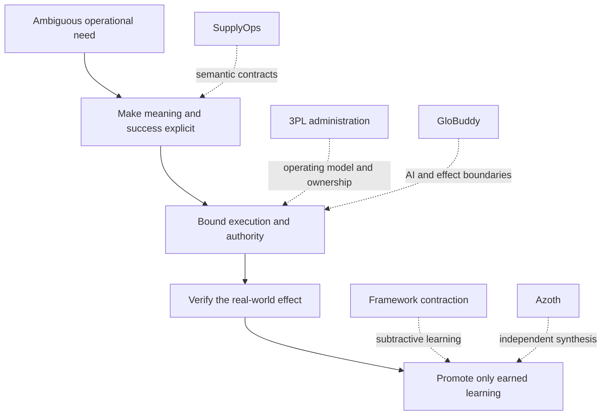
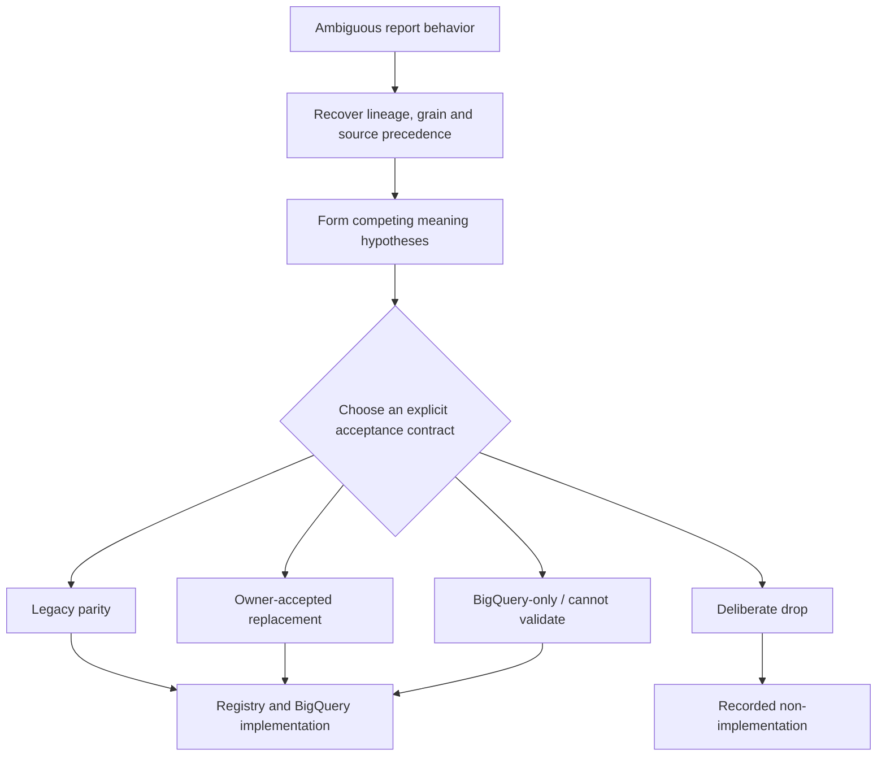
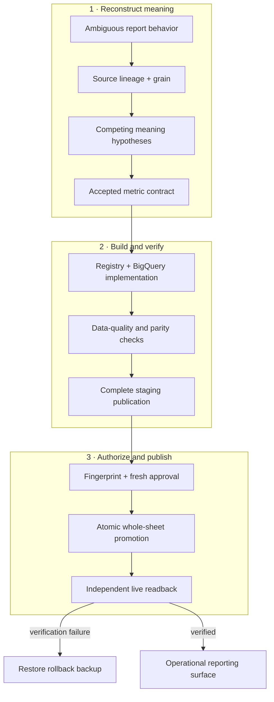
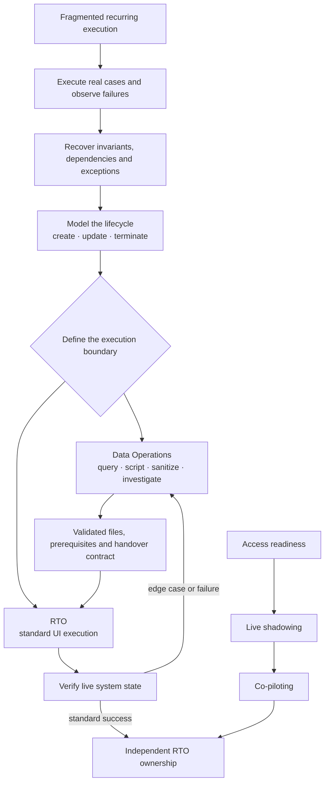
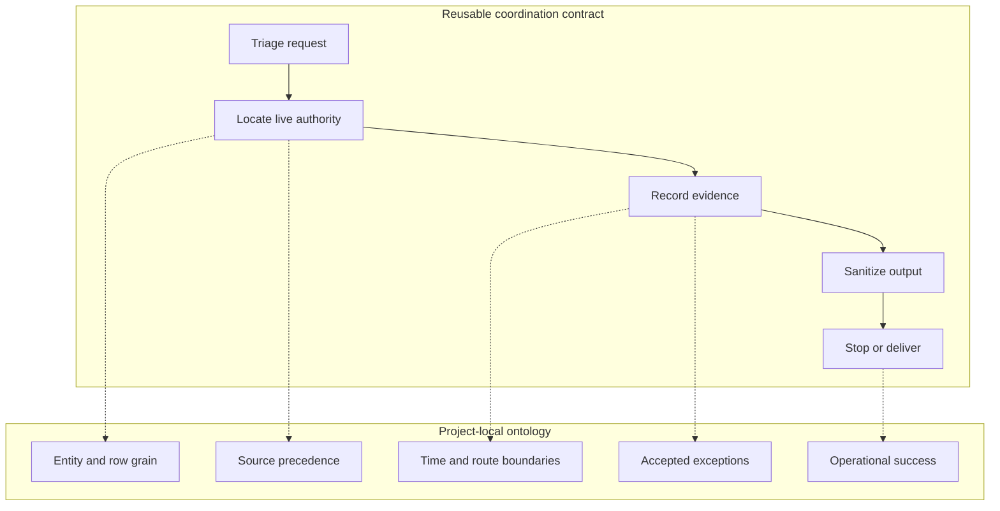
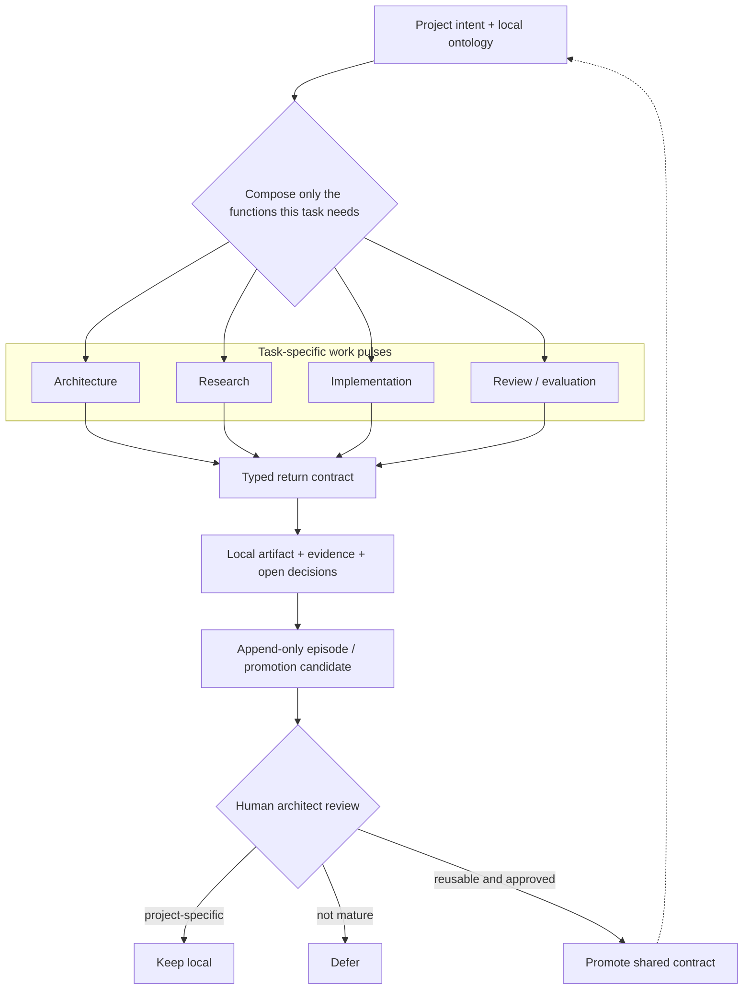
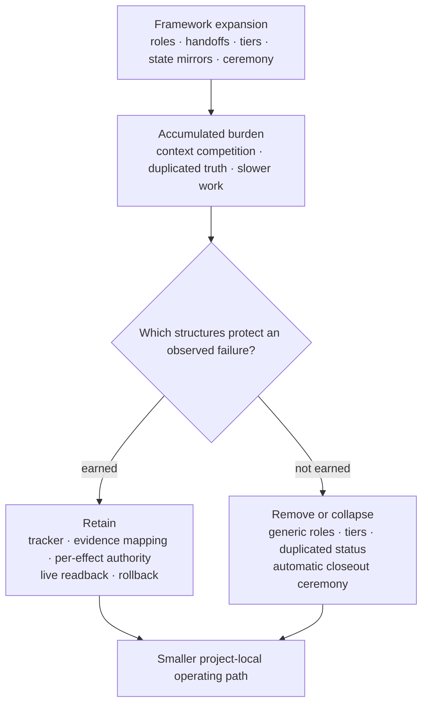
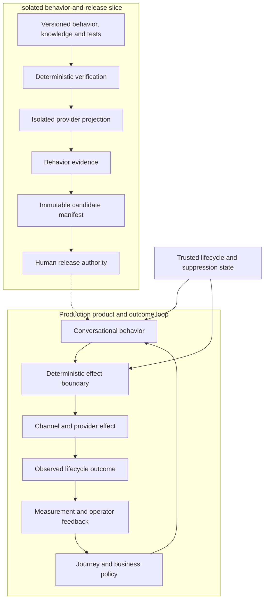
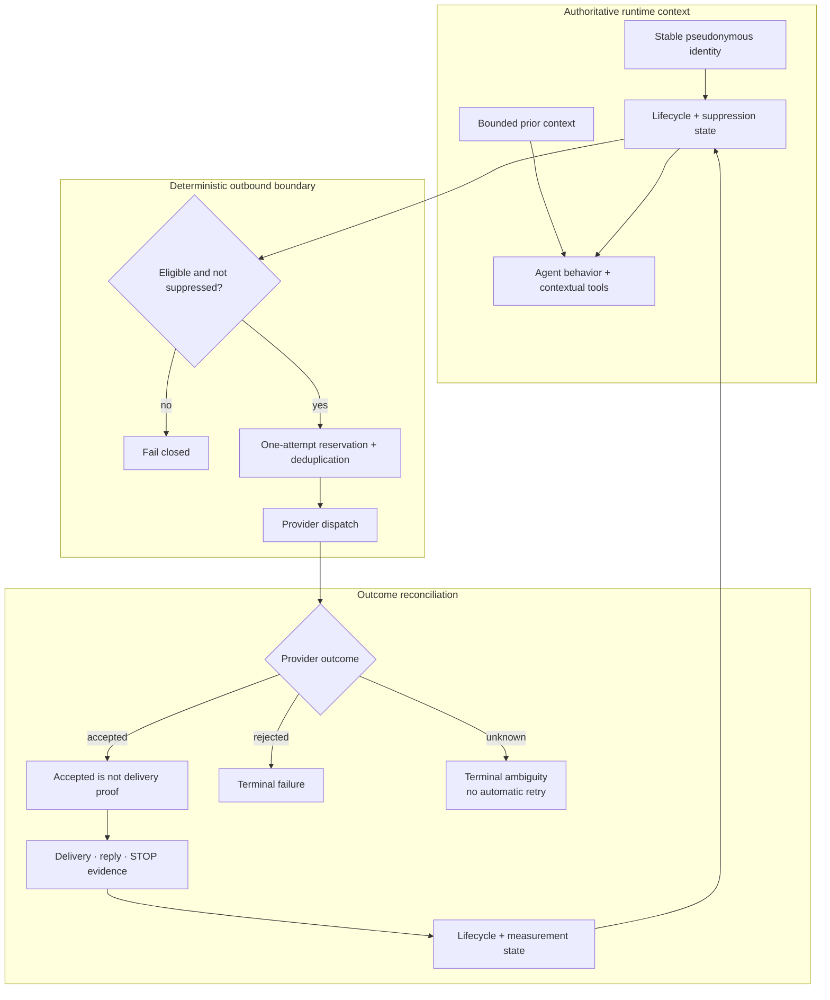

# Narrow Success, Broad Failure

*A braided chronology of operational meaning, transferable execution,
reusable coordination, and architectural contraction.*

An AI-assisted task can succeed at every visible step and still fail the work
that matters. A query runs, an artifact looks plausible, a handoff completes,
or a model gives a fluent answer—while the wider effort has lost the accepted
business meaning, original intent, authority boundary, evidence, or definition
of success.

This is a project account before it is a philosophy account. Each stage below
has two strands:

1. **the work itself**—the problem, approach, implementation, and value; and
2. **what the work revealed**—an observation or engineering inference that
   later contributed to Azoth.

The chronology begins with operational-data semantic reconstruction, not with
conversational AI. A later agent-operations system is its own case, informed by
accumulated learning but not presented as the origin or ideal realization of
the emerging philosophy.

The broader model is developed in [*Intent-to-Outcome Engineering: A Working
Thesis on Durable Agentic Systems*](../INTENT_TO_OUTCOME_ENGINEERING.md). The
piece that can be run in the public candidate is documented in [Executable
Proof: Routing, Context, and Authority](../PERSONAL_HARNESS_OS.md).

## 1. Operational reporting and BigQuery migration: meaning had to move first

### The problem

An operational reporting platform had grown through spreadsheets, dashboard
blocks, copied queries, local exceptions, and undocumented business decisions.
The migration had a canonical 50-unit scope, but the hard problem was not
translating those units into BigQuery SQL. The hard problem was determining
what each output was supposed to mean.

Two technically valid queries could disagree because they used different row
grains, source precedence, week boundaries, target definitions, aggregation
rules, or accepted exceptions. Mechanical migration would have preserved
syntax while silently changing the operational decisions the reporting system
supported.

### The approach

I treated semantic reconstruction as an engineering phase:

- trace source lineage and the grain of each metric;
- compare legacy behavior with live data and owner decisions;
- classify the acceptance contract rather than treating every difference as a
  parity bug;
- encode the accepted meaning in a metric registry and deterministic checks;
- keep each implementation tied to its migration unit and evidence; and
- separate discovery, implementation, publication, and live verification.

### Decision view

The semantic phase did not assume that every discrepancy had the same meaning.
Each unit received an explicit acceptance contract, including deliberate
non-implementation when preserving a legacy output would have reproduced a
known-invalid decision.

### Implementation view

The resulting path joined semantic contracts to a governed publication
workflow. A complete source pull and data-quality gate preceded staging.
Staging succeeded only after readback. Promotion required a deterministic plan
fingerprint and fresh authorization for the exact target and effect. Verified
candidate sheets were swapped atomically, prior sheets were retained as
rollback backups, and an independent read path checked the real workbook after
the write.

The migration ledger remained distinct from the dashboard's presentation
structure. A visible block was not treated as one migration unit, and an
apparently complete dashboard was not allowed to hide missing or unaccepted
meaning.

### Technical judgment recap

- Reconstruct meaning before translating syntax.
- Choose the acceptance contract explicitly instead of calling every
  difference a parity defect.
- Preserve missingness and deliberate drops rather than manufacturing visual
  completeness.
- Fingerprint the exact publication plan so authorization applies to the
  intended effect, not merely to a command.
- Treat atomic promotion, independent readback, and verified rollback as one
  release boundary.

### The value

The migration produced more than converted SQL. It established a recurring
operations and leadership reporting backbone spanning 22 countries, with
business meaning, implementation, publication, weekly operation, and recovery
inspectable as one path. A write response was no longer confused with verified
delivery.

**Observation.** A technically correct local transformation can create a broad
failure when its meaning or publication state is wrong.

**Engineering inference.** Business semantics, evidence, authority, and live
readback belong inside the reliability boundary—not in a separate explanatory
layer around the code.

## 2. 3PL administration: operational knowledge had to become executable

### The problem

Recurring 3PL administration crossed legal approval, company and contract
state, identity and access, applicant routing, reporting, local mappings, and
live operational tools. The real rules, naming conventions, system
dependencies, and country or company exceptions were distributed across
working knowledge and separate execution surfaces.

I initially owned and performed the live work end to end. Completing each
request solved the immediate case, but it did not make the operating model
safe, repeatable, or transferable. The broader problem was to remove dependence
on one operator without flattening the exceptions that made the work correct.

### The approach

I used direct execution as a discovery instrument:

- observe where written guidance and live system behavior diverged;
- recover the invariants, prerequisites, identities, dependencies, and
  escalation conditions;
- reorganize the work around one `create → update → terminate` lifecycle;
- separate privacy-safe data and code preparation from standard manual tool
  execution;
- define each step through its trigger, owner, input, action, output,
  verification, and escalation path; and
- deploy the new ownership model through access readiness, live shadowing,
  co-piloting, and independent execution.

### Operating-system view

The general operating Bible preserved the cross-system lifecycle and the
technical/manual boundary. The receiving-team edition then acted as a distinct
operational interface: modular procedures, explicit prerequisites, repeated
double-checklists, an access and dependency map, troubleshooting paths, and a
staged rollout. It was not merely a shorter copy of the source material.

One termination episode exposed the difference between artifact correctness
and operational truth. An initial extraction missed a target because a supplied
label did not match the live company value. After the cohort and file encoding
were repaired, a later readback still found that one generated city file had
not changed the active contract state. The process therefore had to verify the
real system effect rather than equate a generated file or accepted tool action
with completion.

### Technical judgment recap

- Model the domain as a lifecycle rather than a queue of unrelated requests.
- Expose the dependency graph across approval, identity, permissions, routing,
  reporting, and contract state.
- Divide responsibility at an executable interface: Data Operations owns
  technical preparation and deep investigation; RTO owns standard execution.
- Encode exact naming, least-privilege access, privacy-minimal outputs,
  checklists, and escalation paths as controls rather than reminders.
- Treat adoption as a release path and live-state verification as the
  completion signal.

### The value

The result was a self-service operating model spanning onboarding, information
management, and termination. End-to-end live execution moved to Real-Time
Operations, while Data Operations remained the technical escalation boundary.
The transfer removed the need to backfill the dedicated Growth workload rather
than merely moving a document to another folder.

**Observation.** Documentation can be complete while the receiving team still
cannot execute safely or prove that the intended state changed.

**Engineering inference.** Operational knowledge should be engineered as an
interface with explicit state, authority, verification, and recovery. Ownership
transfer is a governed system release, not a writing deliverable.

## 3. Local operational-data requests: reuse without semantic flattening

### The problem

Local teams also needed urgent answers when standard dashboards did not cover
an edge case. These requests varied widely: diagnose a discrepancy, extract a
bounded dataset, locate the right source, or unblock an operational decision.
Speed mattered, but a fast query at the wrong grain or time boundary could be
more misleading than no answer.

### The approach and implementation

The migration discipline became a small reusable bootloader:

`triage → choose source and tool → extract or diagnose → sanitize → deliver`

A local schema cache accelerated discovery, while live metadata remained
authoritative when it disagreed with the cache. Raw results and sensitive
payloads stayed local; only deliberately sanitized artifacts could enter the
project record.

The semantics stayed inside the request project. For example, stacked work,
route-level allocation, and cross-midnight boundaries can make several
apparently reasonable sums answer different operational questions. A generic
framework can require the analyst to identify grain and boundary conditions;
it cannot decide what those entities mean for the project.

### The value

The shared startup and verification pattern reduced repeated orientation work
without turning domain meaning into framework vocabulary. Requests could move
faster while retaining source freshness, privacy, and semantic checks.

**Observation.** The coordination discipline transferred; the business model
did not.

**Engineering inference.** A reusable harness should route work into a
project-local ontology, not attempt to replace it with a universal one.

## 4. The internal Agentic Framework: composing work and externalizing learning

### The problem

Once several projects used related controls, the next question was how to reuse
experience without promoting every local workaround into shared policy. At the
same time, different kinds of work—research, architecture, implementation,
review, and evaluation—benefited from different contexts and evidence.

### The approach

The internal framework separated three concerns:

- **generic toolkit:** reusable startup, evidence, authority, and handoff
  contracts;
- **role overlay:** the processing function needed for the current stage; and
- **project-local meaning:** sources, entities, acceptance rules, and state
  owned by the project.

Local work produced append-only episodes and promotion candidates. A compressed
signal could surface residual ambiguity and reusable patterns upward while raw
evidence remained local. Final promotion stayed under human architect review;
a project could not silently rewrite shared governance.

### The implementation

Pipelines could adapt to the task rather than invoke every role. Typed handoffs
made the expected artifact, evidence, unresolved decision, and authority state
visible to the receiving function. Evaluation could stop the path instead of
allowing “downstream completed” to stand in for success.

### The value

Research and implementation could use cleaner contexts, reviewers could inspect
different evidence, and local learning could become reusable without erasing
its provenance. The framework also made human authority a structural property
of promotion rather than an informal afterthought.

**Observation.** Capture is not policy, repetition is not proof, and a typed
handoff is useful only if it preserves the information needed for the next
decision.

**Engineering inference.** Durable learning belongs outside any one model
context, but promotion into shared behavior needs provenance, evaluation, and
human authority.

## 5. Overgrowth and contraction: the framework became part of the problem

### The problem

As the framework expanded, it accumulated specialized roles, model tiers,
memory layers, duplicated state, closeout ceremony, and multi-stage pipelines.
Some structures protected real failure boundaries. Others forced ordinary work
to spend context and attention reconstructing the framework itself.

The system could become locally compliant with its process while moving more
slowly or less clearly toward the project outcome—the same narrow-success,
broad-failure pattern at the architecture level.

### The contraction

The project-local contraction retained tracker-first migration, evidence
mapping, explicit acceptance contracts, fresh authorization for consequential
effects, independent readback, and recovery. It removed or collapsed generic
machinery that duplicated live Git or project state, over-specified routine
work, or no longer justified its context cost.

### The value

Contraction did not mean abandoning governance. It clarified which controls
were load-bearing and returned project meaning to the center of the operating
surface.

**Observation.** More architecture can reduce system intelligence when it
competes with the task for context, authority, or source-of-truth status.

**Engineering inference.** Every role, memory surface, handoff, retriever, and
gate is a hypothesis. It should be retained, revised, or removed according to
representative work and observed failure—not architectural prestige.

## 6. GloBuddy: a later agent-operations system in its own right

### The problem

GloBuddy is the broader agent-operations system as a whole. This section focuses
on GloBuddy ME’s governed behavior-and-release path: translating an
activation-to-first-order journey into versioned, testable behavior without
allowing a prompt, provider configuration, or transcript to become the sole
source of truth.

The difficult path crossed business intent, lifecycle state, policy,
conversation behavior, provider mechanics, channel effects, continuity,
measurement, and human release decisions.

### System view

This view keeps the broader production system distinct from one governed
behavior-and-release slice. The slice creates reviewable release evidence; the
production loop connects released behavior to channel effects, lifecycle
outcomes, measurement, and operator learning.

### Implementation and effect-control view

The project separated business meaning, deterministic policy, conversational
behavior, provider mechanics, and channel side effects so each could change
without silently redefining the others. Journey, knowledge, behavior, tools,
procedures, and tests were versioned as agent-as-code. Deterministic checks and
an isolated provider projection produced a candidate manifest; they did not
grant release authority.

At runtime, a stable pseudonymous identity joined trusted lifecycle and
suppression state with bounded prior context. Rider or model input could not
overwrite that authoritative state. Outbound eligibility failed closed, and a
transactional one-attempt reservation prevented duplicate effects. Provider
acceptance was recorded as distinct from delivery proof; rejected or unknown
outcomes were terminal rather than automatically retried after ambiguity.

The wider GloBuddy system also includes routing and contextual tools, cloud
operations, data and measurement pipelines, an operator dashboard,
observability, and human improvement workflows. Those components connect
conversation behavior to rider-lifecycle outcomes. This case uses the ME
behavior-and-release path as an inspectable slice and does not claim that every
component is represented as one perfectly integrated visible-source path.

### Technical judgment recap

- Treat the AI conversation as one component inside an operational control
  system.
- Keep trusted lifecycle state outside the model and inject only bounded
  context into each interaction.
- Put deterministic eligibility, suppression, reservation, and deduplication
  around probabilistic behavior.
- Distinguish provider acceptance from delivery and stop automatic retry when
  the external effect is ambiguous.
- Separate candidate evidence from human release authority, then connect
  observed outcomes back to product learning.

### The value

The architecture made behavior changes inspectable, kept business intent
versioned, separated candidate evidence from release authority, and preserved
recovery and continuity across sessions and provider state.

**Observation.** A capable conversation is one event inside a larger agent-
operations system. Reliability depends on what happens before, around, and
after it.

**Engineering inference.** This later case reinforced the value of persistent
meaning, bounded effects, externalized state, evaluation, and reconciliation.
It benefited from the evolving engineering principles; it is not presented as
their origin or complete realization.

## 7. Independent Azoth synthesis: making the system question explicit

Azoth is independent work. It asks what should carry intent when a project
spans discovery, research, planning, implementation, evaluation, correction,
release decisions, and future sessions.

In the wider root workshop, separate capabilities let raw intent become a
discovery-only seed; research sufficiency can block premature hydration;
initiatives, roadmap tasks, and backlog items can be formed explicitly; a
campaign can route bounded work pulses through role-specific stages; a run
ledger can require real stage evidence; and an evaluator can trigger bounded
repair or an honest stop.

Observed campaigns provide three useful kinds of evidence:

| Workshop observation | What it demonstrates | What it does not prove |
|---|---|---|
| An inline-only campaign was rejected and rerun with real stage evidence | Completion can depend on inspectable execution evidence rather than a plausible summary | That all campaigns are autonomous or externally portable |
| Architect, researcher, builder, reviewer, and evaluator stages were composed for different tasks | Work can be divided into bounded pulses with distinct evidence surfaces | That more roles are always better than one strong context |
| Evaluation exposed route-legibility gaps and opened a bounded repair path | A campaign can revise its own supporting surface without hiding the original failure | That evaluation scores are an objective measure of outcome quality |

The extracted public proof is intentionally narrower:

| Evidence band | Current claim |
|---|---|
| **Portable proof** | Deterministic routing, compact context, explicit authority and stopping state, and no-write rehearsal are implemented and tested. |
| **Root workshop evidence** | Intake, research checks, planning-state formation, ledgers, campaigns, stage evidence, and bounded replay exist as separate source capabilities and observed root-only runs. |
| **Working direction** | A durable intent-to-outcome system should connect those capabilities across many work pulses; that whole is not claimed complete. |

**Observation.** The durable thread through the work is not a particular chat
or model run. It is the evolving purpose, success boundary, project meaning,
evidence, authority, and observed state.

**Engineering inference.** A model invocation is a processing event. A thread
is a bounded work pulse. The larger system may be the more useful locus of
durable intelligence—even though its correct name remains open.

## Findings carried forward

1. **Meaning is operational state.** Semantic reconstruction is part of
   implementation, not documentation added afterward.
2. **Operational knowledge needs an executable interface.** A process becomes
   transferable when state, dependencies, authority, verification, and
   escalation are explicit—not when instructions merely exist.
3. **Adoption is part of the release boundary.** Access readiness, shadowing,
   co-piloting, independent execution, and verified live effects determine
   whether an operating model has actually moved.
4. **Work needs a durable intent anchor.** Purpose and success cannot depend on
   one context window surviving unchanged.
5. **Reuse the coordination contract, not the ontology.** Generic machinery
   should route into local sources and meaning.
6. **Learning needs a promotion boundary.** Evidence can be captured locally;
   shared policy needs review and authority.
7. **A thread is a work pulse, not the durable whole.** It should return
   evidence and state rather than impersonate system continuity.
8. **Evaluation must inspect transitions and outcomes.** Local artifact quality
   alone is insufficient.
9. **Human authority is structural.** People own meaning, risk trade-offs, and
   consequential effects—not every mechanical step.
10. **Subtraction is part of harness engineering.** Architecture must re-earn
   its place as models, tools, and projects change.

These findings are developed—and challenged—in the [working
thesis](../INTENT_TO_OUTCOME_ENGINEERING.md), not repeated here as settled
theory.

## Unresolved questions

- Which intermediate states most reliably preserve alignment with the original
  outcome, and which become maintenance noise?
- When does a typed handoff improve independent reasoning, and when does it
  destroy useful context?
- How should evidence from one project be promoted without flattening local
  meaning?
- What properties must grow before an automation loop can safely become larger?
- What should the durable whole be called if “agent” already names the model,
  runtime, thread, workflow, and product in different contexts?

## Claim boundaries

| Claim family | Status |
|---|---|
| Operational reporting migration, 3PL administration redesign, local data-request workflow, internal framework, and GloBuddy | Historical project experience and repository-grounded evidence; not Azoth deployments |
| 3PL administration | User-confirmed end-to-end ownership and completed RTO transition, supported by private operating artifacts; private screenshots, links, account details, and credential examples are not public evidence |
| Causal lineage | Observed projects contributed signals to a later synthesis; no earlier project is retroactively claimed to implement the thesis |
| GloBuddy | A unified production agent-operations product; the ME behavior-and-release path is an inspectable slice, not the whole product or the ideal Intent-to-Outcome system |
| Internal Agentic Framework | Employer-work lineage distinct from independent Azoth |
| Alignment signal and residual entropy | Qualified engineering metaphors, not formal or empirically calibrated quantities |
| Azoth root workshop | Inspectable capabilities and campaign evidence; not one validated extracted product journey |
| `v0.3.0-rc.4` executable proof | Only routing, bounded context, explicit authority/stopping state, and no-write rehearsal are claimed as portable implemented proof |
| External adoption or production deployment of Azoth | Not claimed |

Continue with the [working thesis](../INTENT_TO_OUTCOME_ENGINEERING.md), inspect
the [executable proof](../PERSONAL_HARNESS_OS.md), or return to the [project
README](../../README.md).
