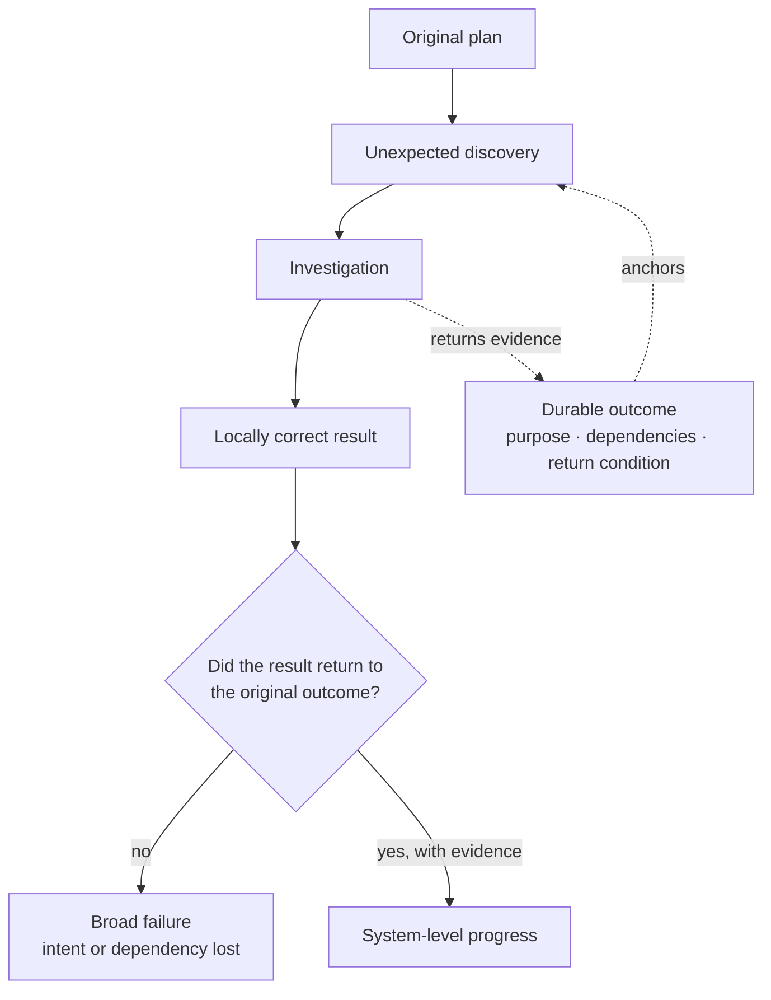
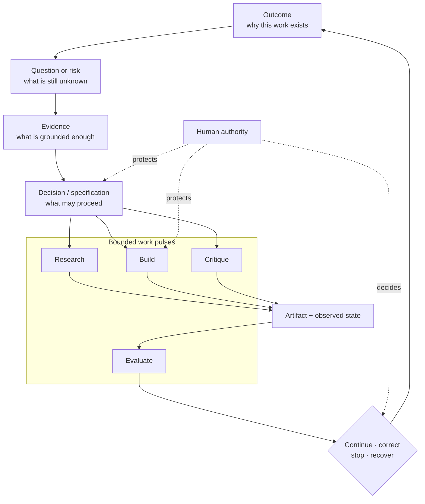
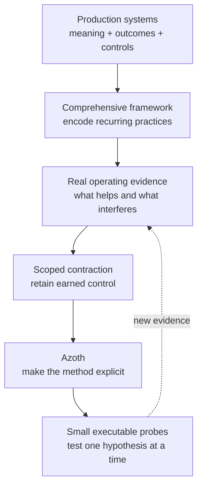
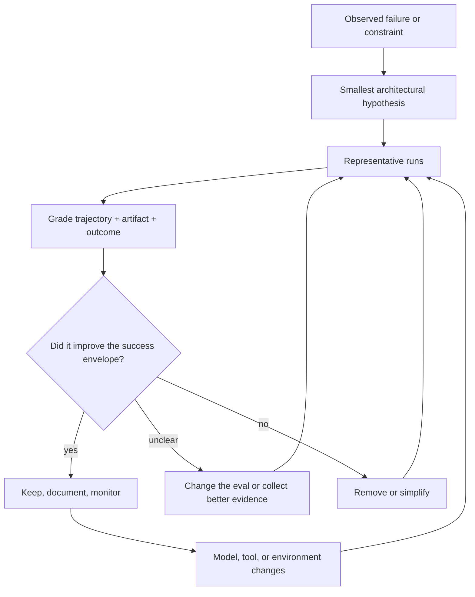

# Narrow Success, Broad Failure

## What production systems taught me about context, control, and long-running agent work

An AI agent can complete every visible step and still fail the task that
matters. It may solve a local problem, produce a plausible artifact, and report
success while the wider workflow has lost the original intent, used the wrong
business meaning, crossed an authority boundary, or optimized a proxy instead
of the outcome.

This case study explains the engineering philosophy behind Azoth. It grew from
building production conversational AI, reconstructing an operational-data
foundation, using a comprehensive internal agentic-delivery framework, and then
removing parts of that framework when their operating cost became clearer than
their value.

### The 30-second read

| | |
|---|---|
| **Problem** | Agent trajectories have a broad failure surface even when each individual model response looks capable. |
| **Thesis** | The outcome—not the conversation—should be the continuity boundary. Threads are bounded pulses that read and update durable state. |
| **Engineering model** | Combine probabilistic reasoning, deterministic tools, explicit authority, semantic context, evaluation, and recovery around a defined success envelope. |
| **Architectural judgment** | Every agent, memory layer, instruction, boundary, and ceremony is a hypothesis. It must earn and re-earn its place through representative work and observable outcomes. |
| **Current proof** | Azoth's public candidate implements and tests one narrow slice: effect-aware routing, compact context, typed authority/stopping state, and no-write rehearsal. |

This is a practical design argument, not a claim that agents are literally
control circuits or that one universal harness can be optimal across projects.

## The failure that made the problem intuitive

Imagine an agent thread with a reasonable plan. During implementation it finds
an undefined term, an architectural contradiction, or a dependency that behaves
differently from the documentation. The agent should investigate. But the
investigation creates a new local objective, and the conversation now preserves
the detour more strongly than the outcome that gave the detour meaning.

The failure is not that the model became distracted in a superficial sense. It
is that one transcript is being asked to serve simultaneously as working memory,
plan, evidence store, authority record, and system of record.

I call this **narrow success with broad failure**. It appears in coding, research,
operations, and data work because plausible progress is easier to observe than
end-to-end correctness.

## The outcome, not the thread, is the continuity boundary

Azoth's central shift is to treat a thread as one bounded pulse, not as the
whole system. The persistent object is an evolving outcome model:

- **outcomes** retain purpose, constraints, ownership, and success criteria;
- **questions** expose what must be learned before a decision is grounded;
- **evidence** retains provenance, freshness, and the claim it supports;
- **decisions** record what changed and why;
- **specifications and tasks** carry dependencies and readiness;
- **artifacts and evaluations** show what was built and whether it works; and
- **authority** identifies transitions that remain protected.

A useful detour can now become a related question with its own evidence target
and return condition. Research, architecture, implementation, and evaluation
can happen in separate contexts without pretending that more threads or agents
are automatically better. Their value comes from clean boundaries and the
evidence passed between them.

The evidence threshold is contextual rather than a universal score. It asks:
are the questions that matter to the next decision supported by current,
traceable evidence; were important alternatives and failure modes considered;
and does the next stage have testable acceptance criteria? The objective is not
to bureaucratize reasoning. It is to prevent a polished specification from
hardening assumptions the system has not earned.

## Where this thinking was earned

Two production systems at Glovo exposed the same reliability problem from
opposite directions.

### GloBuddy: conversational AI as an operational system

GloBuddy is a production conversational-AI Rider CRM system for daily operations
around rider onboarding and the funnel lifecycle. The difficult part was not
making a model converse. It was translating operational intent into a dependable
path from policy and context to interaction, bounded action, follow-up state,
measurement, and human improvement.

The system joined governed agent definitions, scoped tools, routing, contextual
knowledge, cloud services, operational state, observability, and a release path
with verification, human gates, rollback, and recovery. Conversation outcomes
were reconciled into structured state and operational measures rather than left
as isolated transcripts.

That changed the engineering question from “did the agent respond?” to “did the
workflow behave acceptably, and did it support the operational result it exists
to improve?”

### SupplyOps: semantic reconstruction before automation

SupplyOps began with fragmented, undocumented reporting logic whose meaning
could not survive a mechanical data-platform migration. The work required
semantic reconstruction: trace sources and lineage, test competing hypotheses,
establish accepted definitions, encode deterministic metric contracts, and
build a bounded operational ontology around them.

That semantic layer supported a governed BigQuery pipeline and decision
dashboard with quality gates, staged publication, rollback, and independent
readback. The result was not merely converted SQL; it was a maintainable data
backbone connecting business meaning, implementation, publication, and use.

Together, GloBuddy and SupplyOps showed that dependable AI behaviour cannot be
created at the model layer alone. It depends on the meaning and authority of the
context below the agent and on the outcome and feedback loop above it.

They shaped Azoth's method. They are not Azoth deployments.

## From a comprehensive framework to an engineering inquiry

The internal Agentic Framework grew from repeated delivery work, not from a plan
to build a universal platform. It introduced project-local bootloaders, reusable
instructions, promotion rules, append-only evidence, deterministic
classification, retrieval rules, architectural review, typed handoffs, and
bounded continuation.

It also accumulated richer orchestration: specialised roles, model tiers,
compatibility surfaces, memory layers, and multi-stage delivery paths. These
were reasonable hypotheses about where more structure could improve control.

Using the framework exposed the other side of the trade-off. Some controls
proved load-bearing. Others duplicated live repository state, forced decisions
through multiple representations, or made the agent spend context reconstructing
the harness instead of solving the task.

The response was architectural contraction, not indiscriminate deletion. In one
scoped operational-data redesign, 88 files changed, with 464 insertions and
4,835 deletions (net -4,371). That diff shows the size of one contraction; it
does not claim every deleted line was useless or that fewer lines automatically
mean better engineering. The redesign retained domain-specific validation,
release controls, live truth, and human authorization.

This lineage is important to the public framing. Azoth is not best understood
as “Personal Harness OS.” That label came later, during a compact implementation
experiment. The deeper project is the continuing investigation: which controls
preserve outcome coherence, and which become new sources of context loss,
duplicated state, or false confidence?

## Architecture has a counterfactual problem

There is a natural urge to design a large orchestration graph up front. More
agents, instructions, boundaries, memory, and review ceremonies make control
visible, which can feel like reliability. Careful reasoning can also make that
architecture appear coherent before representative work has generated evidence.

But once all work runs inside the harness, success does not reveal what the same
model, tools, and context could have achieved with fewer transitions. A component
that once compensated for a model limitation can remain after newer models make
it unnecessary. The system still appears to work while paying an invisible cost
in context, reasoning freedom, latency, maintainability, or solution quality.

Current frontier practice reinforces this concern. Anthropic describes each
harness component as an assumption about what a model cannot do and recommends
stress-testing those assumptions as models improve
([*Harness design for long-running application development*](https://www.anthropic.com/engineering/harness-design-long-running-apps)).
Its context-engineering guidance similarly recommends starting with the
smallest high-signal context and adding structure from observed failure
([*Effective context engineering for AI agents*](https://www.anthropic.com/engineering/effective-context-engineering-for-ai-agents)).
OpenAI describes replacing a large instruction manual with a short map into
repository-owned knowledge while using feedback loops and architecture tests as
part of the engineering system
([*Harness engineering*](https://openai.com/index/harness-engineering/)).

These sources do not prove Azoth's design. They show that the same tension is
now visible at the frontier: harness engineering matters, and its assumptions
must remain revisable.

Agent evaluations make this loop practical. A trajectory records what the agent
did; an outcome records the resulting state. Both matter. Anthropic's eval
guidance explicitly separates transcripts from end-state outcomes and combines
deterministic, model-based, and human grading
([*Demystifying evals for AI agents*](https://www.anthropic.com/engineering/demystifying-evals-for-ai-agents)).

My resulting rule is:

> **Use reasoning to define the failure, boundary, and evaluation—not to assume
> that it can reveal the final orchestration before the system has run.**

The optimal agent system is usually project- and purpose-specific because its
ambiguity, tools, evidence, authority, cost, and failure surface are specific.
Azoth does not chase a magical universal harness. It explores the thin contracts
that allow the useful architecture to emerge, be evaluated, and change.

## Agents as programmable probabilistic transitions

The control-systems analogy helps when kept precise. A conventional software
component is expected to map inputs to outputs according to code we can inspect.
An agent's next action is conditioned on instructions, tools, selected context,
model behaviour, and accumulated state. It is programmable, but its transition
is probabilistic.

The engineering object is therefore the whole path:

`intent + success envelope -> context/state -> probabilistic reasoning + deterministic tools -> bounded effect -> observed outcome -> evaluation/evidence -> continue, correct, stop, or recover`

Protected human authority spans consequential effects and release decisions.

For a real workflow, success is usually a conjunction:

- the request was interpreted against the correct business meaning;
- context was relevant, current, and authorized;
- tools acted on the intended scope and no wider;
- outputs satisfied known policy and data contracts;
- uncertain or consequential cases reached the correct human decision;
- the operational outcome—not merely the answer—was observed; and
- the system could stop, explain, or recover when a condition failed.

The acceptable success envelope is narrow. Failure remains broad: stale
context, semantically wrong data, ambiguous authority, silent tool failure,
locally sensible but globally harmful action, or feedback that rewards the
wrong proxy.

This is why business semantics belong inside the reliability boundary. An agent
can retrieve a current row and still make the wrong decision if the row's grain,
meaning, ownership, or exception rules are unclear. Data integrity includes
semantic integrity, not only schema validity.

It is also why role names are not architecture. A “reviewer agent” is useful
when it receives an independent evaluation context or holds different authority,
not because a persona label simulates an organization chart. Multi-agent
coordination earns its cost through parallelism, isolation, independent
critique, or real authority separation.

## The current executable proof

The June 2026 implementation developed under the internal name “Personal
Harness OS” is one narrow probe of the broader method. It makes three areas
inspectable:

- `HarnessRequest` and `HarnessDecision` classify intended effects without
  executing them;
- `RouteCapsule` exposes route, authority, required inputs, next safe action,
  and stop reason; and
- the context builders assemble compact, source-referenced packets while
  filtering raw memory and preserving missing-source warnings.

A portable rehearsal runs four representative cases through the same public
code, checks route and authority expectations, and verifies that the target
repository did not change. Thirty focused public tests cover the selected
routing, context, rehearsal, and personal-knowledge contracts.

That is meaningful implementation evidence, but it is not the culmination of
Azoth. It does not implement the complete outcome graph, validate a full
research-to-delivery journey, establish external adoption, or prove that the
mode names are permanent. The exact interfaces and boundary are documented in
[Executable Proof: Routing, Context, and Authority](../PERSONAL_HARNESS_OS.md).

## When a component earns its cost

The practical selection rule is not “simple good, complex bad.” It is “match
structure to a demonstrated failure and make its value observable.”

| Component | It begins to earn its cost when… | Evidence to demand |
|---|---|---|
| More instructions | a recurring behavioural failure cannot be corrected by clearer local context or tools | representative before/after trajectories and regression checks |
| Retrieval | the relevant corpus cannot be navigated reliably with ordinary files/tools and ranking, freshness, and permissions can be measured | retrieval quality on real questions, provenance, and failure analysis |
| Durable memory | information must survive contexts, recomputation is costly, and freshness/authority can be represented | usefulness, staleness rate, promotion review, and recovery behaviour |
| Multiple agents | parallelism, isolation, independent critique, or authority separation exceeds handoff/reconciliation cost | outcome quality, latency/cost, and handoff-loss comparison |
| Deterministic boundary | an invariant is known and the consequence of violation justifies constraining the model | prevented failures, false stops, and recovery evidence |
| Human gate | the decision is consequential, ambiguous, or legitimately owned by a person | clear decision surface, preserved context, and no silent bypass |

Better models do not remove permissions, evaluation, semantic integrity, or
recovery. Native compaction does not make durable state irrelevant. The boundary
between native capability and custom infrastructure simply moves, so the
architecture must be able to move with it.

## Transferable principles and boundaries

The method I would carry into another system is:

1. Define success in operational terms outside the model.
2. Treat the outcome, not the transcript, as the continuity boundary.
3. Model agents as probabilistic transitions inside an explicit control flow.
4. Give each transition the minimum context, tools, and authority it needs.
5. Keep business meaning and provenance inside the reliability boundary.
6. Observe end-state outcomes and retain trajectories as diagnostic evidence.
7. Separate capture of experience from promotion into durable policy.
8. Add orchestration only for a named failure or boundary.
9. Re-evaluate architecture when models, tools, and environments change.
10. Remove machinery when its interference exceeds the control it provides.

The claim boundaries matter:

- This is an engineering lens, not a formal control-theory result.
- The success-envelope expression is a decision heuristic, not a calibrated
  probability model.
- GloBuddy and SupplyOps show where the method was shaped in production; they
  do not prove that every organization has the same adoption problem.
- The internal Agentic Framework was not minimal from the beginning. Its
  complexity produced evidence, including evidence for contraction.
- The public candidate implements selected routing, context, authority, and
  rehearsal contracts—not the complete outcome-centred architecture.
- Retrieval, memory, roles, and multi-agent graphs remain valid when their
  boundaries and value are demonstrated.
- No claim is made of external Azoth adoption, causal business lift, or having
  invented the broader concepts used to explain the project.

Azoth's practical contribution is not a universal recipe. It is a way of
engineering under uncertainty: keep the purpose and success boundary explicit,
make context and authority trustworthy, learn from trajectories and outcomes,
and let the smallest architecture that satisfies those conditions emerge from
evidence.
