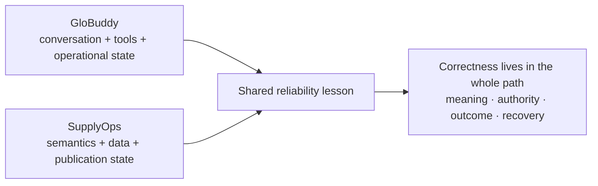
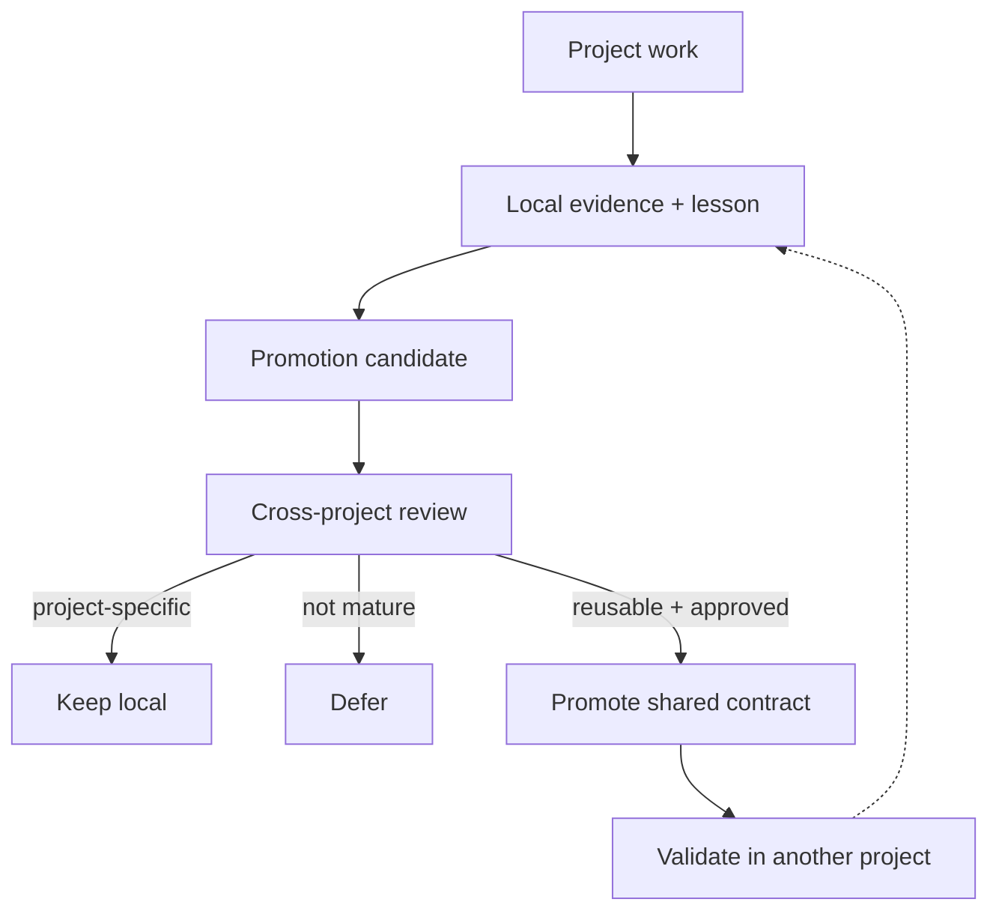
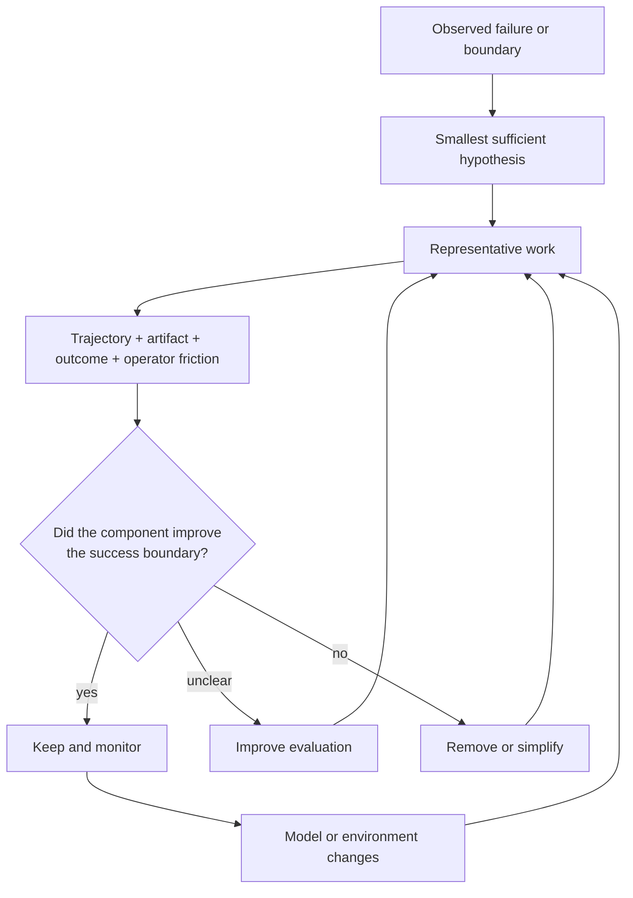

# Narrow Success, Broad Failure

## How production systems, reusable harnesses, and architectural contraction shaped Azoth

An AI agent can complete every visible step and still fail the task that
matters. It may solve a local problem, produce a plausible artifact, and report
success while the wider workflow has lost the original intent, used the wrong
business meaning, crossed an authority boundary, or optimized a proxy instead
of the outcome.

This case study records where that problem became concrete, how the engineering
response evolved, and which findings I now carry into Azoth. The broader model
is developed separately in [*Intent-to-Outcome Engineering: A Working Thesis on
Durable Agentic Systems*](../INTENT_TO_OUTCOME_ENGINEERING.md). The small piece
that can be run today is documented in [Executable Proof: Routing, Context, and
Authority](../PERSONAL_HARNESS_OS.md).

### The 30-second read

| | |
|---|---|
| **Problem** | Locally capable model behaviour has a broad system-level failure surface. |
| **Production evidence** | GloBuddy made operational state, scoped action, measurement, human control, and recovery part of conversational-AI reliability. SupplyOps made semantic reconstruction, evidence, release gates, and live readback part of data correctness. |
| **Framework evolution** | A bootloader and project-local context were reused across BigQuery migration and Local Requests Data; repeated lessons were promoted into shared contracts; typed roles and handoffs then expanded into adaptive pipelines. |
| **Counter-evidence** | The framework eventually duplicated state, over-specified ordinary work, and consumed context reconstructing itself. A project-local contraction retained domain controls while removing generic machinery. |
| **Derived finding** | Preserve purpose, success, meaning, authority, evidence, and observed outcomes outside any one conversation. Treat every additional harness component as a testable hypothesis. |
| **Current proof** | The `v0.3.0-rc.2` candidate implements only effect-aware routing, bounded context, typed authority/stopping state, and no-write rehearsal. |

This is an experience-led engineering account. It does not claim that agents
are literally control circuits, that one ontology fits every project, or that
Azoth has been deployed in the production systems described below.

## 1. Production systems made broad failure visible

Two Glovo systems exposed the same reliability problem from opposite
directions. They are distinct projects with distinct evidence. Neither is an
Azoth deployment.

### GloBuddy: a conversation is not the operational outcome

GloBuddy is a production conversational-AI Rider CRM system for daily
operations around rider onboarding and the funnel lifecycle. The difficult
part was not making a model converse. It was translating operational intent
into a dependable path from policy and context to interaction, bounded action,
follow-up state, measurement, and human improvement.

The system joined governed agent definitions, scoped tools, routing, contextual
knowledge, cloud services, operational state, observability, and a release path
with verification, human gates, rollback, and recovery. Conversation outcomes
were reconciled into structured state and operational measures rather than left
as isolated transcripts.

The practical question changed from “did the agent respond?” to “did the
workflow behave acceptably, and did it support the operational result it exists
to improve?” A fluent answer could still be a broad failure if the system acted
on the wrong state, skipped a boundary, failed to record the result, or could
not recover.

### SupplyOps: technical migration could not preserve meaning by itself

SupplyOps began with fragmented, undocumented reporting logic whose meaning
could not survive a mechanical data-platform migration. The work required
semantic reconstruction: trace sources and lineage, test competing hypotheses,
establish accepted definitions, encode deterministic metric contracts, and
build a bounded operational ontology around them.

That semantic layer supported a governed BigQuery pipeline and decision
dashboard with quality gates, staged publication, rollback, and independent
readback. The result was not merely converted SQL; it was a maintainable data
backbone connecting business meaning, implementation, publication, and use.

An output could be syntactically correct and still fail because its grain,
source precedence, business definition, publication state, or exception rules
were wrong. Meaning belonged inside the reliability boundary.

## 2. The BigQuery migration turned discipline into a harness

The SupplyOps BigQuery migration made recurring engineering needs explicit:

- a bootloader that oriented work to the project and current state;
- tracker-first execution so a local change remained tied to the migration
  unit it served;
- evidence-backed source and table mapping;
- deterministic acceptance contracts and test baselines;
- typed artifacts for proposals, handoffs, and reviews;
- separate authorization before repository implementation or live-system
  mutation; and
- independent readback after publication.

This was not abstract agent-platform work. Each control answered an observed
failure mode: stale status, ambiguous source meaning, premature implementation,
unbounded changes, or a write that looked successful without verifying the
real target.

The migration also showed why one transcript could not own continuity. Work
crossed discovery, semantic investigation, query implementation, review,
publication, dashboard behaviour, and later correction. The stable thread was
the project outcome and its evidence, not any one conversation.

## 3. Local Requests Data tested reuse without semantic flattening

Local Requests Data reused the emerging bootloader and verification discipline
for a different operational-data problem. The project received a local startup
surface, project instructions, deployment validation, lesson capture, and
cross-client parity checks.

What transferred was the coordination discipline. What did not transfer was a
universal business model. Local Requests Data retained its own request
classification, source context, schema context, diagnostic queries, and
acceptance rules.

That reuse produced an important distinction:

- **generic contract:** how to locate authority, verify live facts, record
  evidence, stop at protected effects, and close a bounded unit of work;
- **project-local ontology:** what the entities mean, which sources govern,
  which exceptions matter, what success looks like, and which state may
  change.

The bootloader was useful because it routed the model into project meaning. It
would have become harmful if it tried to replace that meaning with framework
vocabulary.

## 4. Project-local learning became a promotion loop

Once two projects were using related disciplines, the next problem was how to
reuse experience without turning every local workaround into global policy.

The framework separated several stages:

1. Work generated local evidence and lessons.
2. Each project kept its raw experience and candidate patterns within its own
   boundary.
3. Cross-project candidates moved through a typed signal to an architect-owned
   review surface.
4. Human-reviewed patterns could be promoted into shared instructions, tools,
   or governance.
5. Deployment records showed which projects actually received a promoted
   contract.

The important idea was not the exact file layout. It was the provenance
boundary: capture is not policy, repetition is not proof, and a project cannot
silently rewrite the shared framework.

## 5. Roles and handoffs became composable pipelines

As the framework handled more kinds of work, it added specialized processing
functions: architecture, governance review, research, planning, implementation,
evaluation, and closeout. Handoffs became typed so a receiving role could see
the expected artifact, current evidence, unresolved decisions, and whether
human input was required.

The pipeline was not always fixed. Classification and stage state could select
different paths for review-only work, analysis, bounded fixes, or multi-step
delivery. Human approval was made an explicit gate before planning or execution
when the transition changed authority.

This produced real value:

- research and implementation could use clean contexts;
- reviewers could examine a different evidence surface;
- plans and execution summaries could be machine-readable;
- a pipeline could stop honestly rather than imply that downstream work had
  happened; and
- project and shared-framework ownership could remain separate.

It also introduced costs. Each new role, schema, prompt, state file, and
compatibility surface created another place for drift, duplication, and context
competition.

## 6. Framework growth created its own failure surface

The internal Agentic Framework grew from repeated delivery work, not from a
plan to build a universal platform. Its richer architecture was a series of
reasonable hypotheses: perhaps model tiers would allocate reasoning better;
perhaps more explicit roles would improve review; perhaps duplicated adapters
would preserve cross-client parity; perhaps more memory and closeout steps
would compound learning.

Using the framework generated counter-evidence. Some controls remained
load-bearing. Others:

- copied volatile status across multiple canonical-looking files;
- forced one decision through several representations;
- auto-loaded generic process regardless of the task;
- overlapped role orchestration with domain-specific skills;
- made closeout larger than the work it was meant to preserve; or
- consumed scarce context reconstructing the harness.

The framework could still produce good results, which created a counterfactual
problem: success inside the full system did not reveal whether a smaller system
would have done better.

## 7. Contraction preserved the controls that had evidence

A project-local redesign of the SupplyOps environment made the trade-off
concrete. Its accepted direction was to keep the controls tied to real domain
failures—tracker-first migration, evidence-backed mapping, per-patch acceptance,
fresh authority for live changes, readback, rollback, and one owner per
concern—while removing generic model tiering, duplicated state, dynamic role
orchestration, broad always-on instructions, and redundant closeout machinery.

The resulting implementation changed 88 files, with 464 insertions and 4,835
deletions (net -4,371). Those numbers describe the scale of one contraction.
They do not prove that every deleted line was useless or that fewer lines are
inherently better.

The contraction changed the central question from “how complete is the
framework?” to “which controls preserve outcome coherence, and which have
become new sources of failure?”

## 8. Findings derived from the lineage

These findings are conclusions from the experience above, not independent
proofs.

### The outcome, not the thread, is the continuity boundary

A thread is one bounded work pulse. Durable state should retain purpose,
success criteria, questions, evidence, decisions, artifacts, observed outcomes,
and protected authority across pulses.

### Business meaning belongs inside the reliability boundary

Fresh data with the wrong grain or definition can produce a confidently wrong
decision. Semantic integrity is part of system integrity.

### Generic coordination and project ontology should remain separate

Routing, provenance, effect boundaries, and return conditions can transfer.
Project entities, meanings, exceptions, authorities, and success rules should
stay close to the work unless evidence supports a shared contract.

### Roles are processing functions, not an organization chart

A separate role earns its cost through different context, authority,
parallelism, isolation, or independent critique. A persona label alone creates
no reliability.

### Learning requires promotion and subtraction

Experience should be captured before it is generalized. Shared patterns need
cross-project evidence and human review. They also need a removal path when
models, tools, or operating conditions change.

### Architecture has a burden of proof

Reasoning can define a failure, boundary, and evaluation. It cannot reliably
deduce the final orchestration before representative work exposes the
counterfactual.

The full thesis, including counterarguments and falsifiable questions, is in
[*Intent-to-Outcome Engineering*](../INTENT_TO_OUTCOME_ENGINEERING.md).

## 9. The current executable proof

The June 2026 implementation developed under the internal name “Personal
Harness OS” is one narrow probe of the broader method. It makes three areas
inspectable:

- `HarnessRequest` and `HarnessDecision` classify intended effects without
  executing them;
- `RouteCapsule` exposes route, authority, required inputs, next safe action,
  and stop reason; and
- the context builders assemble compact, source-referenced packets while
  filtering raw memory and preserving missing-source warnings.

A portable rehearsal runs four representative cases through the same public
code, checks route and authority expectations, and verifies that the target
repository did not change. Thirty focused public tests cover the selected
routing, context, rehearsal, and personal-knowledge contracts.

That is meaningful implementation evidence, but it is not the culmination of
Azoth. It does not implement the complete outcome graph, validate a full
research-to-delivery journey, establish external adoption, or prove that the
mode names are permanent. The exact interfaces and boundary are documented in
[Executable Proof: Routing, Context, and Authority](../PERSONAL_HARNESS_OS.md).

## 10. Claim boundaries

- GloBuddy and SupplyOps are production systems that shaped the method; they
  are not Azoth deployments.
- The BigQuery migration, Local Requests Data, and internal Agentic Framework
  are employer-work lineage; Azoth is an independent personal project.
- The framework's complexity produced evidence, including evidence for
  contraction. The history is not rewritten as if the minimal design existed
  from the beginning.
- The working thesis is an engineering model, not a formal control-theory or
  cognitive-science result.
- External sources and projects are comparisons, not project experience or
  proof that Azoth's model is correct.
- The public candidate implements selected routing, context, authority, and
  rehearsal contracts—not the complete intent-to-outcome architecture.
- No claim is made of external Azoth adoption, causal business lift, or having
  invented the broader concepts used to explain the project.

Azoth's practical contribution is not a universal recipe. It is the engineering
discipline that survived this lineage: keep purpose and success explicit, make
meaning and authority trustworthy, evaluate trajectories and outcomes, promote
learning carefully, and remove machinery when its interference exceeds the
control it provides.
