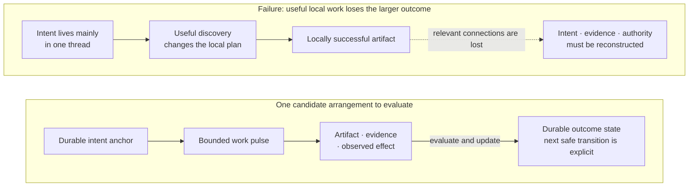
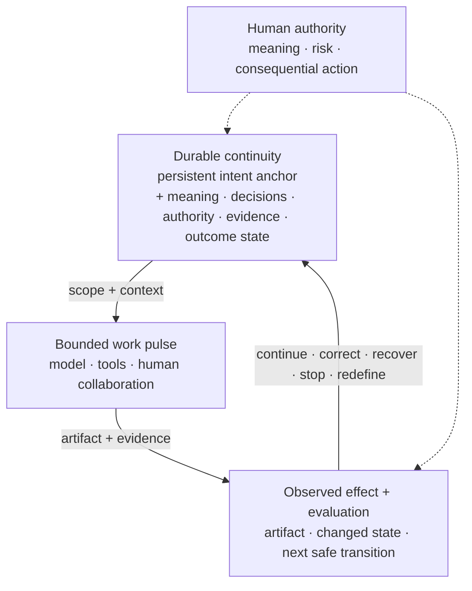

# Azoth

**An evolving engineering framework and experimental toolkit for keeping
AI-assisted work aligned with intent as the work itself changes.**

Azoth began with a recurring task: setting up workspaces for AI agents. Each
new workspace brought familiar questions—what context the agent needs, how to
organize the work, what it can decide, and how to know whether it has helped.

I wanted to capture the reusable essence of that work, so each workspace could
start from accumulated understanding and adapt to its own purpose. That became
an exploration of how to establish an operating model for agents and keep
improving it as the work reveals new needs.

Here, an operating model means how people, agents, tools and knowledge work
together: how work is framed, context is maintained, decisions are made,
actions are checked, and experience informs what happens next.

Azoth develops this approach through an evolving engineering framework and
experimental tooling. This repository presents its principles, a bounded
executable reference, and the experiences that continue to shape it.

- [Explore the engineering framework](docs/INTENT_TO_OUTCOME_ENGINEERING.md)
- [Inspect the implemented capabilities](docs/PERSONAL_HARNESS_OS.md)
- [Read the experiences that shaped the approach](docs/case-studies/narrow-success-broad-failure.md)

## When useful work loses its direction

Agent-assisted work can look successful until the larger outcome is checked. A
thread starts with a sound plan, discovers something important, follows the
detour, and produces a useful artifact—while the original intent, acceptance
boundary, evidence, or stopping condition quietly fades. The conversation
progressed; the work did not.

Conversation and native context can carry enough for some work. When relevant
meaning, evidence or authority becomes difficult to recover across transitions,
additional support may help. Its value depends on better decisions, outcomes
and recovery relative to its cost.

The central concern is the relationship between evolving intent, goals,
assumptions, decisions, work, evidence and effects. A corrected interpretation
or changed requirement should reach the decisions that depend on it while
preserving work that remains useful. A passing test may still be valid while
no longer establishing enough for the current goal.

> **Keep the reasons for decisions, the meaning of evidence and the authority
> for action recoverable as the work changes. Use explicit records where they
> improve that continuity enough to earn their cost.**

This raises a broader question: if continuity and
useful intelligence are distributed across intent, state, people, tools,
evidence, and work pulses, where does the durable intelligence of the larger
effort live—and is any one thread really the agent?

Azoth explores persistent state, intent anchors and bounded work pulses as
candidate ways to support that continuity. The intended experience is to state
an aim naturally, refine it as understanding changes, and have useful work
continue without repeatedly reconstructing its purpose. The system should
expose uncertainty, preserve human authority and recognize sufficiently checked
completion. “The system as agent” is a useful analogy, not a settled name for
the durable whole or a claim that the whole experience is implemented.

## Azoth in one view

This is one implementation hypothesis within the broader philosophy. Native
context and ordinary project artifacts may already provide enough support.

**Alignment signal** is shorthand for the maintained relationship between our
current interpretation of intent and each intermediate representation, action,
item of evidence and observed outcome. Those connections may become clearer,
drift, or reveal a mistaken interpretation. People can also change what they
want. The term is a working engineering metaphor, not a formal measurement.

How reliably can a system recognize which relationships a change affects,
especially when they are implicit or its current account is wrong? That remains
an [open research question](docs/INTENT_TO_OUTCOME_ENGINEERING.md#falsifiable-questions).
Making every relationship explicit is not the proposed answer.

## Explore the project

| If you want to understand… | Continue with… |
|---|---|
| **Experience and evidence** | [*Narrow Success, Broad Failure*](docs/case-studies/narrow-success-broad-failure.md), a braided account of the projects, engineering value, framework growth, and contraction that exposed the problem |
| **Engineering framework** | [*Intent-to-Outcome Engineering*](docs/INTENT_TO_OUTCOME_ENGINEERING.md), the evolving argument about intent, relationships, selective revision, evidence, authority and open research questions |
| **Executable proof** | [Routing, Context, and Authority](docs/PERSONAL_HARNESS_OS.md), the current operator experience and the exact boundary of the tested public slice |
| **Source and architecture history** | [Architecture overview](docs/AZOTH_ARCHITECTURE.md), [decision index](docs/DECISIONS_INDEX.md), and [current proof paths](#inspect-the-current-proof) |

## From intent to governed work

Across the wider Azoth workshop, an operator can assemble a sequence like this
from separate capabilities:

`intent intake → discovery seed → research sufficiency → initiative / roadmap /
task formation → routed work pulse → evidence ledger → independent evaluation
→ bounded replay or next safe transition → closeout`

This is neither one opaque autonomous pipeline nor one fully integrated public
product. Each transition can expose its inputs, evidence, authority, and
stopping reason. Research can be required before a task is hydrated. An
evaluator can reject incomplete stage evidence. A repair can replay within a
declared budget. Protected actions remain closed until a human authorizes the
specific effect.

The public story therefore has three evidence bands:

### Portable proof

The extracted `v{{PUBLIC_VERSION}}` candidate implements and tests deterministic
effect-aware routing, compact source-referenced context, explicit authority and
stopping state, and a four-case no-write rehearsal. Thirty portable tests cover
that selected surface.

### Root workshop evidence

The wider source repository contains separate, inspectable machinery for raw
initiative intake, research-sufficiency checks, proposal knowledge assessment,
initiative and roadmap scaffolding, durable run ledgers, campaign routing,
stage evidence, evaluation, and bounded replay. Root-only campaign receipts
show these parts being used in multi-stage product-strategy, operating-profile,
and route-repair work.

Those capabilities are real, but they are not exported as one validated public
product journey. The [executable proof](docs/PERSONAL_HARNESS_OS.md) keeps the
difference visible.

### Working direction

Azoth is moving toward a system that can carry an outcome across many work
pulses: reconsider goals and interpretations, discover missing knowledge, revise
affected work, select sufficient support, evaluate what happened, retain useful
learning and stop at completion or the boundary of current authority.

That direction is an evolving framework, not a completion claim.

## How this inquiry emerged

The recurring experience was setting up new workspaces for agents inside an
internal Agentic Framework. Repeating that work raised a practical question:
which parts of establishing a useful workspace could be captured and reused,
and which needed to remain specific to the people, purpose and project?

Azoth became the independent place to explore that question. Its approach is
informed by the wider experience of building data products, operational
workflows and AI systems: preserving meaning, making decisions inspectable,
learning from use, and simplifying controls when they cost more than they help.
These experiences continue to shape how a workspace's operating model can be
established and evolved.

The [case study](docs/case-studies/narrow-success-broad-failure.md) holds that
experience and its chronology; the [framework](docs/INTENT_TO_OUTCOME_ENGINEERING.md)
develops the broader model. The employer systems are supporting cases, not
deployments or complete realizations of Azoth.

## Claim boundary

| Surface | Status | Inspect |
|---|---|---|
| Effect-aware routing and typed route state | **Portable proof:** implemented and tested in the candidate | [`scripts/harness_profile.py`](scripts/harness_profile.py) |
| Compact, provenance-preserving context assembly | **Portable proof:** implemented and tested in the candidate | [`scripts/context_view.py`](scripts/context_view.py), [`scripts/personal_harness_context.py`](scripts/personal_harness_context.py) |
| Read-only behavioral rehearsal | **Portable proof:** implemented and tested in the candidate | [runner](scripts/personal_harness_practice_rehearsal.py), [cases](examples/personal-harness/rehearsal-cases.yaml), [tests](tests/test_personal_harness_practice_rehearsal.py) |
| Initiative discovery, research sufficiency, roadmap formation, ledgers, and campaign control | **Root workshop evidence:** separate capabilities and observed campaigns; not one extracted product journey | [`scripts/initiative_intake.py`](scripts/initiative_intake.py), [`scripts/research_sufficiency.py`](scripts/research_sufficiency.py), [`scripts/roadmap_scaffold.py`](scripts/roadmap_scaffold.py), [`scripts/run_ledger.py`](scripts/run_ledger.py), [`scripts/autonomous_loop.py`](scripts/autonomous_loop.py) |
| Intent-to-outcome engineering | **Working direction:** qualified framework, not fully implemented | [framework](docs/INTENT_TO_OUTCOME_ENGINEERING.md) |
| Historical employer projects and internal framework | Experience and repository-grounded evidence; not Azoth deployment evidence | [case study](docs/case-studies/narrow-success-broad-failure.md) |
| External adoption or production deployment of Azoth | Not claimed | [preview boundary](docs/PERSONAL_HARNESS_OS.md#public-preview-boundary) |

## Inspect the current proof

- [Routing](scripts/harness_profile.py) — deterministic effect and authority
  classification.
- [Context assembly](scripts/personal_harness_context.py) — compact,
  source-referenced packets.
- [No-write rehearsal](scripts/personal_harness_practice_rehearsal.py) — shared
  code exercised against representative cases.
- [Portable tests](tests/test_personal_harness_practice_rehearsal.py) —
  behavioral and mutation-detection evidence.
- [Research sufficiency](scripts/research_sufficiency.py) and [knowledge
  richness](scripts/proposal_knowledge_richness.py) — wider root-workshop
  checks, outside the narrow portable claim.
- [Trust Contract](kernel/TRUST_CONTRACT.md) — protected authority and action
  boundaries.
- [Architecture decisions](docs/DECISIONS_INDEX.md) — decision records and
  implementation status.

The framework relies on Git for revision history rather than adding another
changelog. Installer completeness, cross-host parity, package distribution,
and production adoption remain outside the `v{{PUBLIC_VERSION}}` validation
boundary. Existing tags remain immutable. Publication requires review of the
exact extracted tree and explicit human approval for its public commit, tag,
push, and release.

## License

Licensed under the [PolyForm Noncommercial License 1.0.0](https://polyformproject.org/licenses/noncommercial/1.0.0/).
Commercial use outside the licence's permitted noncommercial purposes requires
a separate written agreement. Contact [Yiwei Ye on GitHub](https://github.com/yiwei79).
