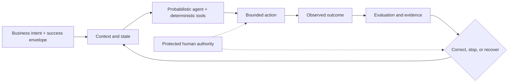

# Azoth

**A personal agentic-engineering project for governed AI-assisted software
delivery.**

Azoth explores a practical question: how should AI coding agents be engineered
when they are programmable probabilistic components inside a larger system,
rather than copilots or simulated employees? It connects intent to compact
context, bounded tools, explicit authority, evidence, stopping, and recovery so
agent-assisted work can remain useful without becoming unbounded.

Azoth is my independent project. `v0.3.0-rc.1` is the latest implemented
snapshot of that exploration, focused on Personal Harness OS. It is an
unfinished release candidate, not a finished universal harness or an external
adoption claim.

## Personal Harness OS preview

Personal Harness OS keeps ordinary work lightweight and escalates consequential
work into explicit context, authority, evidence, stopping, and recovery
boundaries. It routes by intended effect and risk—not by personified employee
roles.

Personal Harness OS is built around three portable contracts:

| Contract | Purpose |
|---|---|
| `HarnessRequest` → `HarnessDecision` | `classify_harness_request` selects a `profile` of `guide`, `assisted`, `managed`, or `governed_autonomy` from intended effects and risk |
| `RouteCapsule` | Exposes route state, required authority, inputs, next safe action, and stop reason |
| Context-view packet | `build_context_view` pulls compact approved summaries and source pointers without dumping raw memory |

The design uses the smallest architecture that preserves the controls a task
actually needs. Retrieval, durable memory, or multi-agent coordination are
added only when a demonstrated failure mode justifies their cost.

**Implemented in this RC:** deterministic request classification, typed
route packets, bounded context assembly, a generic no-write rehearsal runner
and fixture, and 30 passing portable public tests. Private operator state and
environment-specific adapters remain excluded, and the wider profile remains
under development.

### Core control loop



Protected human authority governs consequential action, correction, recovery,
and release decisions. This is an engineering lens, not a formal control-theory
claim or a measured signal-to-noise model.

- [Engineering case study: *Narrow Success, Broad Failure*](docs/case-studies/narrow-success-broad-failure.md)
- [Personal Harness contracts and preview boundary](docs/PERSONAL_HARNESS_OS.md)

## How the project fits together

Azoth is one evolving project, not a collection of separate products. The
repository preserves both the current minimum-sufficient direction and the
broader framework that preceded it:

| Surface | Role in the project |
|---|---|
| Personal Harness OS | The current direction and the focus of `v0.3.0-rc.1` |
| Routing, context, rehearsal, and focused tests | The validated release surface for this RC |
| Kernel, skills, agents, commands, and pipelines | The broader governed toolkit and design history from which the lighter path emerged |
| *Narrow Success, Broad Failure* | The case study explaining the architectural evolution and its trade-offs |

The wider repository remains useful for inspection and continued development,
but this release validates only the selected Personal Harness contracts and
tests described above.

## Why Azoth

AI-assisted development often fails in predictable ways: each session starts
without context, useful lessons remain trapped in chat history, agents expand
scope silently, platform-specific instructions drift apart, and review happens
too late. Azoth addresses those failure modes through a small set of durable
design decisions:

- **One governed operating model:** define shared rules once, then represent
  them through host-specific adapters.
- **Bounded autonomy:** agents can move quickly inside explicit trust,
  scope, approval, checkpoint, and recovery boundaries.
- **Memory with promotion:** retain episodes, promote only reinforced patterns,
  and keep durable instructions under human control.
- **Goal-aware execution:** use lightweight work for simple tasks and staged
  delivery pipelines when the work warrants more review.
- **Honest portability:** preserve shared semantics where a host can enforce
  them, and document degradation where it cannot.

## How a governed session works

Azoth turns a session into a small, inspectable delivery loop:

```text
Activate -> Survey -> Operate -> Harden
   |           |          |         |
   |           |          |         +-- verify, checkpoint, retain lessons
   |           |          +------------ work within scoped trust boundaries
   |           +----------------------- inspect project state and relevant memory
   +----------------------------------- load the kernel and project contract
```

The workflow is backed by four safeguards:

1. **Scope before change.** Map the task and its blast radius before editing.
2. **Trust-aware action.** Separate actions that may proceed, need approval,
   or must never run automatically.
3. **Meaningful human gates.** Require a human decision when risk, governance,
   or scope expansion makes it valuable.
4. **Recovery by design.** Use checkpoints and Git-based recovery rather than
   treating a failed autonomous run as irreversible.

For the precise contract, see the [Trust Contract](kernel/TRUST_CONTRACT.md)
and [gate protocol](docs/GATE_PROTOCOL.md).

## Architecture at a glance

Azoth uses a four-layer model. The lower layers are deliberately stable; the
upper layers are allowed to adapt to the project and goal.

```text
CURRENT  - Orchestration and delivery
           Commands, pipeline presets, coordination, final delivery
                 ↑
WAVE     - Agents and capabilities
           Role-specific agents, skills, evaluators, domain additions
                 ↑
MINERAL  - Portable knowledge and tools
           Reusable skills, memory, prompts, evaluation rubrics
                 ↑
MOLECULE - Invariant kernel
           Bootloader, trust contract, governance, promotion rules
```

The model prevents two opposite failures: an immutable framework that cannot
adapt, and a fully emergent agent system that slowly loses its standards.

| Layer | What it owns | Change posture |
|---|---|---|
| Molecule | Core identity, trust boundaries, governance and promotion rules | Human-approved only |
| Mineral | Portable knowledge, reusable skills and memory mechanisms | Stable and refinable |
| Wave | Agents and specialised capabilities | Emerges when useful; retained when proven |
| Current | Goal-specific commands and delivery flows | Created and adjusted per goal |

Read the full design rationale in [the architecture guide](docs/AZOTH_ARCHITECTURE.md).

## Memory that improves without silently rewriting policy

Azoth separates transient experience from durable operating rules:

```text
Episodes -> candidate patterns -> human-approved durable knowledge -> skills and instructions
   M3              M2                         promotion                         M1
```

- **Episodes** capture what happened during work.
- **Patterns** preserve lessons that recur and remain useful.
- **Skills and instructions** hold durable procedures only after promotion.

This design keeps the system capable of learning while preventing one-off
outputs, stale preferences, or model mistakes from becoming permanent policy.
See [governance](kernel/GOVERNANCE.md), the [promotion rubric](kernel/PROMOTION_RUBRIC.md),
and [architecture details](docs/AZOTH_ARCHITECTURE.md#5-layer-1-minerals-portable-knowledge).

## Platforms and portability

Azoth is protocol-first. Its core governance and workflow semantics live in
portable source files; adapters represent them through different host
conventions. In this RC, those surfaces are inspectable design artifacts;
cross-host parity and supported adoption are outside the preview boundary.

- [Co-primary platform blueprint](docs/CO_PRIMARY_PLATFORM_BLUEPRINT.md)
- [Platform adapters](kernel/templates/platform-adapters/)
- [Adapter projection source](scripts/azoth-deploy.py)

## What is included

| Surface | Purpose |
|---|---|
| [`kernel/`](kernel/) | Bootloader, trust contract, governance, promotion rules |
| [`skills/`](skills/) | Reusable procedures for planning, memory, evaluation, routing and delivery |
| [`agents/`](agents/) | Role-based agent definitions and capability boundaries |
| [`commands/`](commands/) | Human-facing entry points for sessions, planning, delivery and review |
| [`pipelines/`](pipelines/) | Declarative delivery presets and staged orchestration |
| [`docs/`](docs/) | Architecture, decisions, platform strategy and protocols |
| [`scripts/`](scripts/) | Routing, context, validation, checkpoint and support utilities |
| [`examples/personal-harness/`](examples/personal-harness/) | Portable no-write rehearsal cases |
| [Focused public tests](tests/test_personal_harness_practice_rehearsal.py) | Routing, context, recall/review and rehearsal contract coverage |

## Inspect the preview

`v0.3.0-rc.1` is presented for source inspection and local experimentation, not
as a supported installation or adoption path. Installer surfaces remain under
development and are not a validated entrypoint for this preview.

- [Routing and authority contracts](scripts/harness_profile.py)
- [Bounded context assembly](scripts/personal_harness_context.py)
- [No-write rehearsal runner](scripts/personal_harness_practice_rehearsal.py)
- [Rehearsal fixture](examples/personal-harness/rehearsal-cases.yaml)
- [Focused rehearsal tests](tests/test_personal_harness_practice_rehearsal.py)

## Start exploring

- Want the conceptual model? Start with the [architecture guide](docs/AZOTH_ARCHITECTURE.md).
- Want the design record? Browse the [architecture decisions index](docs/DECISIONS_INDEX.md).
- Want safety and autonomy rules? Read the [Trust Contract](kernel/TRUST_CONTRACT.md).
- Want to understand host differences? Read the [co-primary platform blueprint](docs/CO_PRIMARY_PLATFORM_BLUEPRINT.md).
- Want to inspect or extend it? Start with [`commands/`](commands/) and [`skills/`](skills/).

## Boundaries and status

Azoth is an evolving toolkit. Some pipeline and memory-promotion capabilities
are intentionally staged or partial; the [decisions index](docs/DECISIONS_INDEX.md)
tracks implementation status. It is designed for governed AI-assisted delivery,
not as a claim of universal autonomy, identical enforcement across every host,
or a substitute for human engineering judgment.

## License

Licensed under the [PolyForm Noncommercial License 1.0.0](https://polyformproject.org/licenses/noncommercial/1.0.0/).
Commercial use outside the licence's permitted noncommercial purposes requires
a separate written agreement. Contact [Yiwei Ye on GitHub](https://github.com/yiwei79).
