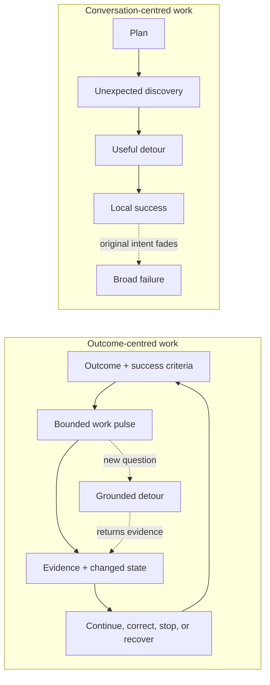
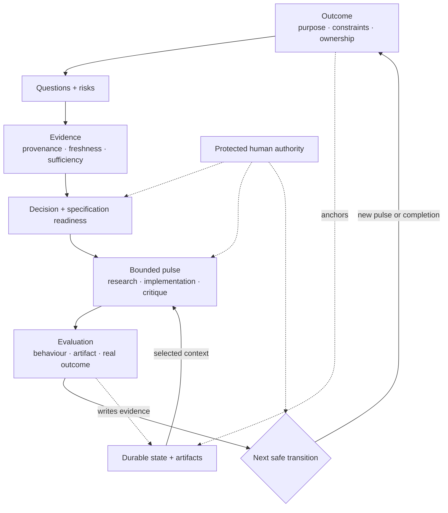
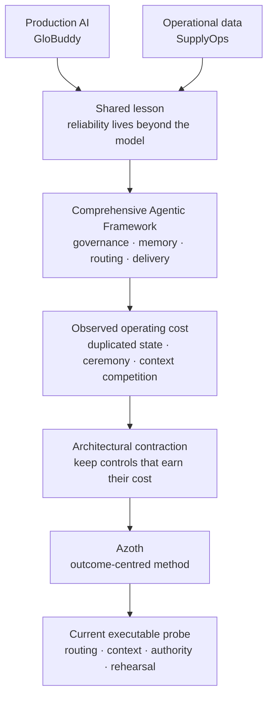

# Azoth

**A personal agent-engineering project about keeping complex AI-assisted work
coherent after the conversation stops being simple.**

I began Azoth after seeing the same problem from several directions: an agent
can solve the issue immediately in front of it while the wider task quietly
loses its intent, evidence, or definition of success. This happens most often
when useful discovery breaks the original plan. The detour succeeds; the
outcome does not.

Azoth explores a different unit of continuity:

> **The outcome—not the conversation—is the system of record. A thread is one
> bounded pulse of work that reads from and contributes back to it.**

That idea grew through production conversational AI, an operational-data
foundation, a comprehensive internal agentic-delivery framework, and the later
contraction of that framework when some of its structure stopped earning its
cost. Azoth is the independent project where I make those lessons explicit,
testable, and transferable.

The current public candidate, `v{{PUBLIC_VERSION}}`, is intentionally narrow. It
contains a tested probe of effect-aware routing, compact context, authority and
stopping state, plus no-write behavioural rehearsal. It does **not** claim to
ship the complete outcome-centred system described here.

## Choose your depth

| Time | Start here | What it shows |
|---|---|---|
| 3 minutes | [*Narrow Success, Broad Failure*](docs/case-studies/narrow-success-broad-failure.md) | The production origin, architectural evolution, and core engineering judgment |
| 8 minutes | [Executable proof: routing, context, and authority](docs/PERSONAL_HARNESS_OS.md) | One small, tested implementation slice and its exact claim boundary |
| Inspect the source | [routing](scripts/harness_profile.py), [context assembly](scripts/personal_harness_context.py), [rehearsal](scripts/personal_harness_practice_rehearsal.py), and [tests](tests/test_personal_harness_practice_rehearsal.py) | The code and behavioural evidence behind the public claims |

## The system I am exploring

The target is not one perfect thread or one universal orchestration graph. It
is a durable outcome model that allows different kinds of work to happen in
clean contexts without losing why they exist or what must return.

In that experience:

- the goal remains visible when a useful detour appears;
- unknowns become explicit questions rather than hidden assumptions;
- evidence is judged against the next decision, not accumulated without limit;
- implementation can begin in a clean context with an inspectable handoff;
- evaluation checks the artifact and operational outcome, not only the
  transcript; and
- every pulse returns evidence, decisions, and changed state before another
  pulse begins.

The broader Azoth workshop contains earlier research-sufficiency, staged
handoff, run-ledger, and session-continuity machinery related to this model.
Those surfaces are architectural lineage, not one fully validated public
product path.

## How the architecture earned its shape

This history is why Azoth does not begin by prescribing a large harness. Every
agent, instruction layer, memory system, retrieval path, boundary, and ceremony
encodes an assumption about what the model and environment cannot do unaided.
Those assumptions can be wrong, project-specific, or made obsolete by better
models and native platform capabilities.

The architecture is therefore treated as a set of falsifiable hypotheses:

1. Name the failure and the acceptable outcome.
2. Start with the smallest observable path that respects real authority.
3. Run representative work and retain trajectories, outcomes, and operator
   friction as evidence.
4. Add structure only when it addresses a demonstrated failure.
5. Re-test, simplify, or remove it as the model and environment change.

This is not minimalism as taste. It is an attempt to avoid invisible performance
damage from architecture whose counterfactual—the result without it—was never
tested.

## What is implemented in this candidate

The candidate makes three contracts executable without presenting them as the
definition of Azoth:

| Contract | What it makes observable |
|---|---|
| `HarnessRequest` -> `HarnessDecision` | Whether the requested effects belong in `guide`, `assisted`, `managed`, or `governed_autonomy` |
| `RouteCapsule` | Side-effect class, route state, required authority and inputs, next safe action, and stop reason |
| Context-view packet | A bounded set of approved summaries and source pointers, with raw memory filtered out |

A generic rehearsal runner executes four representative cases through the same
public routing and context code. It checks expected authority and stopping
behaviour and fingerprints the target repository before and after to detect
mutation.

**Candidate evidence:** 30 portable public tests cover routing, authority stops,
context selection, optional-source behaviour, personal-knowledge recall/review,
and no-write rehearsal. The extracted candidate must also pass fail-closed path,
manifest, privacy, credential, reference, and release-evidence validation.

## Claim boundary

| Surface | Status | Inspect |
|---|---|---|
| Effect-aware routing and typed route state | Implemented and tested in the candidate | [`scripts/harness_profile.py`](scripts/harness_profile.py) |
| Compact, provenance-preserving context assembly | Implemented and tested in the candidate | [`scripts/context_view.py`](scripts/context_view.py), [`scripts/personal_harness_context.py`](scripts/personal_harness_context.py) |
| Read-only behavioural rehearsal | Implemented and tested in the candidate | [runner](scripts/personal_harness_practice_rehearsal.py), [cases](examples/personal-harness/rehearsal-cases.yaml), [tests](tests/test_personal_harness_practice_rehearsal.py) |
| Outcome-centred continuity across many threads | Design direction with supporting project lineage; not fully shipped in this candidate | [case study](docs/case-studies/narrow-success-broad-failure.md#the-outcome-not-the-thread-is-the-continuity-boundary) |
| Research sufficiency and staged delivery machinery | Inspectable in the wider repository; not validated here as one product journey | [`scripts/research_sufficiency.py`](scripts/research_sufficiency.py), [`scripts/proposal_knowledge_richness.py`](scripts/proposal_knowledge_richness.py), [pipeline overview](docs/playbook/01-pipeline-overview.md) |
| External adoption or production deployment of Azoth | Not claimed | [preview boundary](docs/PERSONAL_HARNESS_OS.md#public-preview-boundary) |

GloBuddy and SupplyOps are production systems that shaped the method. They are
not represented as Azoth deployments.

## Explore the repository

- [*Narrow Success, Broad Failure*](docs/case-studies/narrow-success-broad-failure.md)
  — the principal case study and engineering argument.
- [Executable proof: routing, context, and authority](docs/PERSONAL_HARNESS_OS.md)
  — exact interfaces, behavioural rehearsal, and preview boundary.
- [Trust Contract](kernel/TRUST_CONTRACT.md) — protected authority and action
  boundaries.
- [Architecture decisions](docs/DECISIONS_INDEX.md) — decision records and
  implementation status.
- [Broader architecture history](docs/AZOTH_ARCHITECTURE.md) — the larger design
  space from which the current path emerged.

Installer surfaces, cross-host parity, package distribution, and production
adoption are outside the `v{{PUBLIC_VERSION}}` validation boundary. Existing
tags remain immutable. Publication requires review of the exact extracted tree
and explicit human approval for its public commit, tag, push, and release.

## License

Licensed under the [PolyForm Noncommercial License 1.0.0](https://polyformproject.org/licenses/noncommercial/1.0.0/).
Commercial use outside the licence's permitted noncommercial purposes requires
a separate written agreement. Contact [Yiwei Ye on GitHub](https://github.com/yiwei79).
