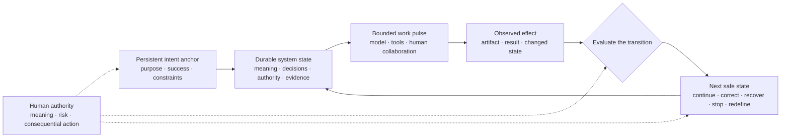

# Azoth

**A personal agent-engineering project about carrying intent through complex,
AI-assisted work.**

If a model call or coding thread is only a bounded episode of work, where does
the durable intelligence of the larger effort live?

Azoth explores that question by treating purpose, project meaning, evidence,
decisions, authority, recovery, and observed outcomes as persistent system
state. A thread can then do focused work without also pretending to be the
plan, memory, policy, and history of the whole effort.

> **A thread is a bounded work pulse. It reads from a durable intent anchor,
> changes or investigates a limited part of the work, and returns evidence for
> the next safe transition.**

The whole system may look more like what people mean by an “agent” than any one
model invocation or thread. Azoth uses that analogy to open the question; it
does not claim that the durable whole already has a settled name.

## Azoth in one view

What propagates through this loop is not merely text or code. It is an
alignment signal: an increasingly concrete translation of intent through
intermediate representations, actions, evidence, and outcomes. “Alignment
signal” is a working engineering metaphor here, not a formal measurement.

## Explore the project

| If you want to understand… | Continue with… |
|---|---|
| **Experience and evidence** | [*Narrow Success, Broad Failure*](docs/case-studies/narrow-success-broad-failure.md), a braided account of the projects, engineering value, framework growth, and contraction that exposed the problem |
| **Working thesis** | [*Intent-to-Outcome Engineering*](docs/INTENT_TO_OUTCOME_ENGINEERING.md), the evolving argument about work pulses, durable system intelligence, feedback, authority, and open research questions |
| **Executable proof** | [Routing, Context, and Authority](docs/PERSONAL_HARNESS_OS.md), the current operator experience and the exact boundary of the tested public slice |
| **Source and architecture history** | [Architecture overview](docs/AZOTH_ARCHITECTURE.md), [decision index](docs/DECISIONS_INDEX.md), and [current proof paths](#inspect-the-current-proof) |

## From intent to governed work

The wider Azoth workshop already supports a practical sequence like this:

`intent intake → discovery seed → research sufficiency → initiative / roadmap /
task formation → routed work pulse → evidence ledger → independent evaluation
→ bounded replay or next safe transition → closeout`

This is not one opaque autonomous pipeline. Each transition can expose its
inputs, evidence, authority, and stopping reason. Research can be required
before a task is hydrated. An evaluator can reject incomplete stage evidence.
A repair can replay within a declared budget. Protected actions remain closed
until a human authorizes the specific effect.

The public story therefore has three evidence bands:

### Portable proof

The extracted `v{{PUBLIC_VERSION}}` candidate implements and tests deterministic
effect-aware routing, compact source-referenced context, explicit authority and
stopping state, and a four-case no-write rehearsal. Thirty portable tests cover
that selected surface.

### Root workshop evidence

The wider source repository contains separate, inspectable machinery for raw
initiative intake, research-sufficiency checks, proposal knowledge assessment,
initiative and roadmap scaffolding, durable run ledgers, campaign routing,
stage evidence, evaluation, and bounded replay. Root-only campaign receipts
show these parts being used in multi-stage product-strategy, operating-profile,
and route-repair work.

Those capabilities are real, but they are not exported as one validated public
product journey. The [executable proof](docs/PERSONAL_HARNESS_OS.md) keeps the
difference visible.

### Working direction

Azoth is moving toward a system that can carry an outcome across many work
pulses: refine intent, discover missing knowledge, form and re-form work,
select the smallest sufficient composition, evaluate what happened, learn
externally to any one model context, and stop honestly at human authority.

That direction is a working thesis, not a completion claim.

## How this inquiry emerged

The starting point was operational-data work: fragmented reporting semantics
could not survive a mechanical platform migration. Recovering business meaning
required traceable evidence, explicit acceptance contracts, staged
publication, independent readback, and recovery.

Reusing that discipline for local data requests showed that the coordination
pattern could transfer while project meaning could not. A shared internal
framework then explored project-local learning, reviewed promotion,
specialized roles, typed handoffs, and adaptive pipelines. When the framework
began duplicating state and consuming more attention than some tasks required,
architectural contraction revealed which controls had actually earned their
place.

A later conversational-agent operations system applied related lessons to a
different problem: versioned business meaning, deterministic policy,
behavioral tests, provider projection, authority gates, continuity, and
reconciliation. It is an individual production-system case, not a deployment
or ideal realization of Azoth.

Azoth is the independent project where these recurring engineering questions
became an explicit inquiry. The [case study](docs/case-studies/narrow-success-broad-failure.md)
holds the grounded chronology; the [thesis](docs/INTENT_TO_OUTCOME_ENGINEERING.md)
develops the broader model.

## Claim boundary

| Surface | Status | Inspect |
|---|---|---|
| Effect-aware routing and typed route state | **Portable proof:** implemented and tested in the candidate | [`scripts/harness_profile.py`](scripts/harness_profile.py) |
| Compact, provenance-preserving context assembly | **Portable proof:** implemented and tested in the candidate | [`scripts/context_view.py`](scripts/context_view.py), [`scripts/personal_harness_context.py`](scripts/personal_harness_context.py) |
| Read-only behavioral rehearsal | **Portable proof:** implemented and tested in the candidate | [runner](scripts/personal_harness_practice_rehearsal.py), [cases](examples/personal-harness/rehearsal-cases.yaml), [tests](tests/test_personal_harness_practice_rehearsal.py) |
| Initiative discovery, research sufficiency, roadmap formation, ledgers, and campaign control | **Root workshop evidence:** separate capabilities and observed campaigns; not one extracted product journey | [`scripts/initiative_intake.py`](scripts/initiative_intake.py), [`scripts/research_sufficiency.py`](scripts/research_sufficiency.py), [`scripts/roadmap_scaffold.py`](scripts/roadmap_scaffold.py), [`scripts/run_ledger.py`](scripts/run_ledger.py), [`scripts/autonomous_loop.py`](scripts/autonomous_loop.py) |
| Intent-to-outcome engineering | **Working direction:** qualified thesis, not fully implemented | [thesis](docs/INTENT_TO_OUTCOME_ENGINEERING.md) |
| Historical employer projects and internal framework | Experience and repository-grounded evidence; not Azoth deployment evidence | [case study](docs/case-studies/narrow-success-broad-failure.md) |
| External adoption or production deployment of Azoth | Not claimed | [preview boundary](docs/PERSONAL_HARNESS_OS.md#public-preview-boundary) |

## Inspect the current proof

- [Routing](scripts/harness_profile.py) — deterministic effect and authority
  classification.
- [Context assembly](scripts/personal_harness_context.py) — compact,
  source-referenced packets.
- [No-write rehearsal](scripts/personal_harness_practice_rehearsal.py) — shared
  code exercised against representative cases.
- [Portable tests](tests/test_personal_harness_practice_rehearsal.py) —
  behavioral and mutation-detection evidence.
- [Research sufficiency](scripts/research_sufficiency.py) and [knowledge
  richness](scripts/proposal_knowledge_richness.py) — wider root-workshop
  checks, outside the narrow portable claim.
- [Trust Contract](kernel/TRUST_CONTRACT.md) — protected authority and action
  boundaries.
- [Architecture decisions](docs/DECISIONS_INDEX.md) — decision records and
  implementation status.

The thesis relies on Git for revision history rather than adding another
changelog. Installer completeness, cross-host parity, package distribution,
and production adoption remain outside the `v{{PUBLIC_VERSION}}` validation
boundary. Existing tags remain immutable. Publication requires review of the
exact extracted tree and explicit human approval for its public commit, tag,
push, and release.

## License

Licensed under the [PolyForm Noncommercial License 1.0.0](https://polyformproject.org/licenses/noncommercial/1.0.0/).
Commercial use outside the licence's permitted noncommercial purposes requires
a separate written agreement. Contact [Yiwei Ye on GitHub](https://github.com/yiwei79).
