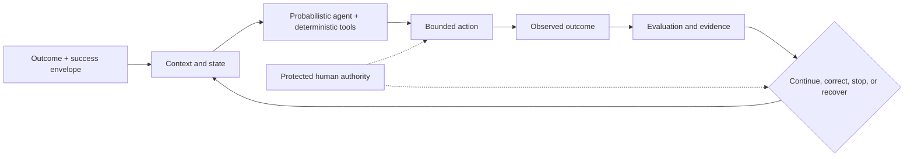

# Azoth

**A personal agentic-engineering project for keeping complex AI-assisted work
aligned with the outcome it is meant to produce.**

A familiar failure mode in agent-assisted work looks like this: a thread starts
with a sound plan, discovers a missing fact or an unmodelled constraint, follows
that detour successfully, and returns with the local problem solved but the
original outcome partially lost. The conversation progressed; the work did not.

Azoth explores a different operating model:

> **The outcome—not the conversation—is the unit of continuity. A thread is a
> bounded pulse of work, not the system of record.**

The broader direction is an evolving, evidence-backed outcome graph: goals,
questions, decisions, tasks, specifications, artifacts, evaluations, and
authority remain durable; individual agent threads read the smallest useful
slice and return evidence to that state. A discovery can create a new branch of
work without silently replacing the reason the work exists.

The current public candidate, `v{{PUBLIC_VERSION}}`, deliberately implements a
smaller foundation: effect-aware routing, compact context, explicit authority
and stopping state, and no-write behavioural rehearsal. It is an unfinished
release candidate—not a universal harness, a finished autonomous system, or an
external-adoption claim.

## Choose your depth

| Time | Start here | What it shows |
|---|---|---|
| 3 minutes | [*Narrow Success, Broad Failure*](docs/case-studies/narrow-success-broad-failure.md) | The production lessons, architectural contraction, and outcome-centred thesis |
| 10 minutes | [Personal Harness OS](docs/PERSONAL_HARNESS_OS.md) | The executable contracts, operator experience, and exact preview boundary |
| Inspect the proof | [routing](scripts/harness_profile.py), [context assembly](scripts/personal_harness_context.py), [rehearsal](scripts/personal_harness_practice_rehearsal.py), and [tests](tests/test_personal_harness_practice_rehearsal.py) | The source and behavioural evidence behind the claims |

## The experience Azoth is aiming for

```text
Outcome + context + constraints
              |
              v
 Questions, risks, and success criteria
              |
              v
 Bounded pulses of work
 research -> discovery -> specification -> implementation -> evaluation
              |
              v
 Evidence and artifacts return to durable state
              |
              v
 Readiness, next safe action, stop, or recovery
```

The intended experience is not “stay inside one perfect thread.” It is:

- the original goal remains visible when a useful detour appears;
- unresolved questions become explicit work rather than hidden assumptions;
- research must become sufficiently grounded before a specification depends on
  it;
- implementation can begin in a clean context with an evidence-backed handoff;
- every pulse returns decisions, artifacts, and evaluation results to durable
  state; and
- the next action is selected from current evidence, not conversational
  momentum.

This full experience is the project direction and is partly represented across
Azoth's workshop lineage. The public candidate does **not** claim to ship the
complete outcome graph or an autonomous research-to-delivery pipeline. It ships
the portable control contracts that such a system needs to remain legible.

## What is implemented and inspectable

Personal Harness OS routes by intended effect and risk—not by simulated employee
roles. Three contracts form the current public core:

| Contract | What it makes explicit |
|---|---|
| `HarnessRequest` -> `HarnessDecision` | Whether work belongs in `guide`, `assisted`, `managed`, or `governed_autonomy` |
| `RouteCapsule` | Side-effect class, route state, required authority and inputs, next safe action, and stop reason |
| Context-view packet | A bounded set of approved summaries and source pointers, with raw memory filtered out |

The extracted candidate also includes a generic rehearsal runner and four
representative cases. The rehearsal executes the same public routing and context
code, checks the expected authority and stopping behaviour, and fingerprints
the target repository before and after to detect mutation.

**Candidate evidence:** 30 portable public tests cover routing, authority stops,
context selection, optional-source behaviour, personal-knowledge recall/review,
and no-write rehearsal. The exact extraction must pass fail-closed path,
manifest, privacy, credential, reference, and release-evidence validation before
publication.

## The engineering model



The model is intentionally compositional:

- agents reason through ambiguity;
- deterministic code enforces invariants where those invariants are actually
  known;
- evaluation compares behaviour with an explicit success envelope;
- durable state preserves evidence and intent beyond one context window; and
- humans retain consequential authority and release decisions.

This is an engineering lens, not a formal control-theory claim. Reliability
comes from the whole path to an acceptable outcome, not from making one model
call look capable.

## Why the architecture stays provisional

More orchestration can feel safer because it makes control visible. It can also
create extra transitions, duplicated state, instruction competition, and stale
assumptions. As models and native agent capabilities improve, yesterday's
useful compensation can become today's invisible performance tax—and the
counterfactual quality of the simpler system is not observable unless it is
tested.

Azoth therefore treats every added agent, memory layer, retrieval system,
instruction, boundary, and ceremony as a falsifiable architectural hypothesis.
It must earn its place through a demonstrated failure mode and observable
improvement. Simplifying or removing a component is a first-class experiment,
not an admission that the earlier work had no value.

That position came from production work and framework use, not from a preference
for minimalism in the abstract. The case study traces the progression from
GloBuddy and SupplyOps, through a comprehensive internal Agentic Framework, to
a 4,835-line scoped contraction and the current minimum-sufficient path.

## Evidence map and claim boundary

| Surface | Status | Inspect |
|---|---|---|
| Effect-aware routing and typed route state | Implemented in the candidate | [`scripts/harness_profile.py`](scripts/harness_profile.py) |
| Compact, provenance-preserving context assembly | Implemented in the candidate | [`scripts/context_view.py`](scripts/context_view.py), [`scripts/personal_harness_context.py`](scripts/personal_harness_context.py) |
| Read-only behavioural rehearsal | Implemented in the candidate | [runner](scripts/personal_harness_practice_rehearsal.py), [cases](examples/personal-harness/rehearsal-cases.yaml), [tests](tests/test_personal_harness_practice_rehearsal.py) |
| Outcome-centred multi-thread continuity | Broader project direction; not fully shipped in this candidate | [case study](docs/case-studies/narrow-success-broad-failure.md#from-conversation-centred-to-outcome-centred-work) |
| Research sufficiency and staged delivery machinery | Inspectable in the wider repository; not validated as one complete public product flow | [`scripts/research_sufficiency.py`](scripts/research_sufficiency.py), [`scripts/proposal_knowledge_richness.py`](scripts/proposal_knowledge_richness.py), [pipeline overview](docs/playbook/01-pipeline-overview.md) |
| External adoption or production deployment of Azoth | Not claimed | [preview boundary](docs/PERSONAL_HARNESS_OS.md#public-preview-boundary) |

GloBuddy and SupplyOps are production systems that shaped the engineering
method. They are not represented as Azoth deployments.

## Explore the repository

- [Personal Harness OS](docs/PERSONAL_HARNESS_OS.md) — exact interfaces,
  operator journey, modes, authority, rehearsal, and validation.
- [*Narrow Success, Broad Failure*](docs/case-studies/narrow-success-broad-failure.md)
  — the engineering argument and evidence-led evolution.
- [Trust Contract](kernel/TRUST_CONTRACT.md) — protected authority and action
  boundaries.
- [Architecture decisions](docs/DECISIONS_INDEX.md) — decision records and
  implementation status.
- [Broader architecture history](docs/AZOTH_ARCHITECTURE.md) — the larger design
  space from which the current path emerged.

Installer surfaces, cross-host parity, package distribution, and production
adoption are outside the `v{{PUBLIC_VERSION}}` validation boundary. Existing
tags remain immutable. Any publication requires review of the exact extracted
tree and explicit human approval for its public commit, tag, push, and release.

## License

Licensed under the [PolyForm Noncommercial License 1.0.0](https://polyformproject.org/licenses/noncommercial/1.0.0/).
Commercial use outside the licence's permitted noncommercial purposes requires
a separate written agreement. Contact [Yiwei Ye on GitHub](https://github.com/yiwei79).
