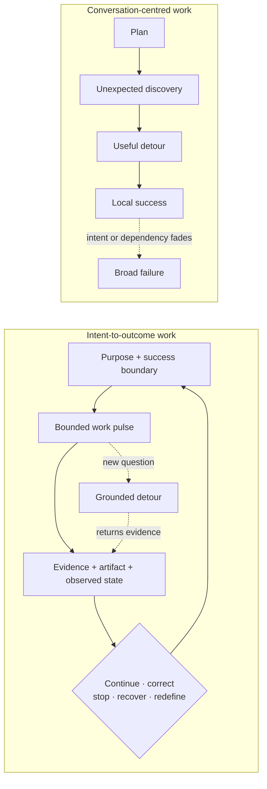
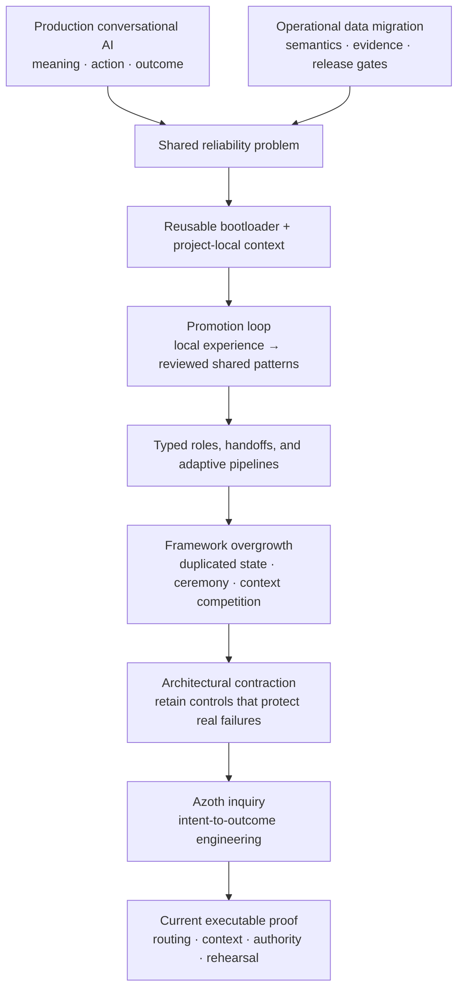

# Azoth

**A personal agent-engineering project about keeping complex AI-assisted work
coherent after the conversation stops being simple.**

An agent can solve the issue immediately in front of it while the wider task
quietly loses its intent, evidence, business meaning, authority, or definition
of success. The detour succeeds; the outcome does not.

Azoth explores a different continuity boundary:

> **The outcome—not the conversation—is the system of record. A thread is one
> bounded pulse of work that reads from and contributes back to it.**

The idea grew through production conversational AI, an operational-data
foundation, a reusable internal agentic-delivery framework, and the later
contraction of that framework when parts of it stopped earning their cost.
Azoth is the independent project where I make those lessons explicit, testable,
and transferable.

## Choose your path

| Reader intent | Start here | What you will find |
|---|---|---|
| **Experience and evidence** | [*Narrow Success, Broad Failure*](docs/case-studies/narrow-success-broad-failure.md) | The production origin, BigQuery and Local Requests Data lineage, framework evolution, contraction, and derived findings |
| **Working thesis** | [*Intent-to-Outcome Engineering*](docs/INTENT_TO_OUTCOME_ENGINEERING.md) | The evolving model: intent anchors, project ontology, composition, feedback, human authority, counterarguments, and research questions |
| **Executable proof** | [Routing, Context, and Authority](docs/PERSONAL_HARNESS_OS.md) | One narrow tested slice, its interfaces, behavioural rehearsal, and exact claim boundary |
| **Source and architecture history** | [Architecture overview](docs/AZOTH_ARCHITECTURE.md), [decision index](docs/DECISIONS_INDEX.md), and [source paths](#inspect-the-current-proof) | The broader design history and the code behind the candidate |

## The 60-second read

| | |
|---|---|
| **Failure** | A locally correct model trajectory can still produce broad system failure. |
| **Observed lineage** | Production systems made meaning, state, authority, evaluation, and recovery part of correctness. Reusing those disciplines across projects exposed the difference between generic coordination and project-local ontology. |
| **Working thesis** | Durable agentic systems should connect model-and-tool work to a persistent intent anchor: purpose, success boundary, project meaning, authority, evidence, and observed outcomes. |
| **Architectural rule** | Every role, handoff, instruction layer, retriever, memory surface, and gate is a hypothesis. Add, test, revise, or remove it according to representative work. |
| **Current proof** | The `v{{PUBLIC_VERSION}}` candidate contains a tested probe of effect-aware routing, bounded context, explicit authority and stopping state, plus no-write rehearsal. |
| **Not claimed** | The full intent-to-outcome system, external Azoth adoption, production deployment, installer completeness, or cross-host parity. |

GloBuddy and SupplyOps are production systems that shaped the method. The
internal Agentic Framework records a separate employer-work lineage. Azoth is
an independent project. None is presented as a deployment of another.

## From local success to outcome continuity

A conversation can be excellent working memory for one pulse. It should not
also have to be the sole plan, evidence store, authority record, semantic model,
and durable history.

The larger engineering object is:

`purpose + success boundary -> project meaning -> task-specific composition -> bounded effect -> observed outcome -> evaluation -> next safe transition`

Protected human authority spans consequential effects, promotion of durable
policy, and release decisions.

## How the architecture earned its shape

The project did not begin with one universal orchestration design.

The BigQuery migration made semantic reconstruction, traceable evidence,
project state, acceptance gates, and human-authorized publication operational.
Local Requests Data reused the bootloader discipline while preserving different
domain meaning and sources of truth. That combination led to an explicit
project-to-shared promotion loop: experience stayed local until repeated
evidence justified a reusable contract.

The framework later added specialised roles, typed handoffs, model tiers,
memory layers, and multi-stage pipelines. Some structures protected real
boundaries. Others duplicated live state or consumed more context than the
problem. A project-local contraction retained domain validation, authority, and
recovery while removing generic machinery.

The resulting rule is not “simple good, complex bad”:

1. Name the failure and the acceptable outcome.
2. Start with the smallest observable path that respects real authority.
3. Run representative work and retain trajectories, artifacts, outcomes, and
   operator friction as evidence.
4. Add structure only for a demonstrated failure or boundary.
5. Re-test, simplify, or remove it as models and environments change.

The [case study](docs/case-studies/narrow-success-broad-failure.md) holds the
historical evidence. The [working thesis](docs/INTENT_TO_OUTCOME_ENGINEERING.md)
develops the broader model and makes its open questions falsifiable.

## What is implemented in this candidate

The candidate makes three contracts executable without presenting them as the
definition of Azoth:

| Contract | What it makes observable |
|---|---|
| `HarnessRequest` -> `HarnessDecision` | Whether intended effects belong in `guide`, `assisted`, `managed`, or `governed_autonomy` |
| `RouteCapsule` | Side-effect class, route state, required authority and inputs, next safe action, and stop reason |
| Context-view packet | A bounded set of approved summaries and source pointers, with raw memory filtered out |

A generic rehearsal runs four representative cases through the same public
routing and context code. It checks expected authority and stopping behaviour
and fingerprints the target repository before and after to detect mutation.

**Candidate evidence:** 30 portable public tests cover routing, authority stops,
context selection, optional-source behaviour, personal-knowledge recall/review,
and no-write rehearsal. The extracted candidate must also pass fail-closed path,
manifest, privacy, credential, reference, and release-evidence validation.

## Claim boundary

| Surface | Status | Inspect |
|---|---|---|
| Effect-aware routing and typed route state | Implemented and tested in the candidate | [`scripts/harness_profile.py`](scripts/harness_profile.py) |
| Compact, provenance-preserving context assembly | Implemented and tested in the candidate | [`scripts/context_view.py`](scripts/context_view.py), [`scripts/personal_harness_context.py`](scripts/personal_harness_context.py) |
| Read-only behavioural rehearsal | Implemented and tested in the candidate | [runner](scripts/personal_harness_practice_rehearsal.py), [cases](examples/personal-harness/rehearsal-cases.yaml), [tests](tests/test_personal_harness_practice_rehearsal.py) |
| Intent-to-outcome engineering | Working thesis derived from project observations and external comparison; not fully implemented | [thesis](docs/INTENT_TO_OUTCOME_ENGINEERING.md) |
| Historical production and framework lineage | Experience and repository evidence; not Azoth deployment evidence | [case study](docs/case-studies/narrow-success-broad-failure.md) |
| Research sufficiency and staged delivery machinery | Inspectable in the wider repository; not validated here as one product journey | [`scripts/research_sufficiency.py`](scripts/research_sufficiency.py), [`scripts/proposal_knowledge_richness.py`](scripts/proposal_knowledge_richness.py), [pipeline overview](docs/playbook/01-pipeline-overview.md) |
| External adoption or production deployment of Azoth | Not claimed | [preview boundary](docs/PERSONAL_HARNESS_OS.md#public-preview-boundary) |

## Inspect the current proof

- [Routing](scripts/harness_profile.py) — deterministic effect and authority
  classification.
- [Context assembly](scripts/personal_harness_context.py) — compact,
  source-referenced packets.
- [No-write rehearsal](scripts/personal_harness_practice_rehearsal.py) — shared
  code exercised against representative cases.
- [Portable tests](tests/test_personal_harness_practice_rehearsal.py) —
  behavioural and mutation-detection evidence.
- [Trust Contract](kernel/TRUST_CONTRACT.md) — protected authority and action
  boundaries.
- [Architecture decisions](docs/DECISIONS_INDEX.md) — decision records and
  implementation status.

The working thesis relies on Git for revision history; it does not add a second
changelog. Installer surfaces, cross-host parity, package distribution, and
production adoption are outside the `v{{PUBLIC_VERSION}}` validation boundary.
Existing tags remain immutable. Publication requires review of the exact
extracted tree and explicit human approval for its public commit, tag, push,
and release.

## License

Licensed under the [PolyForm Noncommercial License 1.0.0](https://polyformproject.org/licenses/noncommercial/1.0.0/).
Commercial use outside the licence's permitted noncommercial purposes requires
a separate written agreement. Contact [Yiwei Ye on GitHub](https://github.com/yiwei79).
